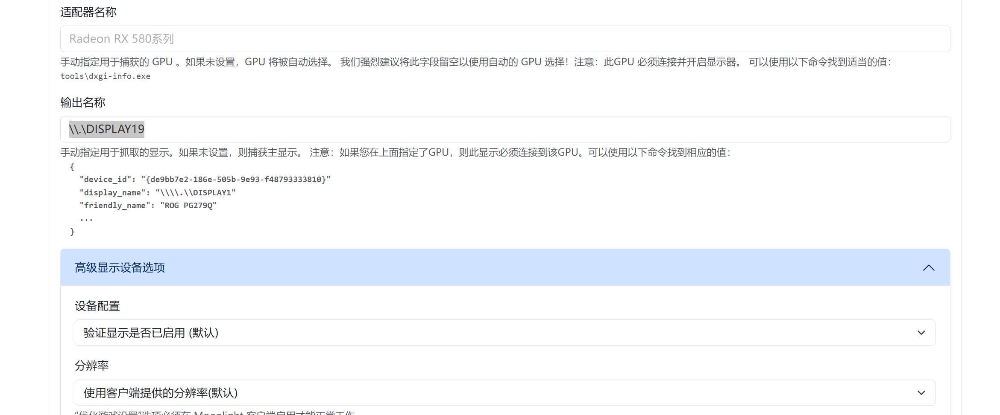

## 什么是Sunshine和Moonlight？
Sunshine是一个开源的游戏串流服务器，Moonlight是其客户端。它们可以在不同的操作系统上运行，支持高质量的游戏串流。
首先，什么是串流？串流是指将游戏画面从一台计算机传输到另一台计算机或设备上进行播放。Sunshine和Moonlight可以让你在低延迟的情况下享受高质量的游戏体验。所以这里串流可以拓展到游戏之外的应用场景，比如远程桌面、视频播放等。

<!-- more -->
## 局域网串流
这里我使用的都是局域网环境，Sunshine作为服务器运行在一台主机上，而Moonlight作为客户端运行在另一台设备上。
步骤：
1. **安装Sunshine**：在你的主机上安装Sunshine。可以从[Sunshine的GitHub页面](https://github.com/LizardByte/Sunshine)下载最新版本。安装过程通常很简单，只需按照说明进行即可。
2. **配置Sunshine**：安装完成后，启动Sunshine并进行基本配置。这里可以打开一个浏览器访问Sunshine的Web界面，通常是`http://localhost:47990`。在此处可以设置Sunshine使用的IP地址族（IPv4或IPv6）、端口等参数。还可以设置游戏目录、控制器等选项。
3. **安装Moonlight**：在你的客户端设备上安装Moonlight。可以从[Moonlight的GitHub页面](https://github.com/moonlight-stream/moonlight-android) 下载安卓设备的APK，或在其他平台上使用相应的安装包。
4. **连接到Sunshine**：在Moonlight中，添加Sunshine服务器的IP地址。Moonlight会自动扫描局域网中的Sunshine服务器，并显示在列表中。选择你的Sunshine服务器并进行配对。
由于这里只涉及局域网环境，所以配对过程通常很简单，只需输入Sunshine的配对码即可。
5. **开始串流**：一旦连接成功，你就可以在Moonlight中看到Sunshine服务器上可用的游戏列表。选择一个游戏并点击开始串流。Moonlight会将游戏画面传输到你的客户端设备上，你可以使用控制器或键盘鼠标进行操作。

## 其他应用场景：
无线副屏：比如使用手上闲置的iPad，在windows上下载[parsec-vdd](https://github.com/nomi-san/parsec-vdd/releases)可以建立一个虚拟的屏幕，之后将sunshine的输出设置到这个虚拟屏幕上，然后在iPad上使用Moonlight连接到这个虚拟屏幕，就可以实现无线副屏的效果。

## 参考
- [Sunshine GitHub](https://github.com/LizardByte/Sunshine)
- [几乎无延迟的无线副屏？sunshine+moonlight最强串流！【保姆级教学】_哔哩哔哩_bilibili](https://www.bilibili.com/video/BV13i421U7zf?spm_id_from=333.788.videopod.sections&vd_source=4f05b05eb19ffd33468ed22d8ea0de7a) 
