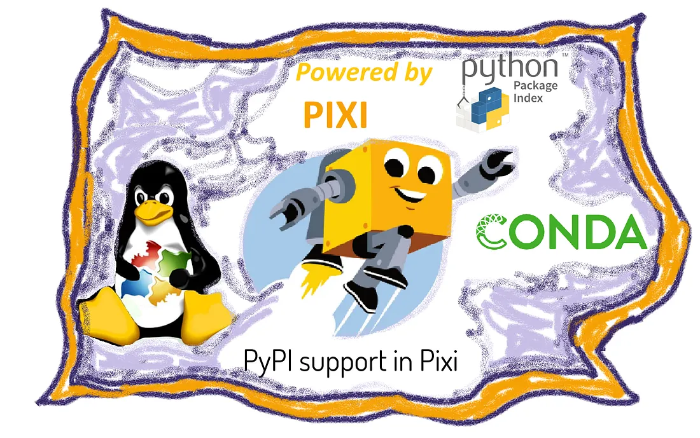

## 序言
我不是专业的程序员，使用python也只是因为其简单易学，比起Matlab更加轻便。使用python时，环境管理和安装包是不可或缺的步骤，在过去的一年多时间中，我一直使用conda进行环境管理，由于需要进行一些矩阵的运算，conda相比pip/venv有着很大的优势，如Numpy Scipy Pandas等计算库底层代码通常由C、C++、Fortran等编译语言编写，pip安装时如果没有提供适用于操作系统和python版本的wheel包，则会尝试从源码编译，这需要预安装好相应的编译器，过程很繁琐。
而conda则从其软件仓库比如default或者conda-forge中直接下载好预编译的二进制包，这些包已经包含了所有必须的底层依赖，只需要使用`conda install`命令即可开箱即用。
## 转变
最近我决定从conda转为pixi进行环境管理以及包的安装。
>事情的起因是使用conda安装速度太慢了（慢到吐血，有时上个厕所回来cmd还卡在安装的步骤），环境解析时间很长，并且很依赖网速。且在conda环境里混用pip可能会造成很严重的问题，相互依赖冲突，且conda的求解器不会对pip安装的包进行依赖计算，甚至可能覆盖或者破坏。

于是我首先看到了`mamba`，这是对传统conda的C++重构版本，环境依赖解析速度更快，并且可以并行下载包，mamba虽然速度快，但根植于conda生态的问题依旧存在，当安装都安装不下来的时候，速度再快有什么吗呢？

然后我就看到了`uv`，这个工具最近特别火热，去年2月份发布后，star数量急剧上升，目前已经60k，足以说明其简单易用.

uv与conda的赛道还是有些许不同的，将`pip`, `venv`, `pip-tools`, `pipx`, `virtualenv` 等多个工具融合成一个，并用 Rust 语言重写，赋予其 10 到 100 倍的速度——这就是 `uv`。对于纯python项目，uv可以管理项目的一切，从项目初始化、虚拟环境创建、包的安装到运行命令、工程的打包等操作全部可以使用uv完成。uv是为pypi而生的，可以完全替代`pip`并遵循pypi的标准和工作流。

但是，uv的方便仅在于纯python项目，科学计算以及数据分析等操作需要跨语言的依赖，在这一点上，conda依然是具有统治力的。所以我放弃conda使用uv是不切实际的。那么有什么工具可以完美替代conda/mamba吗？有的兄弟，有的。

答案是`pixi`，pixi的发布时间比uv还要早（但目前显然没有pixi火，并且存在一些bug）

pixi是站在conda的肩膀上的，pixi的开发者也参与了mamba的开发，pixi的环境依赖解析继承自mamba，这保证了pixi在安装和解析时的速度，且conda的包和渠道也可以由pixi完全兼容。

在uv出现后，pixi集成了uv作为PyPI包的处理器，这意味着混用PyPI上的包时，Pixi可以利用uv的解析能力以及下载速度。类似uv，pixi同样采用`pixi.toml`作为项目的清单文件，定义各种以来以及任务运行器，并且具有`pixi.lock`的锁文件，可以实现环境的完全复刻。

pixi安装包是，首先需要以conda为准，conda是地基，如果conda找不到则采用PyPI进行安装。
## 尝试
目前我已经将anaconda卸载掉了（将需要的conda环境导出为yml），采用[Installation - Pixi by prefix.dev](https://pixi.sh/latest/installation/#__tabbed_1_2) 的方法install pixi，并使用pixi重新安装了原有的conda虚拟环境，速度是真的很快，由于我不怎么进行项目开发，所以无法完全体会到pixi的优势。
pixi工作流：
```shell
# 1. 在你的主终端，为项目添加依赖
pixi add numpy pandas

# 2. 添加完成后，进入 shell 进行交互式开发
pixi shell
(my-project) $ python -c "import numpy; import pandas; print('Success!')"
Success!
(my-project) $ exit

# 或者，直接运行定义好的任务
pixi run test
```

## 参考
- [让uv管理Python的一切](https://www.bilibili.com/video/BV1Stwfe1E7s) 
- [15分钟彻底搞懂！Anaconda Miniconda conda-forge miniforge Mamba](https://www.bilibili.com/video/BV1Fm4ZzDEeY/) 
- [Pixi/uv: Bioinformatics Powerhouse – Joseph Guhlin: Bioinformatics and Genomics](https://josephguhlin.com/pixi-uv-bioinformatics-powerhouse/) 
- [pixi-Home](https://pixi.sh/latest/) 
- [Python package managers: uv vs pixi? - Jacob Tomlinson](https://jacobtomlinson.dev/posts/2025/python-package-managers-uv-vs-pixi/)