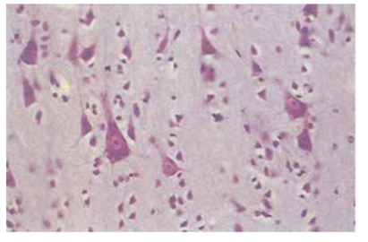
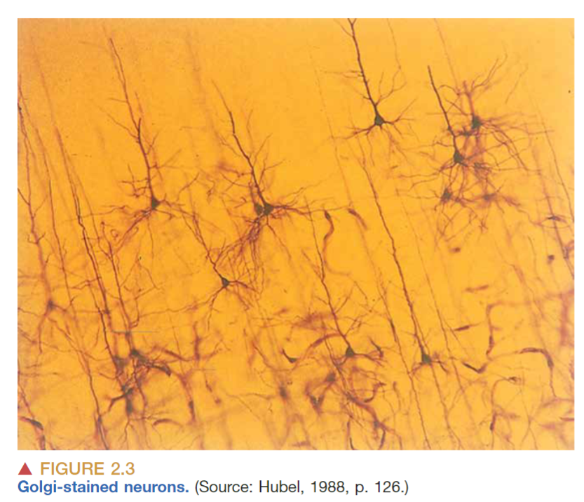
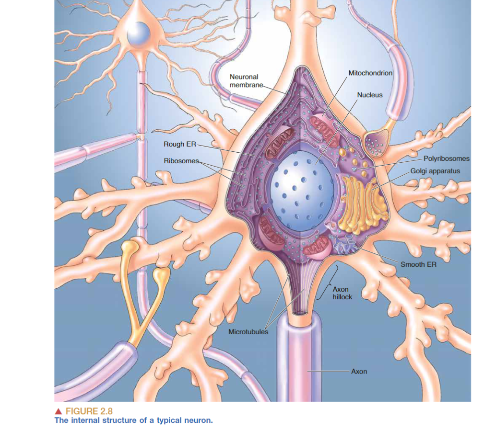
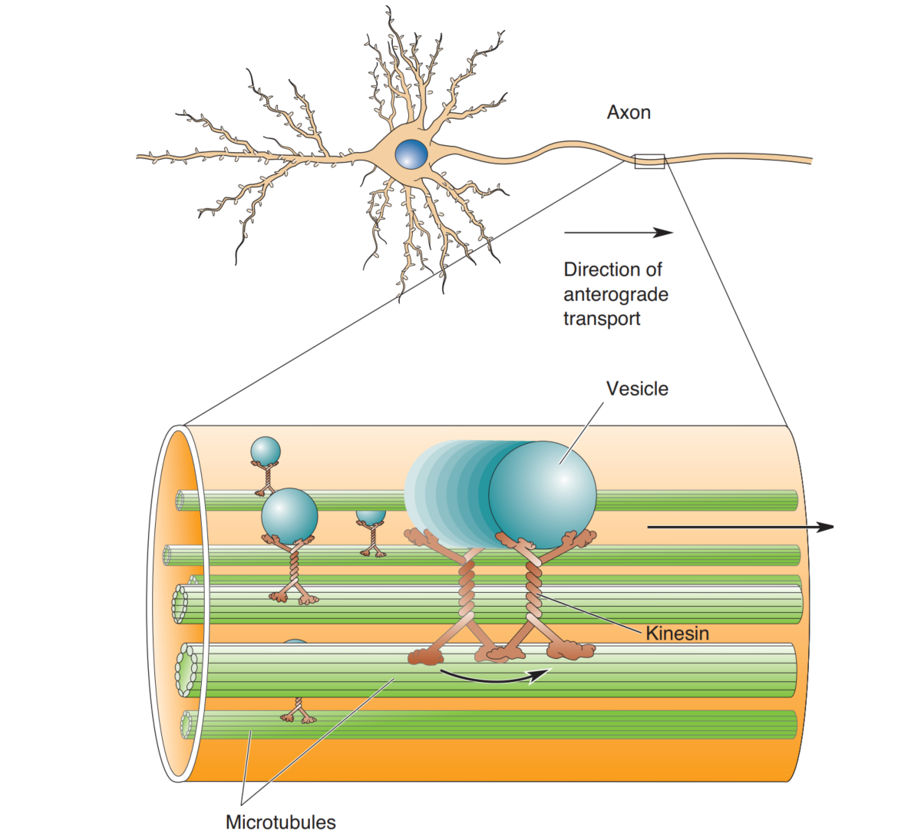
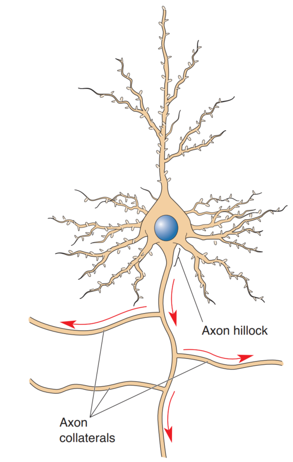
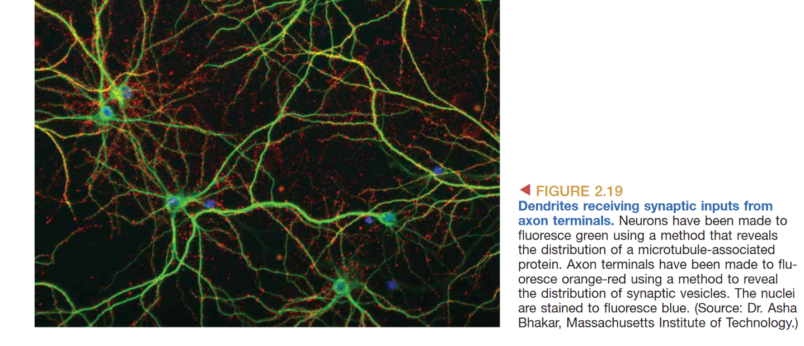

# THE NEURON DOCTRINE

## **Stain**
由于大脑组织柔软，需要让组织变硬，通过在甲醛中浸泡可以固定组织，通过切片机可以将变硬的组织切成薄片。但大脑颜色均一，若想观察细胞形态，就需要进行细胞染色。
一种染色方法是 **Nissl Stain**，是由德国神经科学家Franz Nissl在19世纪末推出的。Nissl通过碱性染料可以染色所有细胞的细胞核以及细胞核周围的物质团块，这些团块被称为 *Nissl bodies* 。Nissl Stain可以染色神经元，但不能染色胶质细胞，这种染色方法现在仍有使用。

但Nissl Stain只能染色一些团块，无法使得神经元形态清晰可见，所以 Camillo Golgi 发明了一种新的染色方法，他发现将大脑组织浸泡在silver chromate solution(铬酸银溶液)中，可以使其中一小部分neuron整体颜色变深而不仅仅局限于细胞核或者小团块，从而可以看到神经元的细胞体与突起。Golgi Stain揭示了神经元可以分为两个部分：胞体(**cell body**, **soma**)与突起(**neurites**, 可分为 **axons** 与 **dendrites**)

## Cajal的贡献
虽然Golgi发明了高尔基染色，但Golgi并未对当时流行的网状理论(Reticular Theory)产生质疑，他依然认为树突为神经元提供营养，轴突使得神经元彼此相连。

并且高尔基染色法相当耗时，结果不稳定，Santiago Ramón y Cajal 对其进行了改进，使其更加可靠且看到的图像更清晰。Cajal也使用了高尔基染色，但却得到了与Golgi完全不同的结论，他在鸟类的小脑中发现了两个原理[^1]，即神经元学说以及动态极化理论[^2]。神经元学说的内容为：神经元是神经系统结构和功能的基本单位，不同神经元之间通过彼此接触或者毗邻的方式相互作用，而不是直接相连为连续的网络。20世纪50年代电子显微镜的出现最终证明了Cajal的正确。

## Electron Microscope
人眼只能区分相距超过约100微米的两个点。因此，可以说100微米是裸眼分辨能力的极限。神经元的直径约为20微米，而neurites可以小到几微米。因此，在研究神经元结构之前，必须先发明光学显微镜。

然而，光学显微镜存在一个理论上的分辨率极限。根据瑞利判据，当一个光斑的中心落在另一个光斑的暗环上时，这两个点被认为是刚好可分辨的，这时的横向分辨率为：$$d_{xy} = \frac{0.61 \lambda}{NA}$$$\lambda$为光波长，$NA$为物镜的数值孔径，$NA = n \cdot \sin(\alpha)$ 其中 $n$ 为介质的折射率，$\alpha$ 为物镜孔径角半角，假设 $NA$ 取最大值1.7，$\lambda$取最小值380，得到的横向分辨率 $d_{xy}$ 最小也只有136nm，由于神经元之间的间隙只有0.02微米（20纳米）。这个问题直到大约70年前电子显微镜被发明并应用于生物标本时才得以解决。

电子显微镜使用电子束而不是光来形成图像，极大地提高了分辨能力。电子显微镜的分辨率极限约为0.1纳米——比裸眼好一百万倍，比光学显微镜好一千倍。我们对神经元内部精细结构（超微结构）的所有了解都来自于对大脑进行电子显微镜检查。如今，技术前沿的显微镜使用激光束照亮组织，并利用计算机创建数字图像。神经科学家现在经常将能够在激光照射下发光的分子引入神经元中。这些荧光被灵敏的探测器记录下来，计算机再根据这些数据重建神经元的图像。与传统的光学显微镜和电子显微镜方法不同，这些新技术不需要固定组织，使神经科学家能够观察仍然活着的大脑组织。此外，它们还实现了“超分辨率”成像，突破了传统光学显微镜的限制，揭示了小至20纳米的结构。

# 典型神经元形态
由以上内容可知，神经元有胞体、轴突、树突组成。一个典型神经元的结构如下图所示：

## 胞体
一个典型神经元的直径约20$\mu m$，细胞膜上含有离子通道，神经递质受体蛋白与转运蛋白，细胞膜为5nm厚。
因为需要大量合成膜蛋白，胞体中含有大量粗面内质网(rER)以及核糖体(ribosome)，这些部分嗜碱性，所以也是Nissl body的一部分。
## 轴突
与胞体不同的是，轴突中没有rER，几乎没有核糖体（成熟轴突中可能由很少的游离核糖体，所以轴突几乎不会合成蛋白质）；此外轴突的膜蛋白组成与胞体不同，轴突膜上富含电压门控离子通道，特别是轴丘部分以及髓鞘化轴突的郎飞节。

轴突通常会有被称为 ***axon collaterals*** 的侧枝，这些侧枝可以延伸到各处，与不同部位的神经系统通信。也有被称为 *recurrent collaterals* 的侧枝，这种侧枝会返回与同一细胞或者临近细胞的树突通信。

轴突的长度不一，直径不一，有的可达1m长直径1mm（枪乌贼），在人体内，直径在少于 $1 \mu m$ 到 $25 \mu m$ 间变换，直径的差别决定了电信号（神经脉冲）的速度，与水管或者导线类似，直径越大一般速度越大。

由于轴突中核糖体的缺失，蛋白质需要从胞体转运到末梢，这个过程为轴浆运输(Axoplasmic Transport)。运输时依赖囊泡的包裹，微管作为骨架，通过马达蛋白将囊泡沿着微管移动。轴浆运输的速度不一，且包括两个方向：顺行运输(anterograde transport)是囊泡通过微管的驱动蛋白(kinesin)将物质顺向运输，逆向运输(retrograde transport)通过动力蛋白(dynein)逆向运输。 

轴突的结构可以分为：一个起始端（轴丘），中间段（轴突主体），以及终端。

轴突的起始端称为轴丘(axon hillock)，由胞体发出。轴丘是一个由胞体发出的锥形的结构。
### 轴突末梢
轴突的终端称为轴突末梢（***axon terminal*** or ***terminal bouton***）末梢是轴突与其他细胞通信的部位，通信点被称为突触(synapse)

***terminal arbor***：轴突产生很多短分支，每个分支都产生一个synapse，这些分支被总称为终末丛。使用名词[[001_innervation|innervation]]来形容细胞通过synapse对另一个细胞的通信。

轴突末梢与轴突也有几处不同：
- 微管不会延伸到末梢中
- 末梢中包含大量的突触囊泡(synaptic vesicles)
- 位于突触前膜的active zone
- 富含线粒体，能量需求很大
## 树突

树突形成了神经元的“天线”，他们被成千上万的轴突覆盖，树突膜上会有很多神经递质的受体。

有些神经元的树突被树突棘(**dendritic spines**)覆盖，树突棘像沙包一样被认为可以隔绝一些化学反应。
# 神经元类型
- 极：神经突数量，可分为单极 双极 多极
- 树突：根据树突形态可分为多种，在大脑皮层主要为两种分类，即星形细胞(stellate cells)与锥体细胞(pyramidal cells)，根据有无树突棘可分为无棘与有棘。皮层中所有锥体细胞都是有棘的。
- function/connection: primary sensory neurons, motor neurons, interneurons

[^1]: The Beautiful Brain: The Drawings of Santiago Ramon Y Cajal
[^2]: 树突为神经细胞的输入端，而轴突为输出端