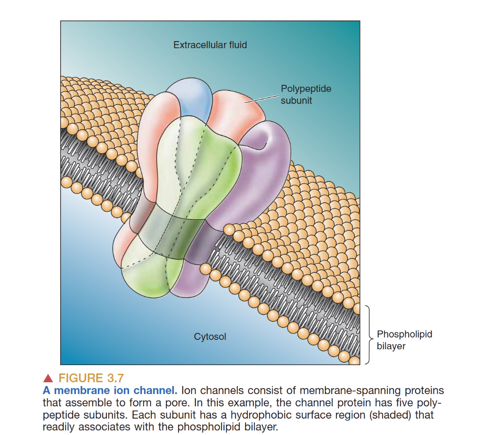

# Resting Membrane Potential
> 可兴奋的细胞不产生冲动时，称为静息状态；处于静息状态的神经元膜内相对于膜外是负电荷，跨膜电荷存在着差异称为resting membrane potential
- Excitable Membrane: 可以产生动作电位的细胞的膜(神经元或者肌肉细胞)
## The Chemical Basis
- cytosal and extracellular fluid: Water is the main solvent. Ions (Cations $+$ and Anions $-$) are the charge carriers.
- phospholipid membrane: 提供屏障作用，由于磷脂双分子层是非极性的，导致离子无法通过
- Ion pumps:  细胞膜上的跨膜蛋白，可以允许特定离子通过细胞膜

## Movement of Ions
1. **扩散**: 通过离子通道顺浓度梯度扩散。
2. **电场驱动**: Movement of ions due to an electrical field (Current $I$, Voltage $V$, Conductance $g$). 

## Ion Basis of RMP
- **离子平衡电位**(equilibrium potential)：电场驱动力与浓度驱动力平衡，某种离子浓度梯度平衡
- 膜电位巨大改变由离子极小变化引起
- 净电荷差分布在膜内侧和外侧表面
- 离子驱动速度正比于driving force
- 已知某一离子浓度差，可计算离子平衡电位
### Nernst Equation
$$
E_{ion}=2.303\frac{RT}{zF}log\frac{[ion]_o}{[ion]_i}
$$
这里E为某个离子的静息膜电位。
K+: in>out
Na+ Ca2+ Cl-: out>in
> [!note] 37°C 时的简化公式
> $$
E_{ion}=\frac{61.65}{z}log\frac{[ion]_o}{[ion]_i}
$$

| 离子        | 浓度比 (外:内)  | 平衡电位 ($E_{ion}$) |
| --------- | ---------- | ---------------- |
| $K^+$     | 1 : 20     | -80 mV           |
| $Na^+$    | 10 : 1     | +62 mV           |
| $Ca^{2+}$ | 10,000 : 1 | +123 mV          |
| $Cl^-$    | 11.5 : 1   | -65 mV           |

# GHK Equation
Nernst方程只考虑了单个离子如何流动，但细胞膜的离子是复杂的，所以GHK方程在Nernst方程基础上进行了拓展。
### GHK Equation
> The GHK equation is a fundamental fomula in neuroscience, extending the Nernst equation which is limited to a single ion species. It considers the relative permeabilities and concentrations of multiple ions. 
#### Assumptions
Because the environment in the cell is very complex, we must build some assumptions to make the deriving process easy.
- Ionix Flux: the movement of ions across the membrane decribed by **Nernst-Planck Equation** which accounts for both concentration and electric potential gradients.
- The Electric Field is constant, letting us integrate **Nernst-Planck Equation** more easily
- Steady-State Condition: the net ionic current across the membrane is 0 (the membrane potential is stable over time)
#### step1 Get the $J_i$ equation about $C_i^{outside}$and $C_i^{inside}$
From **Nernst-Planck Equation**：
$$
 J_i=-D_i(\frac{dC_i}{dx}+\frac{z_iF}{RT}C_i\frac{dV}{dx})
$$
- $J_i:$ Flux of ion $i$ ($mol \cdot m^{-2}\cdot s^{-1}$)
- $D_i$: Diffusion coefficient of ion $i$ in the membrane
- $x$: Position
- $z_i$: Valence of ion $i$
- $F$: 法拉第常数
- $R$: 气体常数
- $T$: 绝对温度(K)
- V: potential

Apply the Constant Field Assumption:
Because of the assumption:  $\frac{dV}{dx}=-\frac{V_m}{d}$  where $V_m=V_{outside}-V_{inside}$
so, substitute $\frac{dV}{dx}$ into the **Nernst-Planck Equation**:
define $\alpha=\frac{z_iF}{RTd}V_m$
$$
 J_i=-D_i(\frac{dC_i}{dx}-\alpha C_i) 
$$
here, we time $e^{-\alpha x}$ on both sides:
$$
\begin{aligned}
\because e^{-\alpha x}J_i=-D_i(\frac{dC_i}{dx}e^{-\alpha x}-\alpha e^{\alpha x}C_i) \\
\therefore -\frac{e^{-\alpha x}J_i}{D_i}=\frac{dC_i}{dx}e^{-\alpha x}-\alpha e^{-\alpha x}C_i\\
\therefore -\frac{e^{-\alpha x}J_i}{D_i}=\frac{\partial (C_ie^{-\alpha x})}{\partial x}
\end{aligned}
$$
Now, we can integrate both sides from $x=0(inside)$ to $x=d(outside)$
$$
\begin{aligned}
-\frac{J_i}{D_i\alpha}\int_{x=0}^{x=d}e^{-\alpha x}dx=(C_ie^{-\alpha x})\mid_{x=0}^{x=d}\\
\therefore \frac{J_i (e^{-\alpha d}-1)}{D_i \alpha}=C_i^oe^{-\alpha d}-C_i^i\\
\therefore J_i=-\frac{D_i\alpha(C_i^o-C_i^ie^{\alpha d})}{e^{\alpha d}-1}
\end{aligned}
$$
We use $C_i^o$ and $C_i^i$ to represent the concentration of the given ion inside and outside the membrane.
Then recall that $\alpha=\frac{z_iFV_m}{RTd}$, and substitute $\frac{D_i}{d}=P_i$ (represent the permeability of ion $i$)
$$
\begin{aligned}
 J_i=-\frac{P_i{z_iF}V_m(C_i^o-C_i^ie^{\frac{z_iFV_m}{RT}})}{RT(e^{\frac{z_iFV_m}{RT}}-1)}
\end{aligned}
$$
We use $\xi_i=\frac{z_iFV_m}{RT}$, so we can get:
$$
\begin{aligned}
 J_i=-P_i\xi_i\frac{C_i^o-C_i^ie^{\xi_i}}{e^{\xi_i}-1}
\end{aligned}
$$
#### Step2 get $V_m$
The ionic current $I_i$ per square is
$$
\begin{aligned}
I_i=z_iFJ_i\\
\therefore I_i=-\frac{P_i{z_i^2F^2}V_m(C_i^o-C_i^ie^{\xi_i})}{RT(e^{\xi_i}-1)}
\end{aligned}
$$
Apply $I_i$ to the Steady-State Condition, where
$$
\sum I_i=I_{total}=0
$$
we use $K^+$, $Na^+$ and $Cl^-$ as examples, which are significant for the membrane potential. Here it is:(let $\xi=\frac{FV_m}{RT}$)
$$
\begin{aligned}
I_{K^+}=-\frac{P_{K^+}{F^2}V_m(C_{K^+}^o-C_{K^+}^ie^{\xi})}{RT(e^{\xi}-1)}\\
I_{Na^+}=-\frac{P_{Na^+}{F^2}V_m(C_{Na^+}^o-C_{Na^+}^ie^{\xi})}{RT(e^{\xi}-1)}\\
I_{Cl^-}=-\frac{P_{Cl^-}{F^2}V_m(C_{Cl^-}^o-C_{Cl^-}^ie^{-\xi})}{RT(e^{-\xi}-1)}\\
=-\frac{P_{Cl^-}{F^2}V_m(C_{Cl^-}^i-C_{Cl^-}^oe^{\xi})}{RT(e^{\xi}-1)}
\end{aligned}
$$
So the sum of the currents is
$$
\sum I_i=I_{K^+}+I_{Na^+}+I_{Cl^-}=0
$$
substitute the currents:
$$
\begin{aligned}
-\frac{P_{K^+}{F^2}V_m(C_{K^+}^o-C_{K^+}^ie^{\xi})}{RT(e^{\xi}-1)}-\frac{P_{Na^+}{F^2}V_m(C_{Na^+}^o-C_{Na^+}^ie^{\xi})}{RT(e^{\xi}-1)}-\frac{P_{Cl^-}{F^2}V_m(C_{Cl^-}^i-C_{Cl^-}^oe^{\xi})}{RT(e^{\xi}-1)}=0\\ \Rightarrow
P_{K^+}C_{K^+}^o+P_{Na^+}C_{Na^+}^o+P_{Cl^-}C_{Cl^-}^i=e^{\xi}(P_{K^+}C_{K^+}^i+P_{Na^+}C_{Na^+}^i+P_{Cl^-}C_{Cl^-}^o)\\
\therefore e^{\xi}=\frac{P_{K^+}C_{K^+}^o+P_{Na^+}C_{Na^+}^o+P_{Cl^-}C_{Cl^-}^i}{P_{K^+}C_{K^+}^i+P_{Na^+}C_{Na^+}^i+P_{Cl^-}C_{Cl^-}^o}
\end{aligned}
$$
recover $\xi$ with $\frac{FV_m}{RT}$
$$
V_m = \frac{RT}{F}ln\frac{P_{K^+}C_{K^+}^o+P_{Na^+}C_{Na^+}^o+P_{Cl^-}C_{Cl^-}^i}{P_{K^+}C_{K^+}^i+P_{Na^+}C_{Na^+}^i+P_{Cl^-}C_{Cl^-}^o}
$$

$V_m=E_{Cl}=-65mV$
通透性与离子通道开放的个数有关，在RMP与AP下，通透性不同，所以膜电位也会相应改变
P_K:P_na:Pcl
At rest $P_K:P_{Na}:P_{cl} = 1:0.04:0.45$
Action potential $P_K:P_{Na}:P_{cl} = 1:20:0.45$