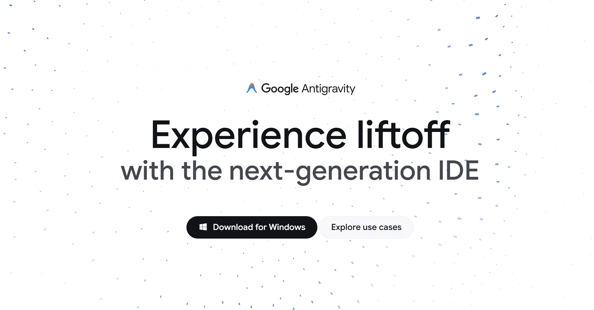
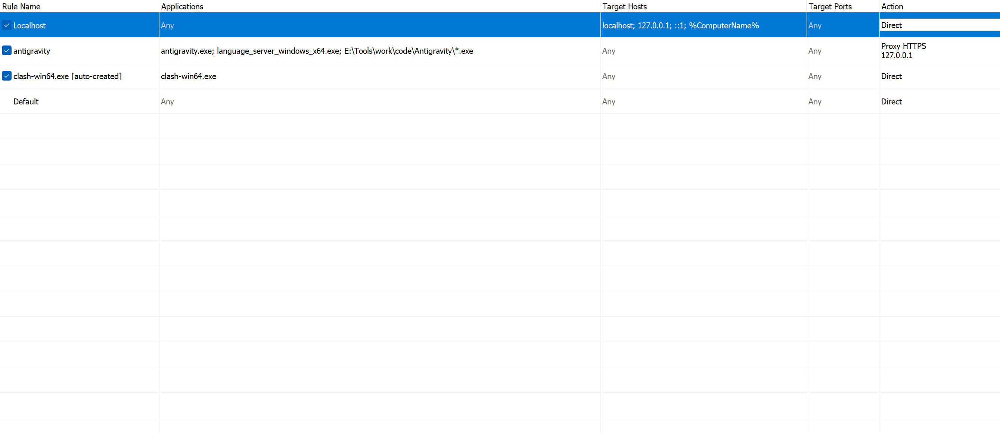
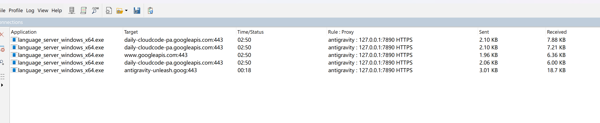
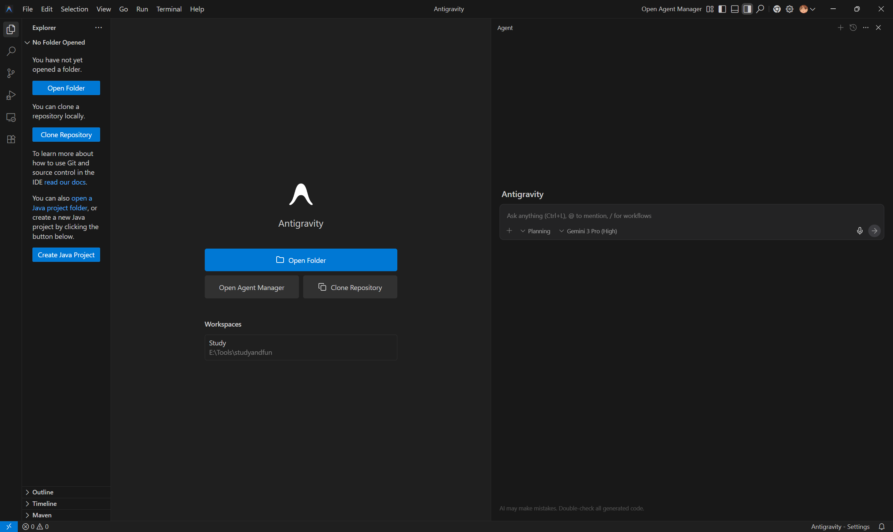
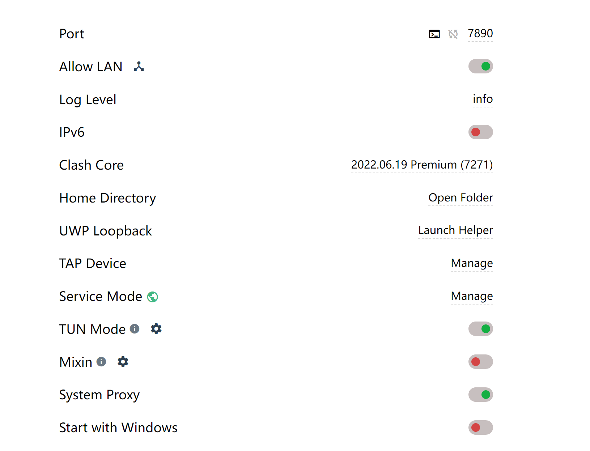

> 之前通过CLI的方式可以使用google Agent，现在google公司推出了一个新的AI IDE，比肩Cursor、Trae等软件，我也是上手一用，但没成想第一个问题就是软件联网

## TUN mode
TUN模式（Tunnel Mode）是一种虚拟网络技术，它在操作系统内核中创建一个虚拟网卡，将所有网络流量（包括TCP和UDP）重定向到用户空间的代理程序进行处理，实现对系统所有应用流量的“全局”捕获和代理。

但使用这个软件的首先拦路虎就是登录软件，我在实验室与家里电脑都安装了一个Antigravity软件，实验室电脑在使用clash开启TUN mode后，可以顺利认证跳转并使用，但家里的电脑就没这么顺利了。

开启TUN mode后，软件依然在尝试直连，最后显示处于offline的状态无法登录，TUNmode无法发挥作用。
## 命令行强制走代理
使用Gemini给我的第一个方案：直接命令行强制antigravity走代理：
```powershell
$env:HTTP_PROXY="http://127.0.0.1:7890" 
$env:HTTPS_PROXY="http://127.0.0.1:7890" 
& "C:\Path\To\Antigravity.exe"
```
但出现了如下`runtime error`的问题
```text
TypeError: fetch failed
    at node:internal/deps/undici/undici:13510:13
    at process.processTicksAndRejections (node:internal/process/task_queues:105:5)
    at async GJe.w (file:///E:/Tools/work/code/Antigravity/resources/app/out/main.js:238:215165)
    at async ben.g (file:///E:/Tools/work/code/Antigravity/resources/app/out/main.js:238:209242)
    at async Timeout.n [as _onTimeout] (file:///E:/Tools/work/code/Antigravity/resources/app/out/main.js:238:209530) {
  [cause]: ConnectTimeoutError: Connect Timeout Error (attempted addresses: 142.250.66.74:443, 142.250.204.42:443, 142.250.196.202:443, 142.250.77.10:443, 142.250.198.74:443, timeout: 10000ms)
      at onConnectTimeout (node:internal/deps/undici/undici:2602:28)
      at Immediate._onImmediate (node:internal/deps/undici/undici:2568:35)
      at process.processImmediate (node:internal/timers:485:21) {
    code: 'UND_ERR_CONNECT_TIMEOUT'
  }
}
[main 2026-01-09T16:03:22.619Z] Failed to fetch NUXes: TypeError: fetch failed
    at node:internal/deps/undici/undici:13510:13
    at process.processTicksAndRejections (node:internal/process/task_queues:105:5)
    at async GJe.w (file:///E:/Tools/work/code/Antigravity/resources/app/out/main.js:238:215165)
    at async ben.g (file:///E:/Tools/work/code/Antigravity/resources/app/out/main.js:238:209242)
    at async Timeout.n [as _onTimeout]
```
gemini指出**报错来源**：`node:internal/deps/undici` 是软件后台主进程的连接出现了问题，之后哈吉米向我建议了一系列骚操作：软件快捷方式的目标添加`--proxy-server="http://127.0.0.1:7890"`；为Antigravity的`settings.json`添加`"http.proxy": "http://127.0.0.1:7890",` 设置`"http.proxyStrictSSL": false` 均没有任何效果，无奈，只能通过知乎网友分享的方案，使用Proxifier强制代理。
## Proxifier
按照文章[^1]的方法，在Proxifier的Servers中添加`HTTPS`类型的代理本地端口，又为antigravity配置了规则，再打开antigravity，输出为
```text
[01.10 01:12:50] antigravity.exe - www.google.com:443 close, 517 bytes sent, 0 bytes received, lifetime <1 sec
[01.10 01:12:50] antigravity.exe - www.google.com:443 close, 517 bytes sent, 0 bytes received, lifetime <1 sec
[01.10 01:13:15] antigravity.exe - play.googleapis.com:443 open through proxy 127.0.0.1:7890 HTTPS
[01.10 01:13:16] antigravity.exe - play.googleapis.com:443 close, 25692 bytes (25.0 KB) sent, 5726 bytes (5.59 KB) received, lifetime <1 sec
[01.10 01:13:16] antigravity.exe - antigravity-auto-updater-974169037036.us-central1.run.app:443 close, 3285 bytes (3.20 KB) sent, 9829 bytes (9.59 KB) received, lifetime <1 sec
[01.10 01:13:16] antigravity.exe - browser.events.data.microsoft.com:443 close, 654138 bytes (638 KB) sent, 9638 bytes (9.41 KB) received, lifetime <1 sec
[01.10 01:13:22] antigravity.exe - www.googleapis.com:443 open through proxy 127.0.0.1:7890 HTTPS
[01.10 01:13:22] antigravity.exe - www.googleapis.com:443 open through proxy 127.0.0.1:7890 HTTPS
[01.10 01:13:22] antigravity.exe - www.googleapis.com:443 open through proxy 127.0.0.1:7890 HTTPS
[01.10 01:13:22] antigravity.exe - www.googleapis.com:443 open through proxy 127.0.0.1:7890 HTTPS
[01.10 01:13:27] antigravity.exe - www.googleapis.com:443 close, 1125 bytes (1.09 KB) sent, 5884 bytes (5.74 KB) received, lifetime <1 sec
[01.10 01:13:27] antigravity.exe - www.googleapis.com:443 close, 1220 bytes (1.19 KB) sent, 7768 bytes (7.58 KB) received, lifetime <1 sec
[01.10 01:13:27] antigravity.exe - www.googleapis.com:443 close, 1364 bytes (1.33 KB) sent, 6944 bytes (6.78 KB) received, lifetime <1 sec
[01.10 01:13:29] antigravity.exe - www.googleapis.com:443 close, 1780 bytes (1.73 KB) sent, 7092 bytes (6.92 KB) received, lifetime <1 sec
```
可以看到`www.google.com`流量为0，通过**Profile** -> **Name Resolution** 取消勾选`Detect DNS settings automatically`并选中`Resolve hostnames through proxy` 可以正常连接（可能这一步不重要）
之后认证时，有输出为
```text
[01.10 01:26:51] antigravity.exe - daily-cloudcode-pa.googleapis.com:443 open through proxy 127.0.0.1:7890 HTTPS
[01.10 01:26:51] antigravity.exe - www.googleapis.com:443 open through proxy 127.0.0.1:7890 HTTPS
[01.10 01:26:51] antigravity.exe - daily-cloudcode-pa.googleapis.com:443 open through proxy 127.0.0.1:7890 HTTPS
[01.10 01:26:51] antigravity.exe - daily-cloudcode-pa.googleapis.com:443 open through proxy 127.0.0.1:7890 HTTPS
[01.10 01:26:56] antigravity.exe - www.googleapis.com:443 close, 1125 bytes (1.09 KB) sent, 6074 bytes (5.93 KB) received, lifetime <1 sec
[01.10 01:26:56] antigravity.exe - daily-cloudcode-pa.googleapis.com:443 close, 1220 bytes (1.19 KB) sent, 7613 bytes (7.43 KB) received, lifetime <1 sec
[01.10 01:26:56] antigravity.exe - daily-cloudcode-pa.googleapis.com:443 close, 1364 bytes (1.33 KB) sent, 6840 bytes (6.67 KB) received, lifetime <1 sec
[01.10 01:26:58] antigravity.exe - daily-cloudcode-pa.googleapis.com:443 close, 1780 bytes (1.73 KB) sent, 7102 bytes (6.93 KB) received, lifetime <1 sec
[01.10 01:27:15] antigravity.exe - oauth2.googleapis.com:443 open through proxy 127.0.0.1:7890 HTTPS
[01.10 01:27:15] antigravity.exe - daily-cloudcode-pa.googleapis.com:443 open through proxy 127.0.0.1:7890 HTTPS
[01.10 01:27:17] antigravity.exe - www.googleapis.com:443 open through proxy 127.0.0.1:7890 HTTPS
[01.10 01:27:17] antigravity.exe - daily-cloudcode-pa.googleapis.com:443 open through proxy 127.0.0.1:7890 HTTPS
[01.10 01:27:17] antigravity.exe - daily-cloudcode-pa.googleapis.com:443 open through proxy 127.0.0.1:7890 HTTPS
[01.10 01:27:20] antigravity.exe - oauth2.googleapis.com:443 close, 957 bytes sent, 7047 bytes (6.88 KB) received, lifetime <1 sec
[01.10 01:27:22] antigravity.exe - daily-cloudcode-pa.googleapis.com:443 close, 2849 bytes (2.78 KB) sent, 8718 bytes (8.51 KB) received, lifetime <1 sec
```
可以看到`oauth2.googleapis.com`可以正常连接，而`daily-cloudcode`也可以正常连接，但依然无法跳转连接，这就很奇怪了。在查看账号归属地没有问题后，gemini建议我检查 Windows Hosts 文件，进入`C:\Windows\System32\drivers\etc\hosts`果然看到`127.0.0.1 localhost`这一行被注释了，导致`localhost`解析失败，之后再次重启antigravity，出现如下报错：
```text
[01.10 01:48:51] antigravity.exe - www.googleapis.com:443 close, 1125 bytes (1.09 KB) sent, 6047 bytes (5.90 KB) received, lifetime <1 sec
[01.10 01:48:51] language_server_windows_x64.exe - antigravity-unleash.goog:443 close, 3237 bytes (3.16 KB) sent, 72861 bytes (71.1 KB) received, lifetime <1 sec
[01.10 01:48:51] antigravity.exe - daily-cloudcode-pa.googleapis.com:443 close, 1220 bytes (1.19 KB) sent, 7605 bytes (7.42 KB) received, lifetime <1 sec
[01.10 01:48:51] antigravity.exe - daily-cloudcode-pa.googleapis.com:443 close, 1364 bytes (1.33 KB) sent, 7031 bytes (6.86 KB) received, lifetime <1 sec
[01.10 01:48:53] antigravity.exe - daily-cloudcode-pa.googleapis.com:443 close, 1780 bytes (1.73 KB) sent, 7170 bytes (7.00 KB) received, lifetime <1 sec
[01.10 01:49:10] language_server_windows_x64.exe (31592) - www.googleapis.com(142.250.196.202):443 error : Could not connect to www.googleapis.com(142.250.196.202):443 - connection attempt failed with error 10060
[01.10 01:49:10] language_server_windows_x64.exe (31592) - daily-cloudcode-pa.googleapis.com(142.250.198.74):443 error : Could not connect to daily-cloudcode-pa.googleapis.com(142.250.198.74):443 - connection attempt failed with error 10060
```
可以看到`antigravity.exe`可以正常走代理，并有数据发送与接收，而`language_server_windows_x64.exe`则使用直连并发送失败，由于规则只添加了antigravity，导致出现了漏网之鱼，按照如下方式添加：

再次运行后可以正常连接：



## TUN mode 修复
之前TUN mode不可用是因为没有为clash安装`Service Mode`，`Service Mode` 本质上是一个安装在 Windows 系统底层的“后台服务” (Windows Service)。没有`Service Mode`，系统的核心网络设置就不会被Clash修改。

安装`Service Mode`后，即可正常在Antigravity中使用代理服务。

[^1]: [Google Antigravity (Gemini 3) 登录卡死、资格不符？熬夜总结的保姆级避坑指南 - 知乎](https://zhuanlan.zhihu.com/p/1975374409305985935) 
