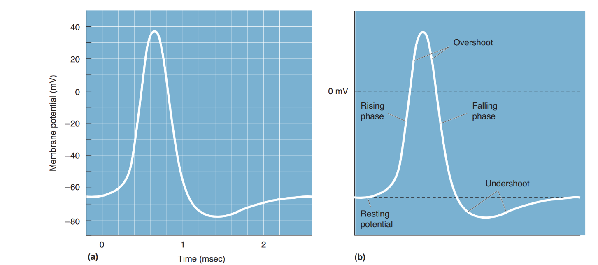
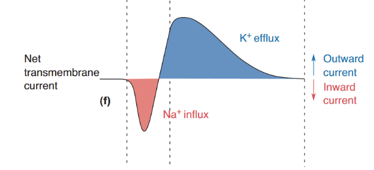
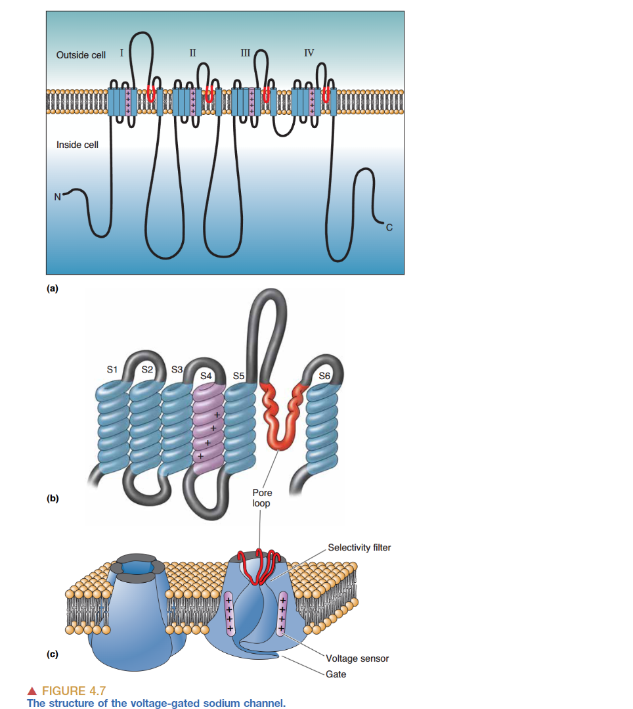
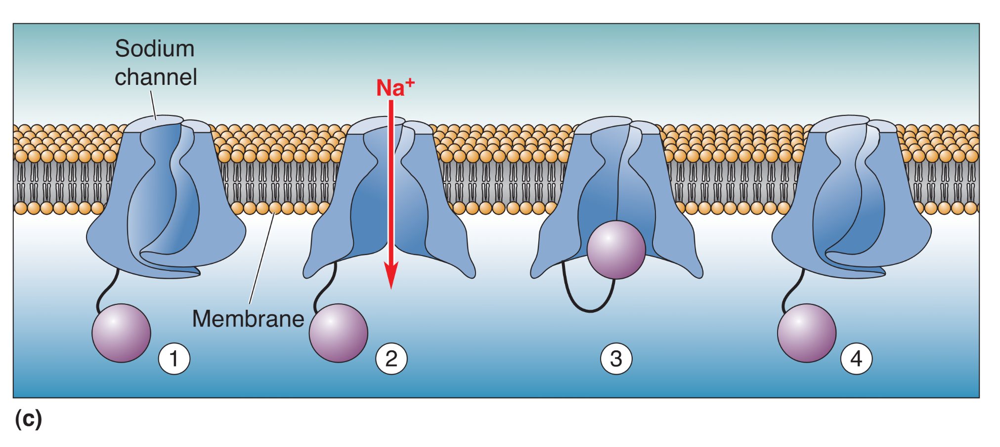
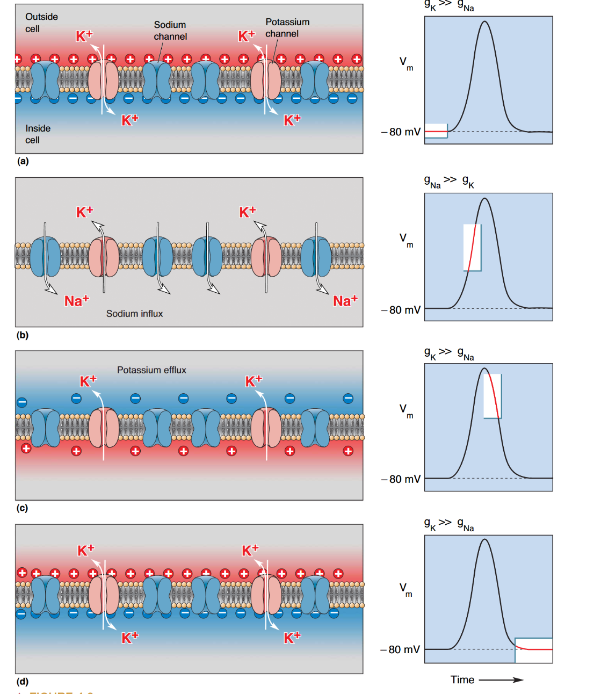
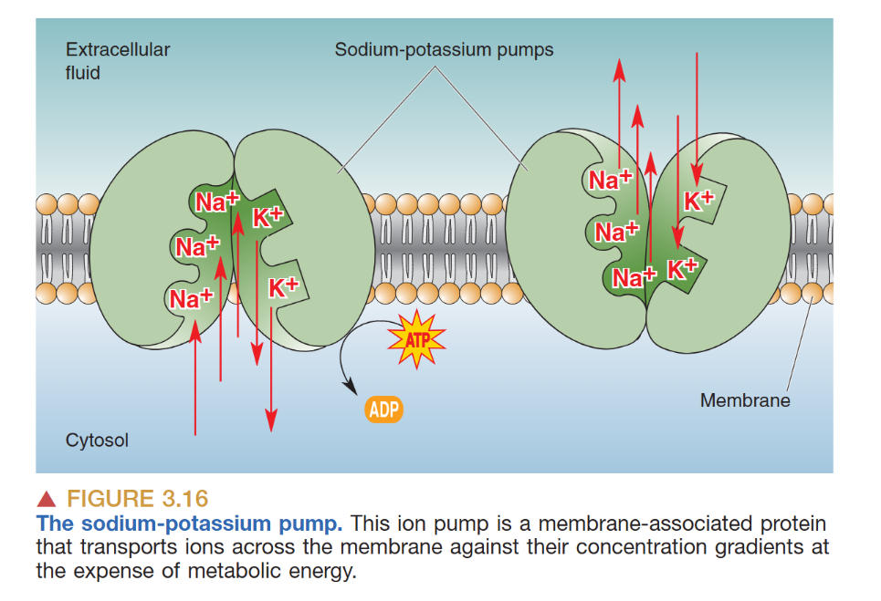
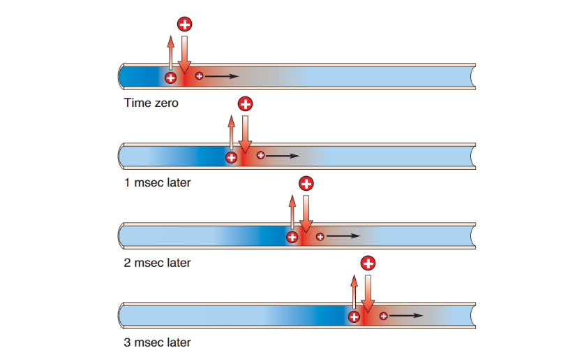
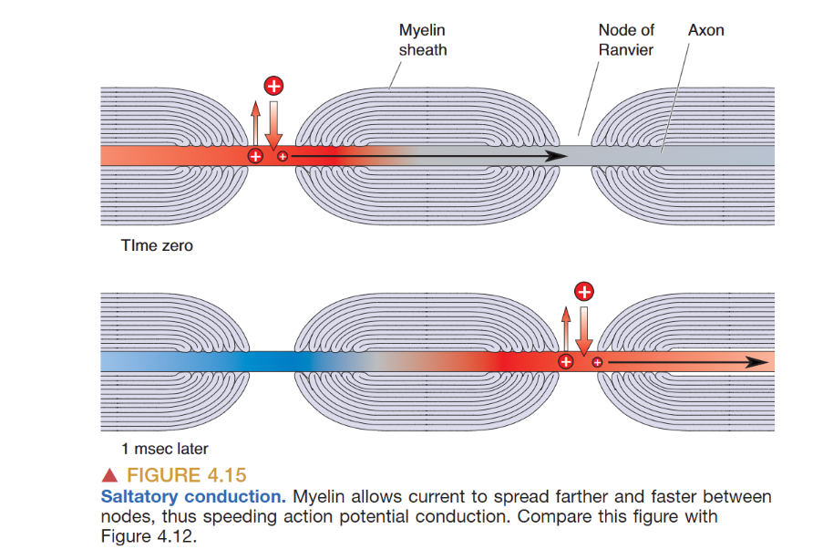
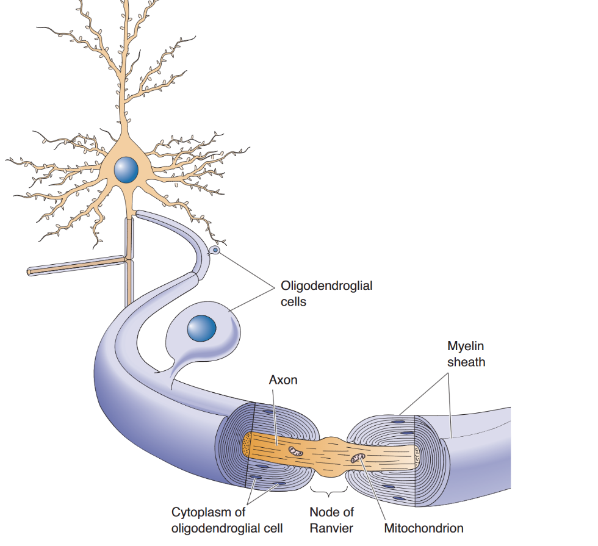

# Action Potential (动作电位)

> 动作电位（Action Potential, AP），亦被称为神经冲动（Nerve Impulse）或发放（Discharge），是神经系统进行远程信息传递的高速公路。它是一种“全或无”（All-or-None）的电信号，其产生过程标志着神经元从静息平衡态向兴奋状态的剧烈转变。

## The Phases of Action Potential (动作电位的时相)

一个典型的动作电位由四个连续的时相组成，生动地体现了膜电位的极速翻转。
- **Rising Phase (上升相)**：当外界刺激使膜电位超过某个临界**阈值 (Threshold)**（通常约为 $-55 mV$）时，电压门控钠通道瞬间大规模开启。$Na^+$ 沿电化学梯度如洪水般涌入胞内，导致膜电位发生剧烈去极化。
- **Overshoot (超射)**：由于钠通道的极高通透性，膜电位不仅跨越零位，甚至会冲向钠离子的平衡电位（约 $+40 mV$），使胞内暂时呈现正电性。
- **Falling Phase (下降相)**：达到峰值后，钠通道迅速关闭并进入失活状态。与此同时，**延迟整流钾通道 (Delayed Rectifier K+ Channels)** 开始发挥作用。$K^+$ 大量外流，驱动膜电位迅速回落，实现复极化。
- **Undershoot (后超极化)**：由于钾通道关闭过程存在时间滞后，膜电位会短暂低于静息水平，向 $K^+$ 的平衡电位靠拢，形成后超极化，随后由钠钾泵恢复至静息稳态。

## Mechanism of Action Potential (发生机制)

### Voltage-Gated Sodium Channel (电压门控钠通道)

钠通道的分子结构决定了其精密的工作逻辑。通道蛋白由四个结构域组成，每个结构域的 **S4 片段** 含有密集分布的带正电氨基酸，充当物理意义上的**电压感受器 (Voltage Sensor)**。当跨膜电压变化时，S4 片段发生位移，牵动 S5 和 S6 片段开启中央孔道。

钠通道具有三个独特的功能状态：**关闭 (Closed)**、**开启 (Open)** 与 **失活 (Inactivated)**。其中失活态受 **"Ball and Chain" (球链模型)** 调控：在通道开启后，蛋白的胞内球状部分会迅速堵塞孔道。这一机制直接导致了**绝对不应期 (Absolute Refractory Period)** 的产生——此时无论刺激多强，失活的通道都无法再次响应。只有当膜电位恢复至负向水平，通道重新进入脱失活（Deinactivated）状态，才能迎接下一次冲动。

药理学工具为揭示这一过程提供了有力证明。**TTX (河豚毒素)** 能精准堵塞钠通道孔道，彻底阻断动作电位。相反，**Batrachotoxin (箭毒蛙毒素)** 会强迫通道提前开启并保持开放，导致神经编码信息的完全崩溃（Scrambling information）。

### Voltage-Gated Potassium Channel (电压门控钾通道)

与钠通道相比，钾通道的响应存在约 $1 ms$ 的延迟，因此被称为“延迟整流器”。这种延迟至关重要：它确保了上升相的 $Na^+$ 流不会被 $K^+$ 外流抵消，从而使动作电位能顺利产生。在下降相中，$K_v$ 通道提供了强大的复极化动力。

### sodium-potassium pump （钠钾泵）
消耗ATP，泵出Na，泵入K

## Conduction principles (传导原理)

动作电位的传导通常遵循**正向传导 (Orthodromic)** 原则，即从胞体向轴突末梢传播。传导速度取决于轴突的**电缆特性 (Cable Properties)**：**轴突直径**越大，内电阻 ($r_i$) 越低，电荷流动越快；而**髓鞘 (Myelination)** 的存在显著增加了膜电阻 ($r_m$) 并减少了电荷流失。

在有髓纤维中，动作电位通过**跳跃式传导 (Saltatory Conduction)** 进行。$Na^+$ 通道高度集中在**朗飞氏结 (Nodes of Ranvier)**，电信号在此处得到“接力”放大。这种机制不仅极大地提升了传导效率，还通过减少跨膜离子流动总量，减轻了钠钾泵的代谢负荷，实现了生物演化上的高能效比。

