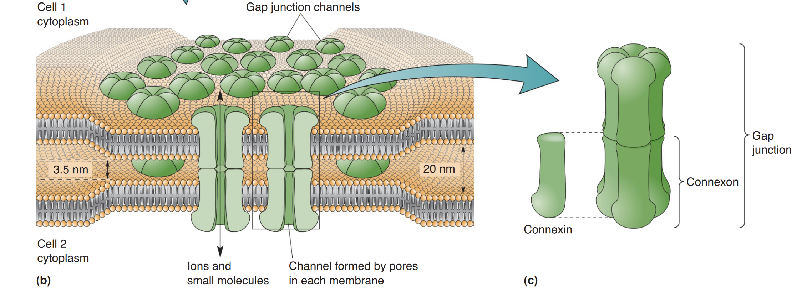
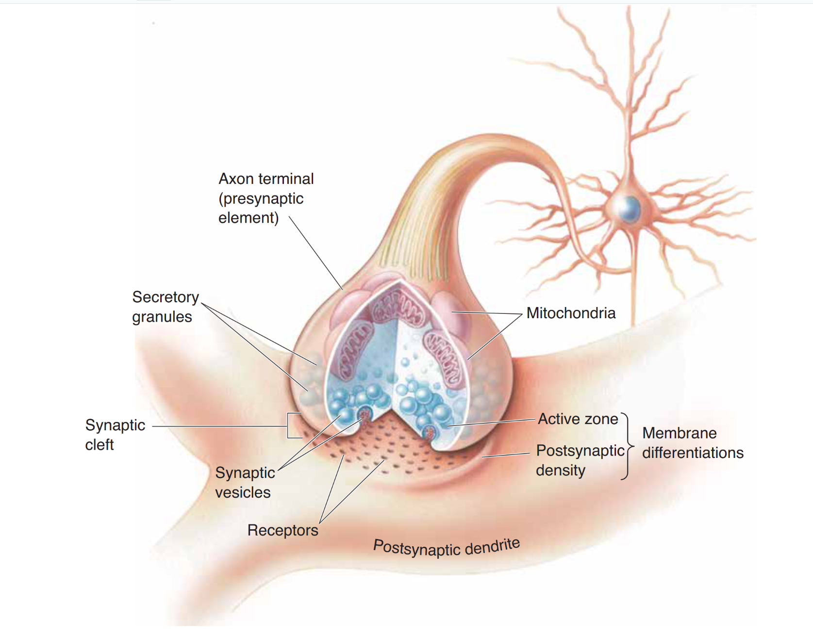
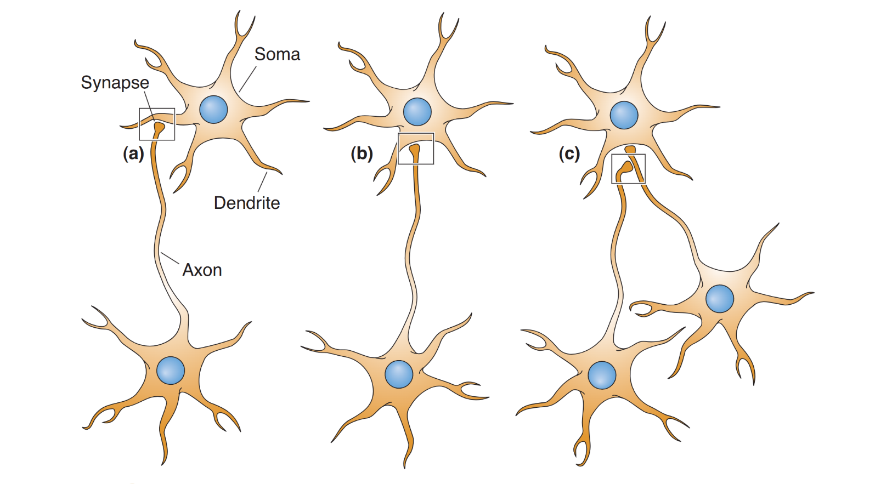
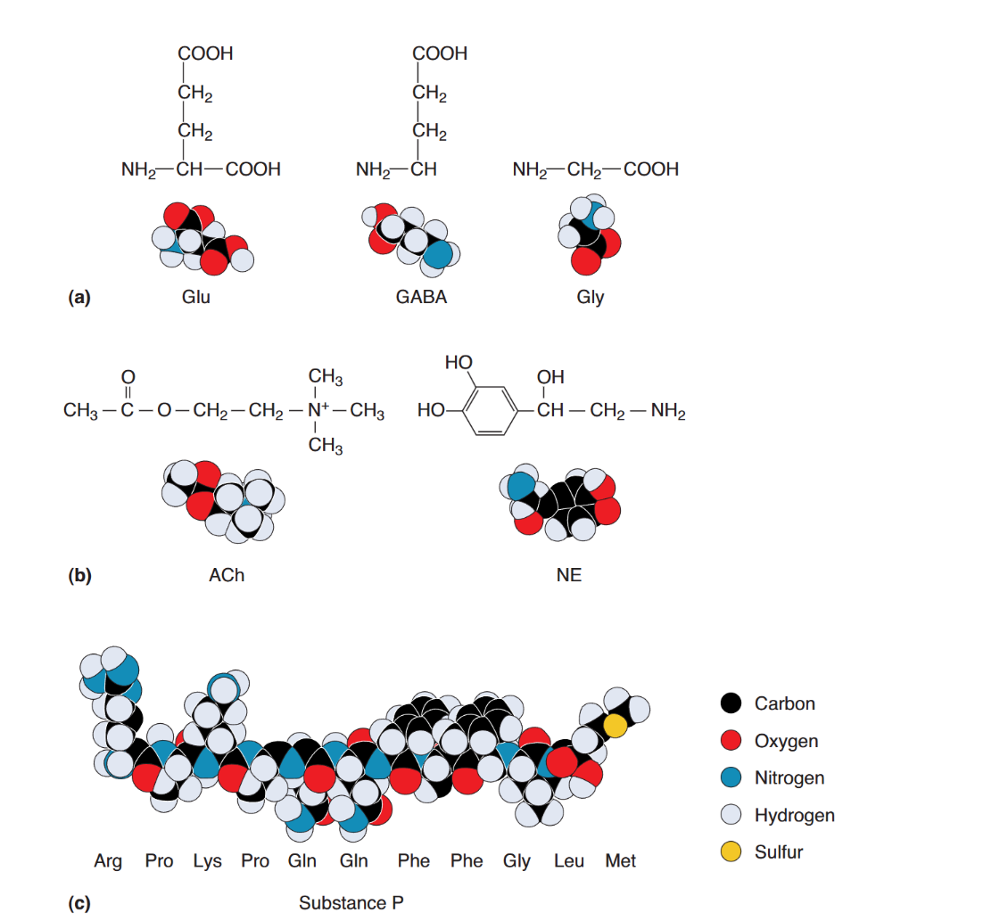
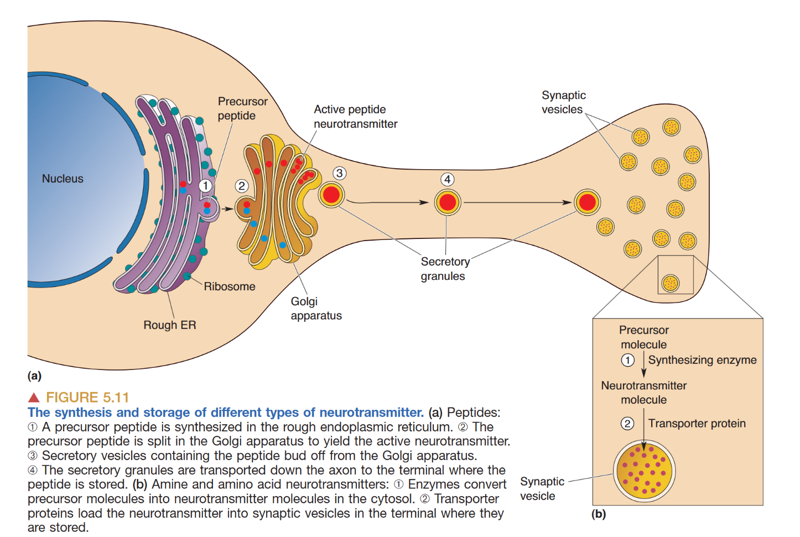
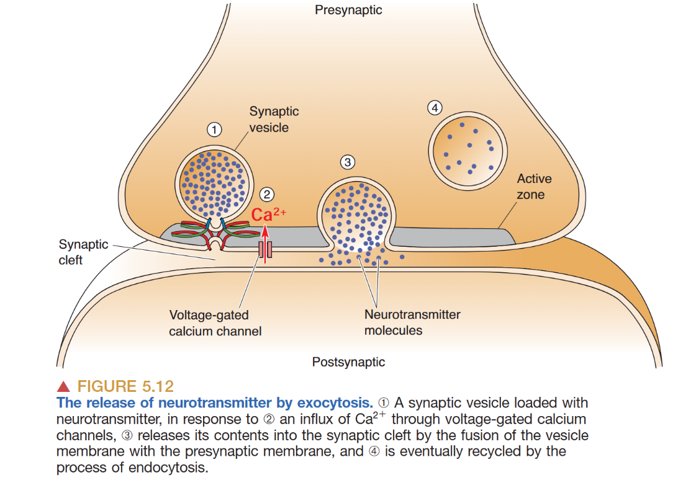
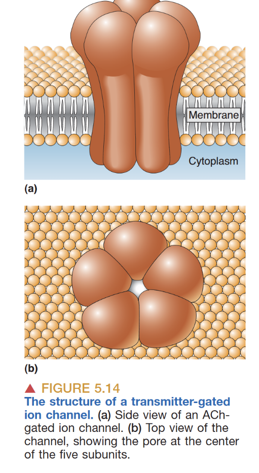
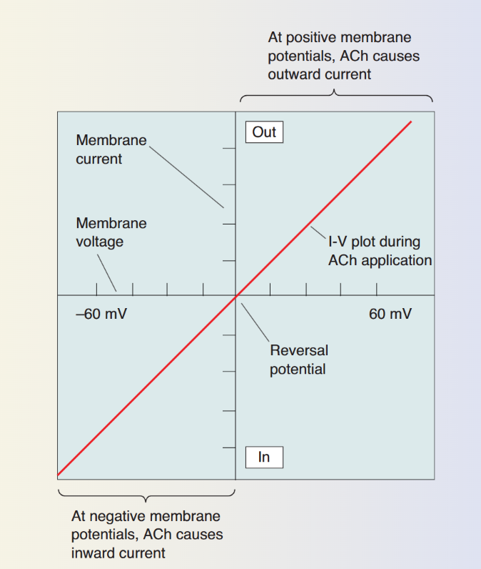
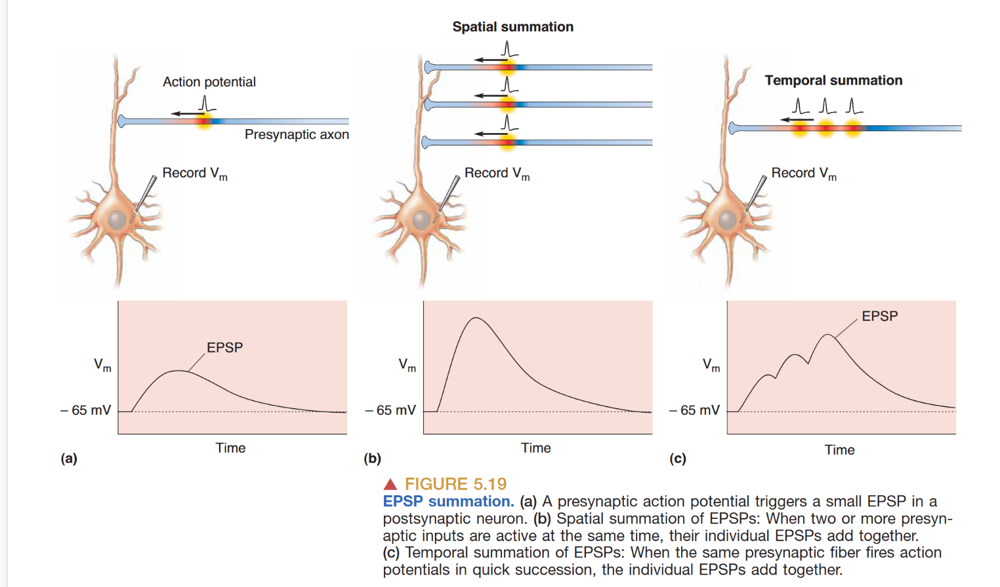
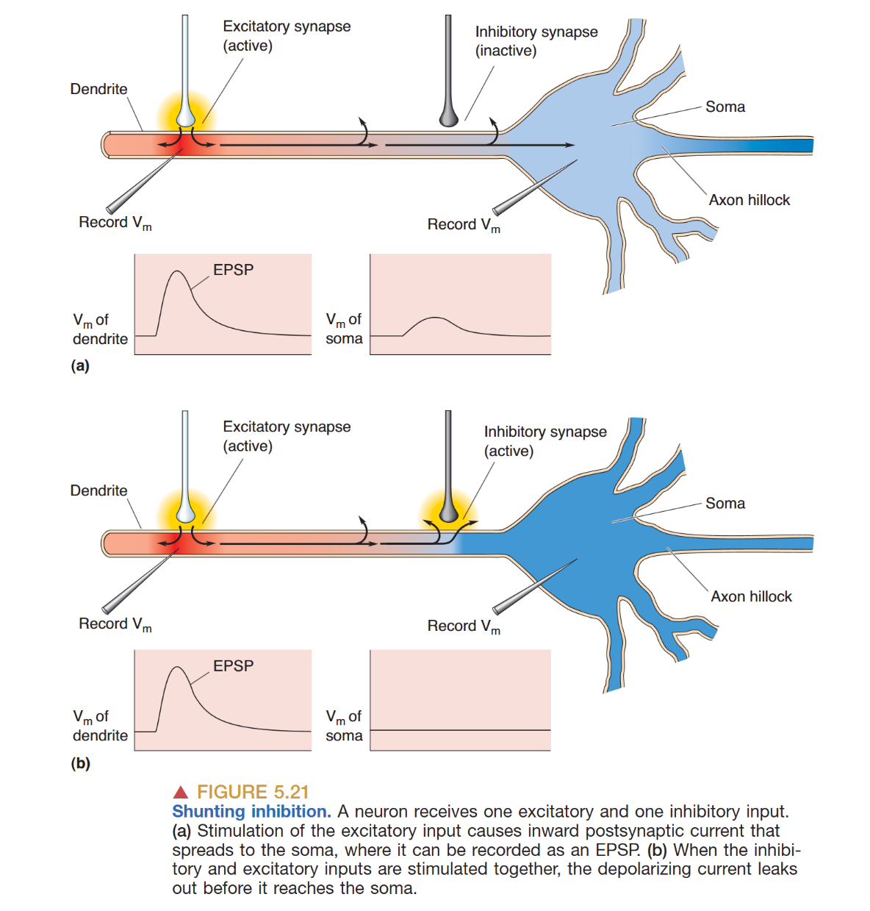

# 突触传递 (Synaptic Transmission)

突触（**Synapses**）是神经系统执行信息传递、整合与处理的核心特化结构。这一学术术语最早由 **Charles Sherrington** 提出，旨在界定神经元之间专门化的物理接触点。**Synaptic Transmission** 描述了生物电信号或化学信号跨越细胞边界，从突触前神经元向突触后细胞（包括其他神经元、肌肉纤维或腺细胞）转移的过程。

在历史探索中，**Otto Loewi** 通过著名的蛙心实验（通过灌流液将受抑制心脏的化学信号转移至第二个心脏）确证了化学分子在突触传递中的载体作用。突触不仅是简单的信号跳转点，更是大脑执行 **Neural Computation（神经计算）** 的微观基石。

## 突触的类型与形态学架构 (Synaptic Types and Morphology)

神经元间的通讯机制主要分为 **Electrical Synapses（电突触）** 与 **Chemical Synapses（化学突触）**，两者在结构与功能特性上存在显著差异。

### 电突触：间隙连接与同步化 (Electrical Synapses)

电突触允许离子电流直接在细胞间流动，其核心结构是 **间隙连接 (gap junction)**。在间隙连接处，相邻细胞膜的间距仅约 **3 nm**。这种结构由对称的 **连接子 (connexons)**（半通道）对接而成，每个连接子包含六个 **连接蛋白 (connexin)** 亚基。这些跨膜孔道的直径约为 **1–2 nm**，足以容纳所有主要的细胞离子（Na⁺, K⁺ 等）及许多小分子有机物。

电突触具有高度的 **双向性 (bidirectional)** 且传递极其 **快速 (fast)**。当前神经元去极化时，离子流会瞬间引导至后神经元，产生微小的 **突触后电位 (PSP)**。虽然单个电突触触发的 PSP 较弱，但一个神经元通常与多个邻近细胞耦合，这对于神经元群体的 **同步化 (synchrony)** 活动至关重要。电突触广泛分布于某些胶质细胞、视网膜、**施旺细胞 (Schwann cells)** 以及具有高度同步要求的神经核团中。

### 化学突触：传递多样性与微细结构 (Chemical Synapses)
化学突触在中枢神经系统（CNS）中占据绝对主导地位。其突触间隙较宽（**20–50 nm**），包含细胞外基质。
- **突触前区域**：富含 **突触囊泡 (Synaptic Vesicles)**（储存氨基酸/胺类递质）和 **分泌颗粒 (Secretory Granules)**。**活性带 (Active Zones)** 是囊泡释放的物理位点，也是膜高度特化的区域。
- **突触后区域**：**突触后致密区 (Postsynaptic Density, PSD)** 积聚了高浓度的受体蛋白，负责将化学信号转译为电位波动或生化级联。

根据解剖位置，化学突触可细分为 **轴树突触 (axodendritic)**、**轴体突触 (axosomatic)**、**轴棘突触 (axospinous)** 及 **树树突触 (dendrodendritic)**。依据 Gray 的显微分类，**Gray’s type I**（非对称突触）具有明显的电子致密后膜，通常介导 **兴奋性** 效应（如 **Glutamate**）；**Gray’s type II**（对称突触）则呈现较薄且均衡的内外膜结构，多涉及 **抑制性** 效应（如 **GABA** 或 **Glycine**）。在 **神经肌肉接头 (NMJ)** 中，后膜进化出高度褶皱的 **运动终板 (motor-end plate)**，以极高密度的乙酰胆碱受体确保运动指令传递的绝对可靠性。

## 神经递质的化学分类、合成与储存 (Neurotransmitter Chemistry)

神经递质在化学构成上主要分为三大类：
1. **氨基酸类 (Amino acids)**：如 **Glu**, **GABA**, **Gly**。它们介导了 CNS 的大部分快速突触传递。
2. **胺类 (Amines)**：如 **乙酰胆碱 (ACh)**（介导 NMJ 与部分的 CNS 快速传递）、**多巴胺 (DA)** 等。
3. **肽类 (Peptides)**：如 **P 物质 (Substance P)**、脑啡肽。它们主要储存于分泌颗粒中，动作缓慢且多具调节作用。

氨基酸与胺类递质在轴突末梢的细胞质中合成，并由特定 **转运体 (transporters)**（如 **VAChT** 处理 ACh，**VMAT** 处理单胺类）泵入囊泡。
肽类递质则在胞体核糖体合成，随后经由 **轴浆运输 (axoplasmic transport)** 输送至末梢，这一过程耗时且不可在局部补充。

## 神经递质释放的定量机制与循环 (Vesicle Cycle)

递质释放是受 Ca²⁺ 驱动的 **胞吐作用 (exocytosis)** 过程。
当动作电位诱导突触前膜去极化，**电压门控钙通道 (voltage-gated calcium channels)** 开启，Ca²⁺ 迅速涌入活性带附近的微域。Ca²⁺ 水平的快速抬升（从 0.2 nM 至约 0.1 mM）是触发膜融合的核心信号。

这一极其快速的过程（枪乌贼中约 **0.2 ms**）涉及精密的蛋白质协作：
- **Docking（停靠）**：囊泡由 **Munc18** 和 **SNARE 蛋白** 定位于活性带。
- **Priming（准备）**：**Munc13** 诱导囊泡进入即时释放状态。
- **Fusion（融合）**：Ca²⁺ 与 **Synaptotagmin**（钙检测器）结合，引发 **v-SNARE** 与 **t-SNARE** 的紧密缠绕，强制膜融合。
- **Recycling（回收）**：释放后的囊泡通过 **内吞作用 (endocytosis)** 予以回收（**Dynamin** 切断膜颈，**Clathrin** 介导包被），并随后由 **V-ATPase** 通过质子泵驱动建立梯度重新充盈。

递质释放具有典型的 **量子化 (Quantized)** 特性，即每个囊泡释放的分子量（如 ACh 约 4000-5000 个）相对固定。无刺激下的散在释放被称为 **微小突触后电位 (miniature PSP)**。

## 受体动力学与效应器系统 (Receptor and Effector Systems)

突触后受体的多选性赋予了神经信号极大的复杂性，主要可区分为：

### 递质门控离子通道 (Ionotropic Receptors)

这类离子型受体由 4-5 个亚基构成，递质结合可令孔道直接开启。
- **EPSP**：对于 Na⁺ 通透的通道（如 **AMPA** 或 **NMDA**）介导兴奋性效应。*注意：NMDA 受体兼具 Ca²⁺ 通透性与电压依赖性的 Mg²⁺ 阻断*。
- **IPSP**：对于 Cl⁻ 通透的通道（如 **GABA_A** 或 **Gly** 受体）介导抑制性效应（$E_{Cl} \approx -65 mV$）。
- **反转电位 (Reversal Potential)**：反转电位是指跨膜净电流为零时的膜电位。作为判断递质属性的关键物理依据。当某种神经递质与其受体结合并打开离子通道时，驱动离子流动的动力是**电化学驱动力**，可以用公式表示为：
$$I_{ion} = g_{ion} (V_m - E_{rev})$$
此处- $I_{ion}$ 是离子电流，$g_{ion}$ 是通道电导，$(V_m - E_{rev})$ 是驱动力。

### G 蛋白偶联受体 (Metabotropic Receptors)
代谢型受体不直接作为通道，而是激活膜内的 **G 蛋白**，继而调控离子通道或激活 **效应器蛋白**（促发 cAMP, IP₃/DAG 等第二信使级联）。这种方式具有更慢的速度、更长的持续时间以及更广的调节灵活性。**自身受体 (Autoreceptors)** 常分布于突触前膜，作为反馈机制调节递质浓度的自稳态。

## 传递的清除与药理学干预 (Clearance and Pharmacology)

为确保信号的时空精度，突触间隙的递质必须迅速移除，其途径包括 **扩散 (diffusion)**、**再摄取 (reuptake)**（由转运体将其拉回神经元或进入胶质细胞）以及 **酶降解 (enzymatic degradation)**（如乙酰胆碱酯酶 **AChE** 对 ACh 的水解）。若递质移除受阻，受体可能会陷入 **脱敏 (desensitization)** 状态。

药理学通过 **拮抗剂 (Antagonists)**（如阻断 ACh 受体的 **箭毒 curare**）或 **激动剂 (Agonists)**（如模拟 ACh 的 **尼古丁 nicotine**）实现对突触效能的直接干预。

## 突触整合的长效原则 (Synaptic Integration)

**突触整合** 是神经元执行神经网络计算的核心环节：
1. **EPSP 总和**：涉及基于输入频率的 **时间总和 (Temporal Summation)** 以及基于不同输入位点的 **空间总和 (Spatial Summation)**。

2. **树突电缆理论 (Cable Properties)**：树突具有被动传导损耗。信号振幅 $V$ 随传播距离 $x$ 指数衰减：$V_x = V_0 / e^{x/\lambda}$，其中 **长度常数 ($\lambda$)** 等于 $\sqrt{R_m / R_i}$。**时间常数 ($\tau$)** 等于 $R_m \times R_i$。增加膜电阻 $R_m$ 可显著提升信号在远距离上的整合精度。
3. **分流抑制 (Shunting Inhibition)**：抑制性轴突若位于兴奋性输入与胞体之间，其开启的 Cl⁻ 流入相当于增加了膜电导，将原本流向胞体的电流“分流”出去，从而构成了有效的计算闸门。

4. **调制作用 (Modulation)**：如去甲肾上腺素（NE）的作用，不产生特定的 PSP 数值，但通过调节钾通道改变 $R_m$ 值，进而动态重塑树突的长度常数（$\lambda$），改变神经元对微弱信号的敏感度。

## 突触传递相关的临床失常 (Disease Relevance)

突触传递的各级失调是多种神经疾病的根源。**重症肌无力** 源于对 AChR 的自身免疫攻击；**癫痫** 多表现为兴奋/抑制（E/I）平衡的系统性崩溃。**阿尔茨海默病** 中淀粉样蛋白对 NMDA 受体及可塑性通路的攻击，直接导致了认知的解体；而 **帕金森病** 则根源于对纹状体突触整合具有核心调制作用的多巴胺能神经元的变性。