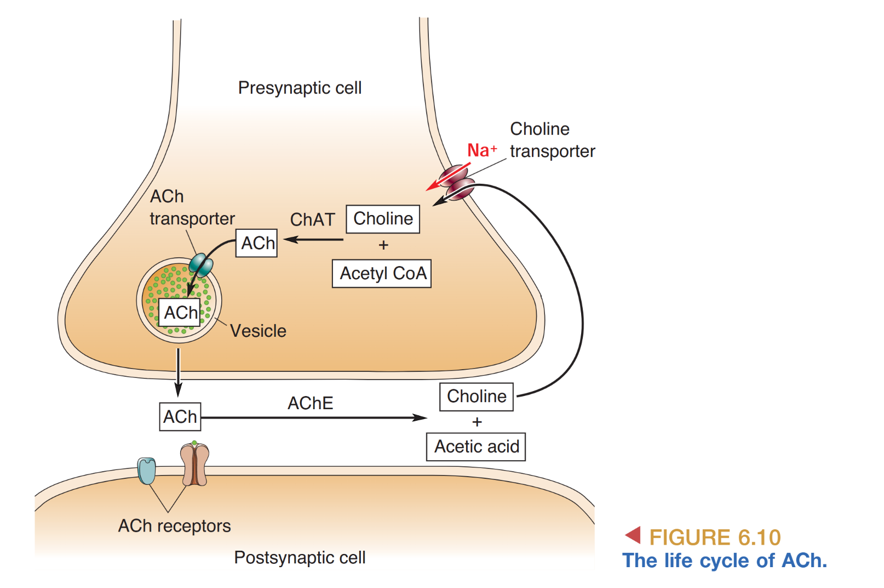
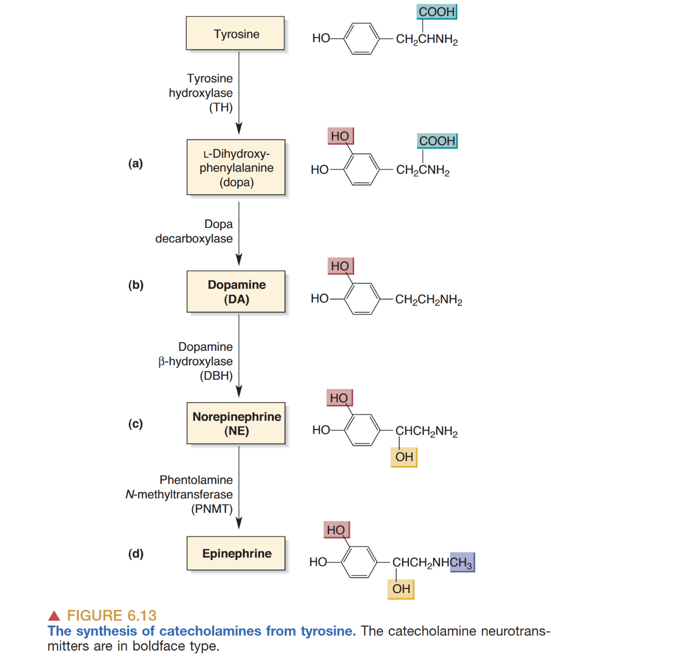
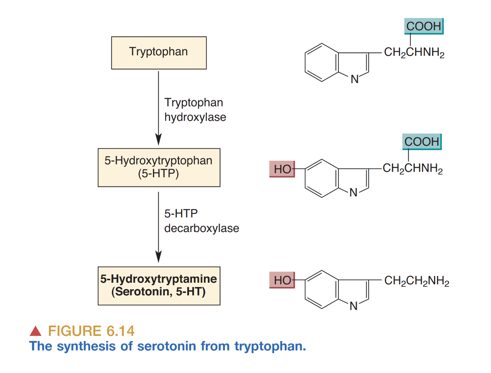
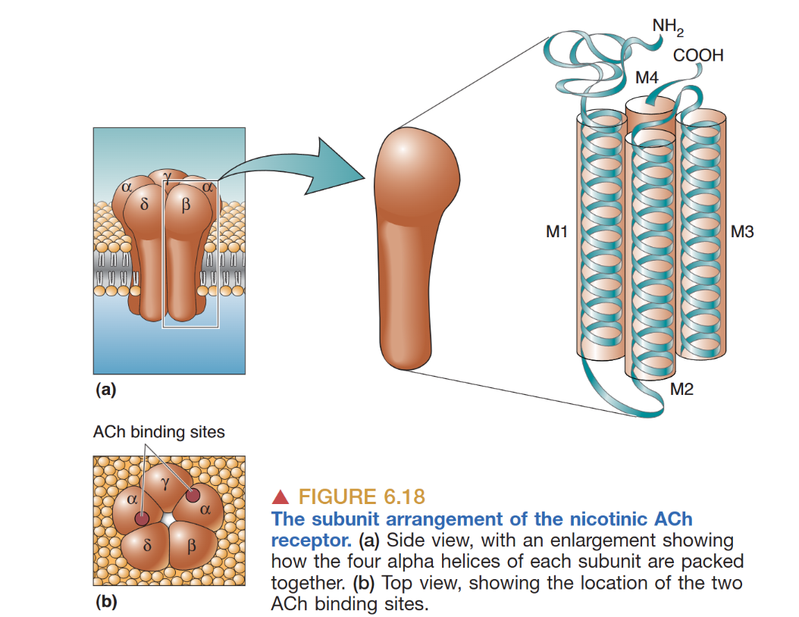
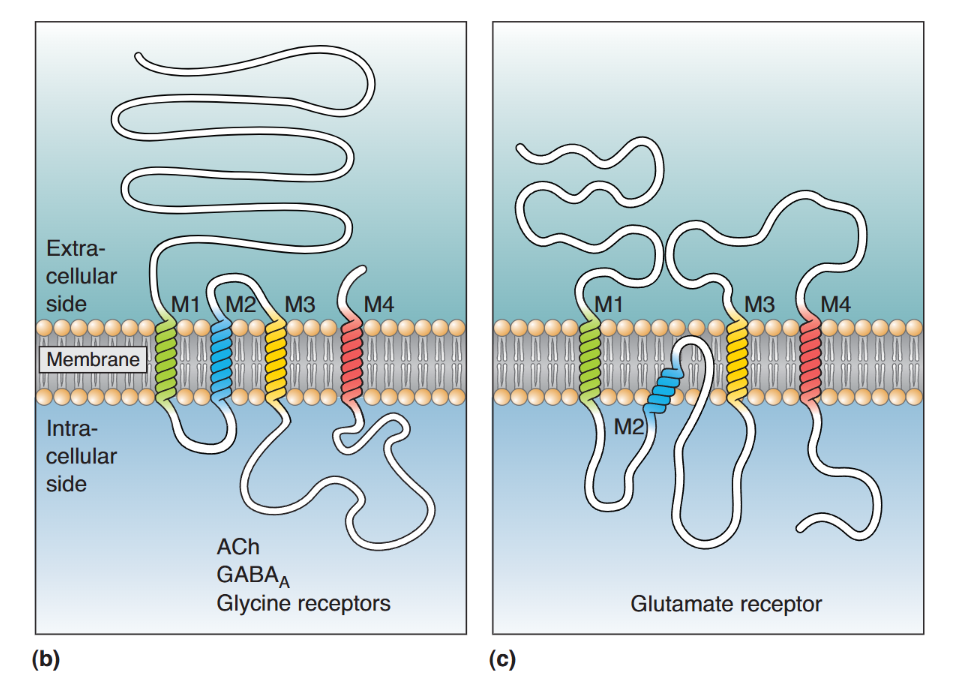
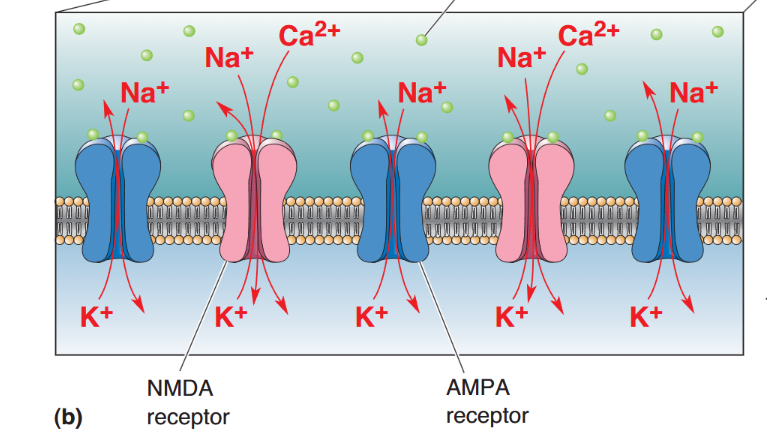
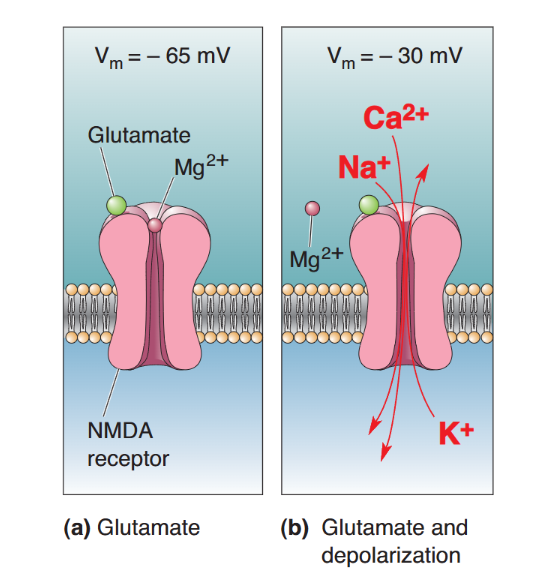
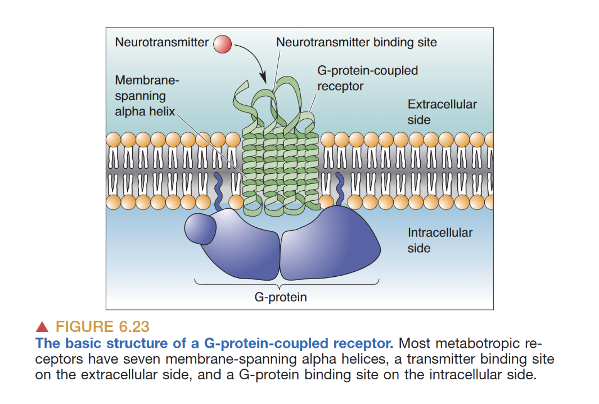
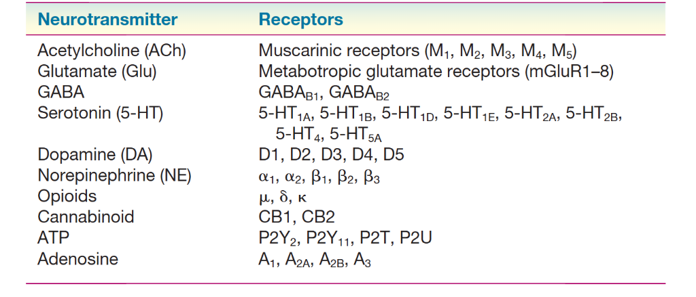
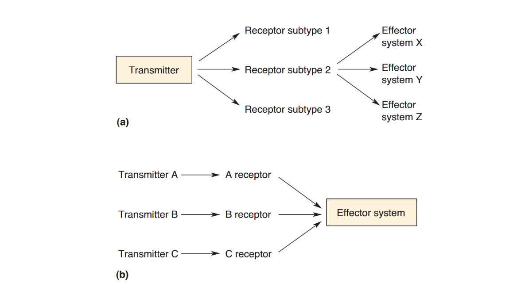

# Neurotransmitter Systems

神经递质系统是脑内化学信号传递的核心，通常根据其释放的特定化学物质，以后缀 "-ergic" 命名（例如 Cholinergic）。这一命名法由英国药理学家 Henry Dale 引入，旨在系统化地描述产生并释放特定神经递质的神经元及其相关的分子机制。

## Criteria for Neurotransmitters and Experimental Strategies

确立一种化学分子作为神经递质，必须严谨地满足三个基本标准。首先，该分子必须在突触前神经元中合成并储存（Synthesized and stored）。为了验证这一点，神经科学家常采用免疫细胞化学（Immunocytochemistry）技术，利用抗体定位递质分子或其特异性合成酶。此外，原位杂交（In Situ Hybridization）技术通过同位素或荧光标记的探针（FISH）检测编码合成酶的 mRNA，从而在转录水平证实神经元的化学性质。

其次，该分子必须在受到刺激时从轴突末梢释放（Released）。在实验环境下，研究者常使用高钾溶液造成去极化，并确保在钙离子存在的情况下观察到分子的释放。最后，外源施加的该分子必须能产生与突触前释放完全一致的突触后反应（Synaptic mimicry）。通过微离子透入法（Microiontophoresis），研究者可以将极微量的递质备选物精准投递至突触后膜，观测其电生理效应是否与天然突触传递相吻合。

在受体研究方面，药理学分析、配体结合法（Ligand-binding methods）以及分子分析（Molecular analysis）是三大核心工具。值得注意的是，虽然一个神经元通常只释放一种主要的小分子递质（即 Dale's Principle），但许多含肽神经元违反了这一原则，它们会同时释放氨基酸/胺类与肽类物质，这种现象被称为递质共存（Co-transmitters）。

## The Chemistry of Neurotransmitter Systems

### Cholinergic System (ACh)
乙酰胆碱（Acetylcholine）是第一种被确认的神经递质。胆碱乙酰转移酶（ChAT）是其合成的核心酶，也是胆碱能神经元的特异性标志物。ACh 的合成发生在轴突末梢的胞浆中，由 Acetyl CoA 与胆碱（Choline）在 ChAT 的催化下结合而成。由于神经元无法自行合成胆碱，必须从细胞外液（主要来源于饮食）中摄取，因此胆碱的重摄取过程（Choline uptake）成为了 ACh 合成的限速步骤（Rate-limiting step）。ACh 被释放后，由位于突触间隙的乙酰胆碱酯酶（AChE）迅速降解。AChE 是许多神经毒气（如沙林）和有机磷农药的攻击靶点，抑制该酶会导致 ACh 堆积，引发神经肌肉接头的持续去极化。

[[../../99_Meta/Attachments/SavedPictures/Acetylcholine.png]]

### Catecholaminergic System (DA, NE, E)
儿茶酚胺类递质包括多巴胺（Dopamine, DA）、去甲肾上腺素（Norepinephrine, NE）和肾上腺素（Epinephrine, E），它们均具有共同的儿茶酚（Catechol）结构。这一系统的合成起始于酪氨酸（Tyrosine），由酪氨酸羟基化酶（TH）调节。TH 的活性受终产物抑制（Negative feedback）和 $Ca^{2+}$ 浓度的精密调控，是整个代谢路径的限速门槛。随后的转化路径表现为：Tyrosine → Dopa → DA → NE → E。其中，DBH 存在于突触囊泡内，而 PNMT 则位于胞质中。与 ACh 不同，儿茶酚胺通常没有快速降解酶，其作用的终止主要通过 $Na^+$ 依赖的转运体进行重摄取（Reuptake）。可卡因和苯丙胺等药物能够阻断这一过程，从而延长递质在间隙中的作用时间。

### Serotonergic and Amino Acidergic Systems
血清素（5-HT）系统源自必需氨基酸——色氨酸（Tryptophan），在调节情绪、睡眠和情感行为中扮演关键角色。其清除机制同样依赖重摄取，这类转运体是氟西汀等 SSRI 类抗抑郁药的作用靶点。

在氨基酸递质中，谷氨酸（Glutamate）负责绝大部分的兴奋性传递，而 GABA（由谷氨酸经 GAD 脱羧产生）和甘氨酸（Glycine）则介导抑制作用。此外，ATP 作为嘌呤类递质常与经典递质共存释放，而内源性大麻素（Endocannabinoids）则是独特的逆行信使（Retrograde messengers），它们从突触后释放，作用于突触前膜的受体，以降噪或反馈调节递质释放。

## Architecture of Neurotransmitter Receptors

### Transmitter-Gated Channels
传送门控离子通道（Transmitter-gated ion channels）通过其复杂的亚基组合实现多样化的生理功能。著名的烟碱型 ACh 受体（nAChR）是一个五聚体（Pentamer），通常由两分子 ACh 结合至其 $\alpha$ 亚基来引发通道开放，通透 $Na^+$ 和 $K^+$。与之类似，GABA$_A$ 和甘氨酸受体也是五聚体，但它们调控的是 $Cl^-$ 通流。

谷氨酸受体（AMPA, NMDA, KA）则表现出不同的结构特征，通常为四聚体（Tetramers）。AMPA 受体介导快速的兴奋性电流。NMDA 受体因其独特的电压依赖性 $Mg^{2+}$ Block 机制而备受关注：在静息电位下，镁离子堵塞孔道，只有当细胞膜显著去极化时，镁离子才被驱逐。更关键的是，NMDA 受体对 $Ca^{2+}$ 具有高通透性，$Ca^{2+}$ 的内流被认为是触发生长时程增强（LTP）及学习记忆分子机制的触发因子。

### G-Protein-Coupled Receptors (GPCRs)
GPCRs 具有典型的 7 次跨膜螺旋结构（7TM），通过激活与其偶联的 G 蛋白发挥作用。其信号传递路径分为两类：一是快捷路径（Shortcut pathway），即 G 蛋白直接作用于离子通道（如心肌中的 M 型 ACh 受体）；二是第二信使级联反应（Second messenger cascades），涉及如 cAMP 或 IP3/DAG 等分子的合成。这种级联反应虽然时程较长，但具备强大的信号放大效应（Signal Amplification），能够让微弱的多样化刺激引发深远的细胞代谢变化。

## Divergence and Convergence
神经递质系统通过发散（Divergence）和会聚（Convergence）展现了信号处理的高度灵活性。发散是指一种递质可以激活多种受体亚型，从而在不同组织或状态下产生截然不同的生物学效应；而会聚则是指多种递质通过不同的受体通路作用于同一个效应系统（例如共同调节某一特定的离子通道）。这种复杂的交互网络确保了神经系统在处理复杂信息时既具特异性又不失整合能力。
