# Brain Structure
> 哺乳动物的大脑虽然形态各异，而在神经系统的组织结构上共享一些普遍特征。理解这些宏观和微观结构是深入研究神经功能的基础。

## Anatomical References (解剖学术语)
为了精确描述大脑结构的位置，我们需要一套标准的参照坐标系：
-   **Anterior / Rostral (前/吻侧)**: 指向鼻子/面部的方向。
-   **Posterior / Caudal (后/尾侧)**: 指向尾部的方向（对于直立的人类，指向脑后）。
-   **Dorsal (背侧)**: 指向背部/头顶的方向。
-   **Ventral (腹侧)**: 指向腹部/下巴的方向。
-   **Medial (内侧)**: 靠近中线。
-   **Lateral (外侧)**: 远离中线。
-   **Ipsilateral (同侧)** & **Contralateral (对侧)**: 描述两个结构是否位于身体的同一侧。
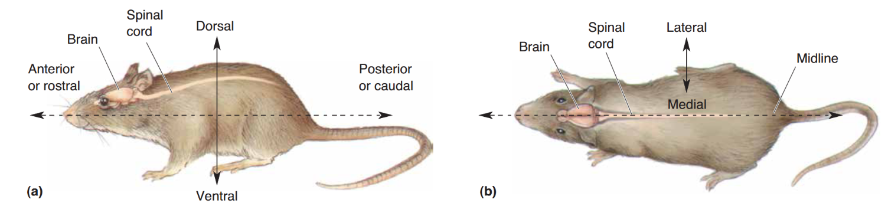
### Planes of Section (切面)
-   **Sagittal (矢状面)**: 将脑分为左右两半。正中矢状面（Midsagittal）将脑均分为左右半球。
-   **Horizontal (水平面)**: 平行于地面，将脑分为上下两部分。
-   **Coronal (冠状面)**: 平行于面部，将脑分为前后两部分。
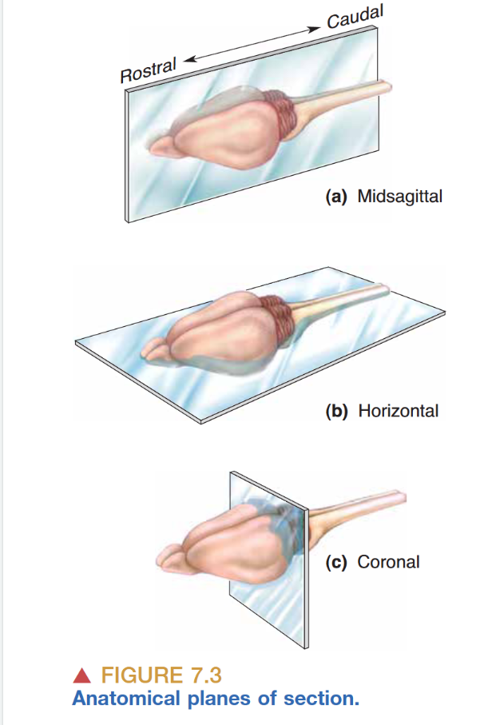
## Central Nervous System (CNS)
**CNS** 包含 **Brain** (脑) 和 **Spinal Cord** (脊髓)。

### The Brain
大脑主要由三部分组成：
1.  **Cerebrum (大脑)**:
    -   体积最大，分为左右两个半球 (**Cerebral Hemispheres**)。
    -   被 **Sagittal Fissure** (大脑纵裂) 分开。
    -   **功能侧化**: 右脑接收左侧身体感觉并控制左侧运动；左脑接收右侧身体感觉并控制右侧运动（对侧控制）。
2.  **Cerebellum (小脑)**:
    -   位于大脑后方，包含大量神经元（数量甚至超过大脑）。
    -   主要负责运动控制中心。
    -   **同侧控制**: 左侧小脑控制左侧身体运动。
3.  **Brain Stem (脑干)**:
    -   连接大脑、小脑和脊髓的柄状结构。
    -   生命中枢：调节呼吸、意识、体温等基本生命活动。是最原始的脑区。
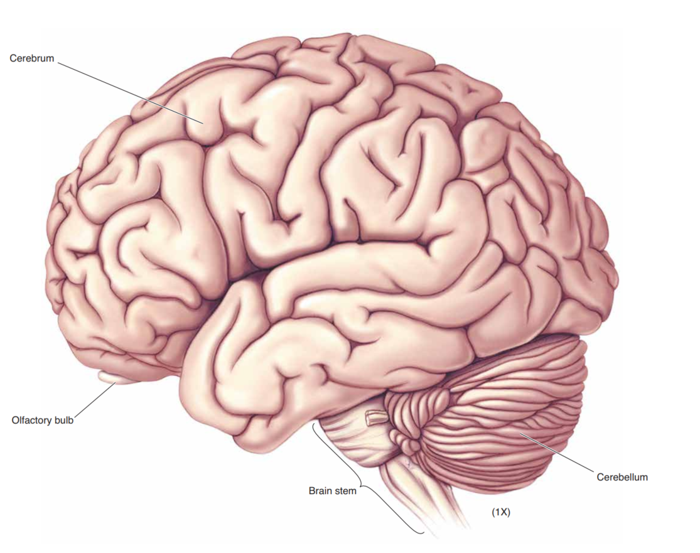
### The Spinal Cord
-   连接脑干，被脊柱保护。
-   通过 **Spinal Nerves** (脊神经) 与身体相连。
    -   **Dorsal Root (背根)**: 携带传入的感觉信息（Sensory afferents）。背根神经节 (**Dorsal Root Ganglia**) 包含感觉神经元胞体，位于脊髓外。
    -   **Ventral Root (腹根)**: 携带传出的运动信息（Motor efferents）。胞体位于脊髓灰质内。

## Peripheral Nervous System (PNS)
除 CNS 以外的所有神经系统部分。
-   **Somatic PNS (躯体神经系统)**: 支配皮肤、关节和骨骼肌（随意运动）。
-   **Visceral PNS (内脏神经系统/ANS)**: 支配内脏、血管和腺体（非随意运动）。包含交感和副交感神经系统。

> [!note] Cranial Nerves (脑神经)
> 12对从脑干发出的神经，主要支配头部。
> 一嗅二视三动眼，四滑五叉六外展，七面八庭九舌咽，十迷副神舌下全。

## Support Systems
### Meninges (脑膜)
CNS 被三层膜结构包裹保护：
1.  **Dura mater (硬脑膜)**: 最外层，皮革样坚韧。
2.  **Arachnoid membrane (蛛网膜)**: 中间层，像蜘蛛网一样疏松。
    -   **Subarachnoid space (蛛网膜下腔)**: 充满脑脊液 (CSF) 和血管。
3.  **Pia mater (软脑膜)**: 最内层，紧贴脑表面，富含血管。

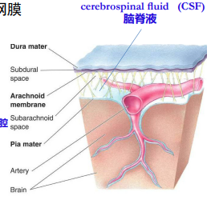

### Ventricular System (脑室系统)
-   脑内部充满 **Cerebrospinal Fluid (CSF)** 的腔隙和管道。
-   **CSF 循环**: 由脉络丛 (**Choroid plexus**) 分泌 -> 脑室 -> 蛛网膜下腔 -> 蛛网膜颗粒 -> 进入血液循环。
-   **Hydrocephalus (脑积水)**: CSF 循环受阻导致脑室扩张，压迫脑组织。

## Development of the CNS
> 理解神经解剖最好的方式是回顾其发育过程。整个 CNS 均起源于胚胎期的 **Neural Tube** (神经管)。

### Formation of the Neural Tube
1.  **Neural Plate (神经板)**: 胚胎外胚层增厚形成。
2.  **Neural Groove (神经沟)**: 神经板下陷形成。
3.  **Neural Tube (神经管)**: 神经沟闭合形成。
    -   管壁发育成 CNS 组织。
    -   管腔发育成脑室系统。
    -   **Neural Crest (神经嵴)**: 神经管两侧的细胞分离出来，发育成 PNS 的神经节。
    -   **Folic Acid (叶酸)**: 对神经管闭合至关重要，缺乏可导致脊柱裂或无脑儿。
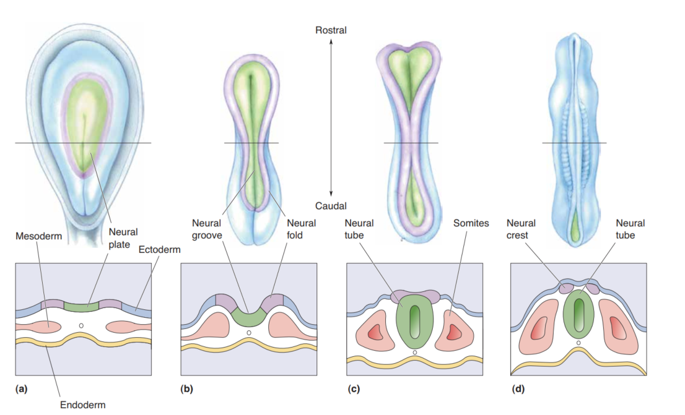
### Three Primary Brain Vesicles
神经管头端分化为三个初级脑泡：
1.  **Prosencephalon (Forebrain, 前脑)**
    -   分化为 **Telencephalon (端脑)** -> 大脑皮层、基底节、嗅球。
    -   分化为 **Diencephalon (间脑)** -> 丘脑 (Thalamus)、下丘脑 (Hypothalamus)。
    -   **Optic Vesicles**: 发育成视神经和视网膜（视网膜属于 CNS）。
2.  **Mesencephalon (Midbrain, 中脑)**
    -   **Tectum (顶盖)**: 包含上丘（视觉反射）和下丘（听觉中继）。
    -   **Tegmentum (被盖)**: 包含红核、黑质（运动控制）。
    -   **Cerebral Aqueduct**: 连接第三和第四脑室。
3.  **Rhombencephalon (Hindbrain, 后脑)**
    -   分化为 **Metencephalon**: 发育为 **Pons (脑桥)** 和 **Cerebellum (小脑)**。
    -   分化为 **Myelencephalon**: 发育为 **Medulla Oblongata (延髓)**（含有锥体束交叉）。
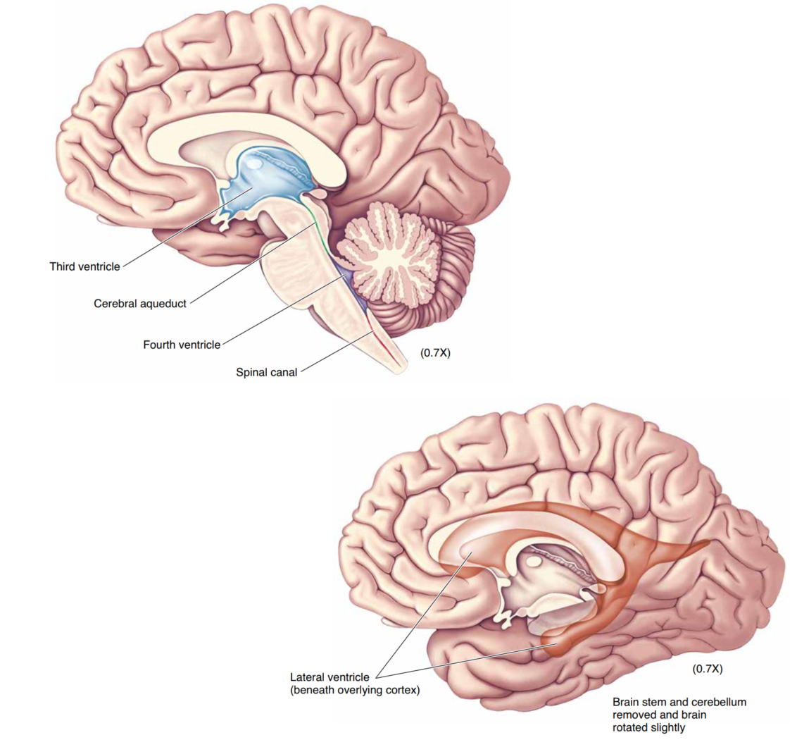
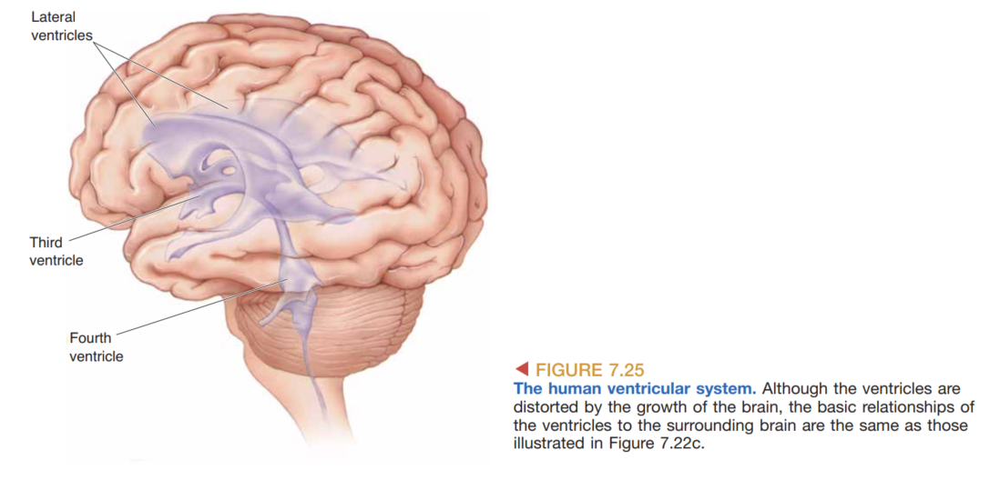
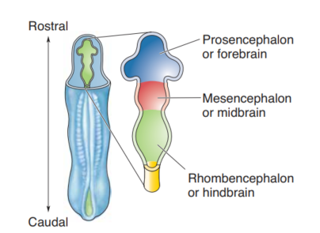

## Cerebral Cortex (大脑皮层)
哺乳动物大脑最显著的特征是其表面折叠的皮层结构。
-   **Sulcus (沟)**: 凹陷部分。如 Central Sulcus (中央沟)。
-   **Gyrus (回)**: 隆起部分。如 Precentral Gyrus (中央前回)。
-   **Lobe (叶)**:
    -   **Frontal Lobe (额叶)**: 运动、执行功能。
    -   **Parietal Lobe (顶叶)**: 躯体感觉。
    -   **Temporal Lobe (颞叶)**: 听觉、记忆。
    -   **Occipital Lobe (枕叶)**: 视觉。
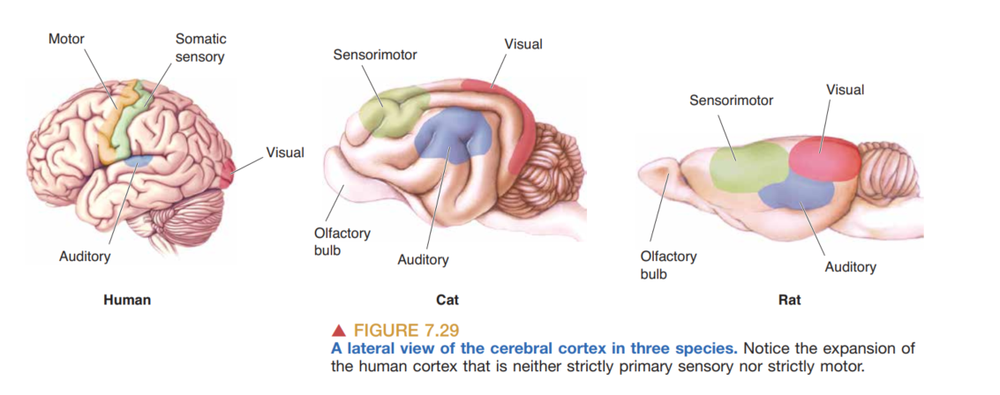
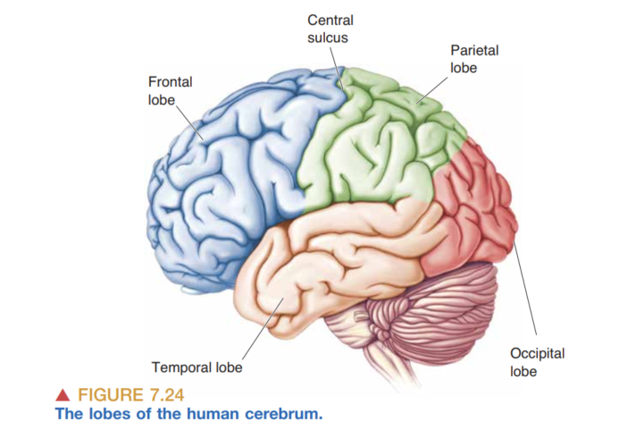
### Cytoarchitecture (细胞构筑)
-   **Neocortex (新皮层)**: 哺乳动物特有，通常有6层结构 (**Brodmann Area** 基于此划分)。
-   **Hippocampus (海马)**: 只有3层结构，与记忆有关。
-   **Olfactory Cortex (嗅皮层)**: 与嗅球直接相连。

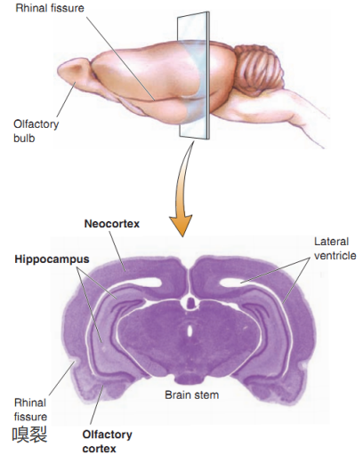
## Human Brain
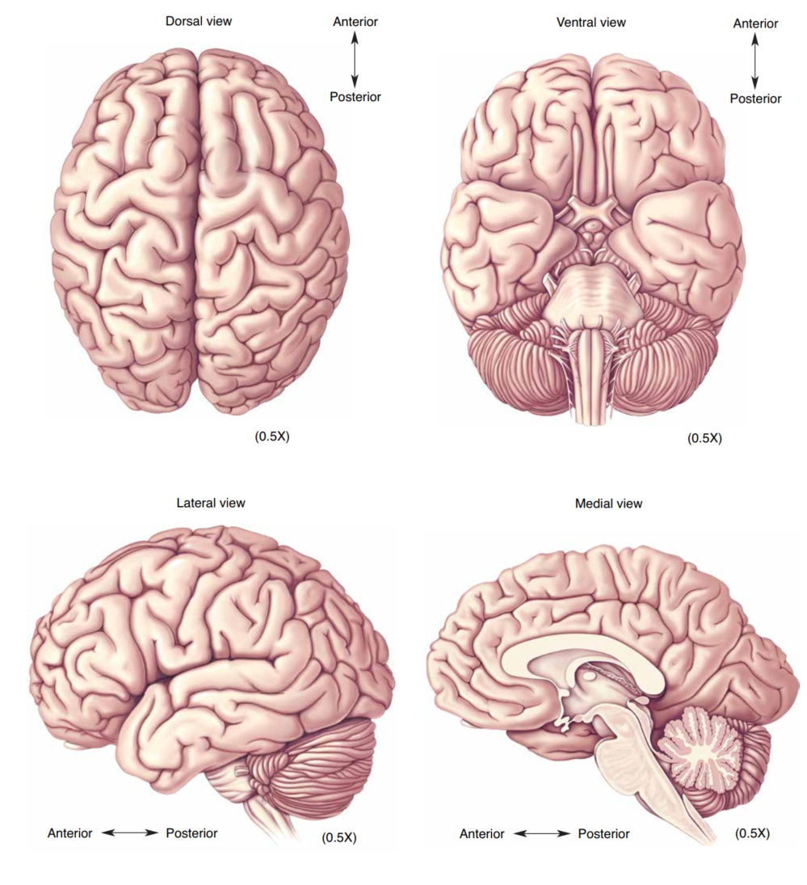
主要的感觉运动以及关联区域：
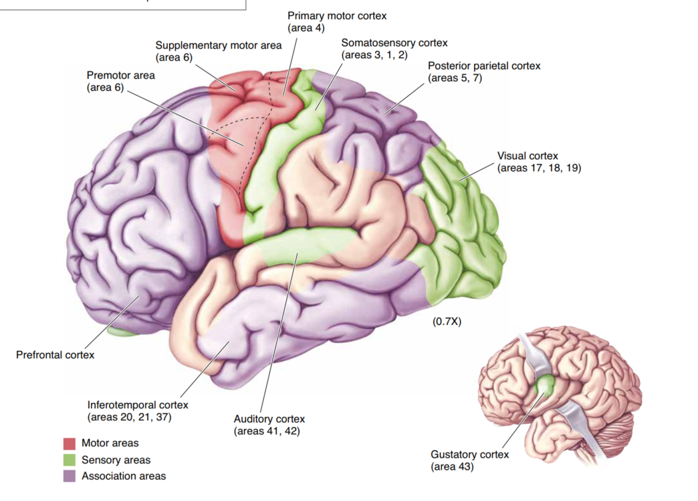

脑干结构：脑干包括中脑 脑桥和延髓

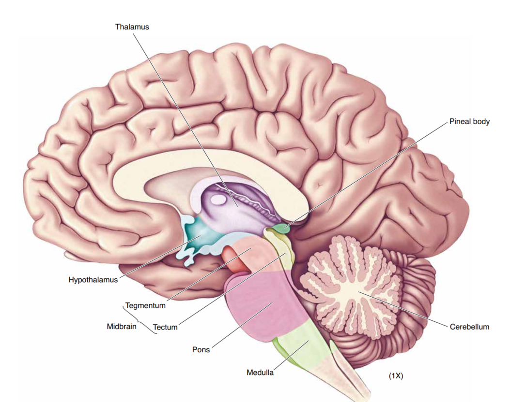