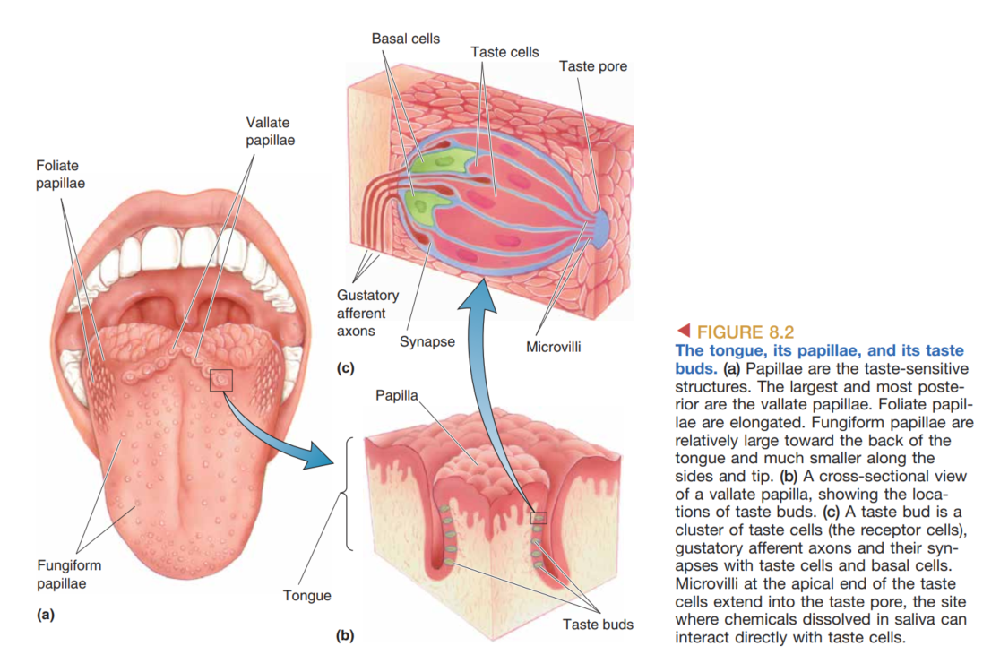
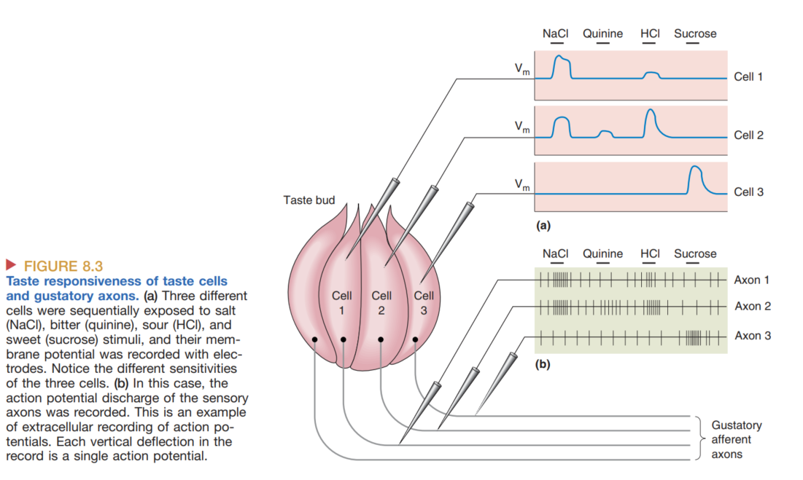
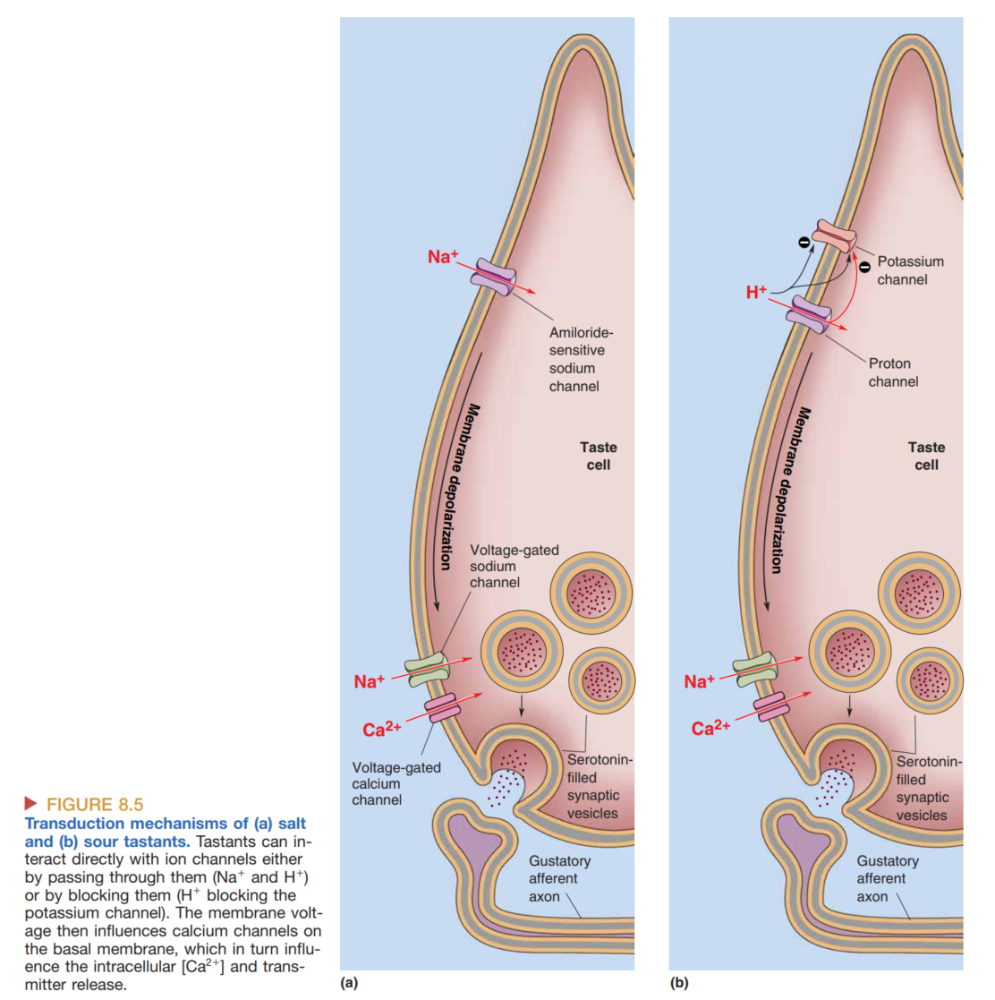
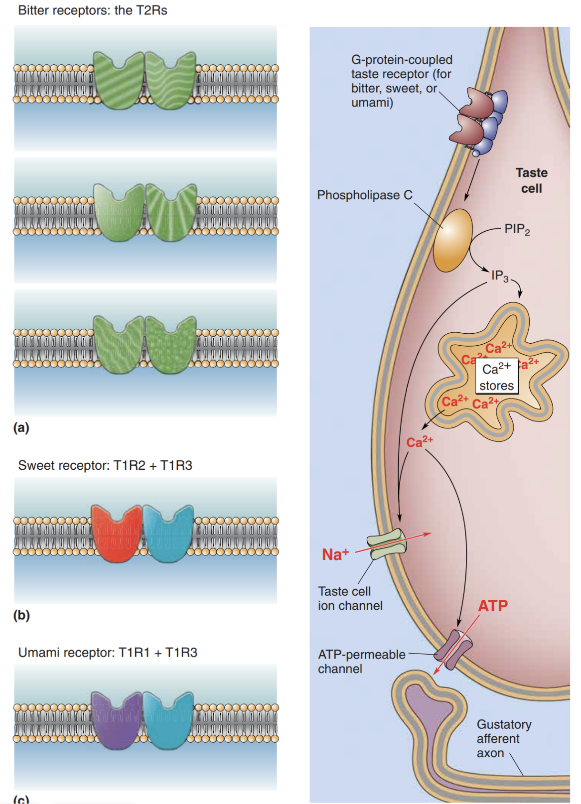
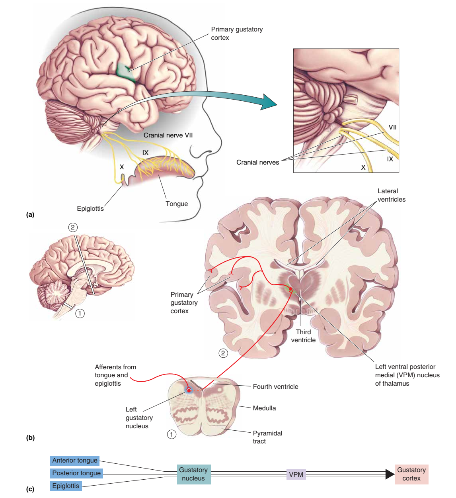
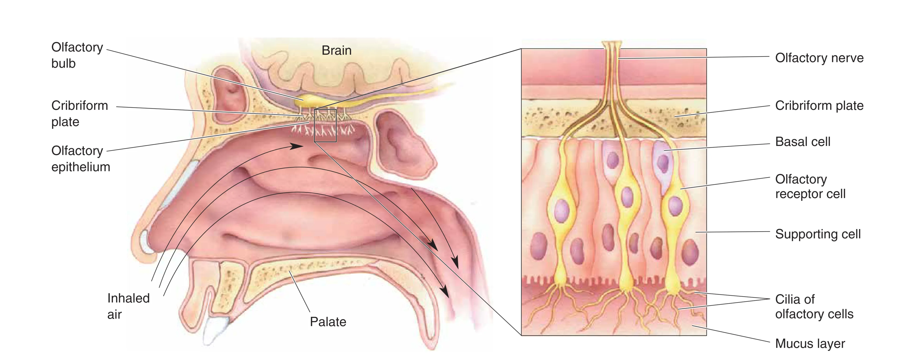
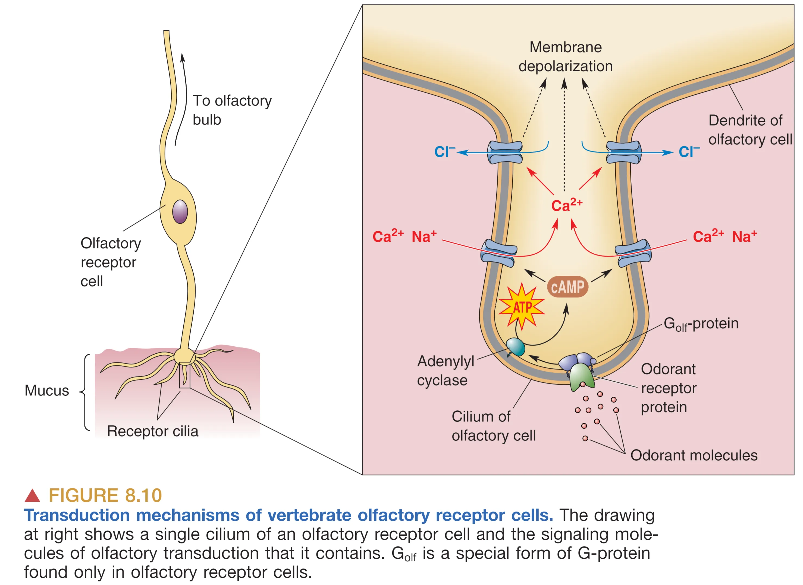
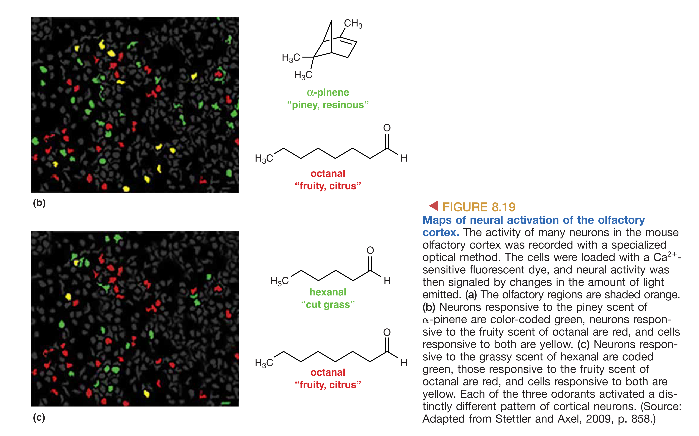
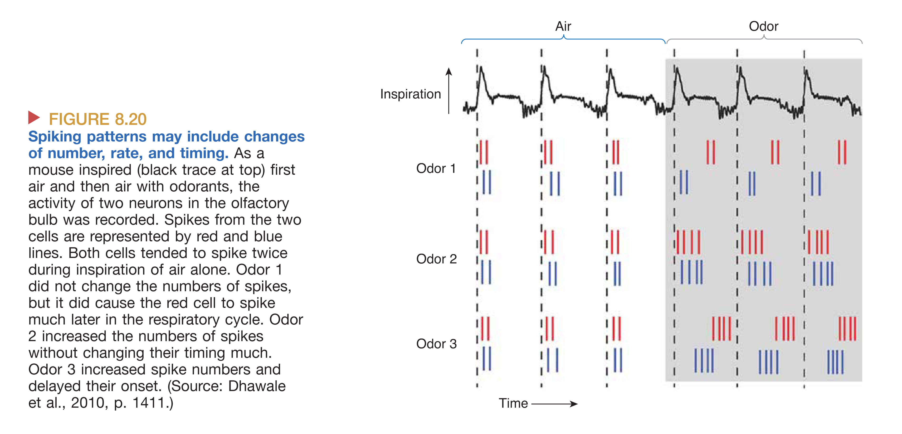

# The Chemical Senses: Gustation and Olfaction

我们的化学感官——**Gustation (味觉)** 和 **Olfaction (嗅觉)**——是进化上最古老的感觉系统。它们的最基本任务是探测环境中的化学物质，这对于生存至关重要，能够帮助生物区分营养源（如糖类）与潜在毒素（如许多生物碱），并引导寻找配偶等社会行为。虽然在较低处理水平上味觉与嗅觉是相互独立的系统，但神经系统通过整合这两者的信息，才能产生我们日常体验中的“风味 (Flavor)”。这种信息的融合通常发生在皮层的高级处理阶段。

## Gustation (味觉)

### The Organs and Structure of Taste
主要的味觉器官是 **Tongue (舌)**，但味觉敏感性并不局限于此。咽 (Pharynx)、腭 (Palate) 和会厌 (Epiglottis) 同样含有味觉感受器。舌表面布满了名为 **Papillae (乳突)** 的小凸起，根据形状可分为长圆锥形、叶状或蕈状。每个乳突包含一个或多个 **Taste Buds (味蕾)**，而每个味蕾则由 50 至 150 个 **Taste Receptor Cells (味觉受体细胞)** 像橙子瓣一样排列组成。

值得注意的是，味觉受体细胞在组织学标准下**不是**神经元，但它们与味蕾底部的 **Gustatory Afferent Axons (味觉传入纤维)** 形成化学突触。这些细胞的寿命非常短暂（约 2 周），会经历持续的生长、死亡与再生。其顶端具有名为 **Microvilli (微绒毛)** 的细长延伸，通过 **Taste Pore (味孔)** 伸出，与舌表面接触的化学物质相互作用。

### The Basic Tastes and Survival Significance
目前公认有 5 种基本味觉。**Saltiness (咸)** 主要是为了平衡电解质；**Sourness (酸)** 指示 pH 值及可能的腐败；**Sweetness (甜)** 是碳水化合物等能量物质的指标；**Umami (鲜)** 指示蛋白质的摄入；而 **Bitterness (苦)** 则作为一种防御机制，警示环境中可能存在的毒素。味觉感知的复杂性来自于多种基本味觉的组合、口感（Texture）以及嗅觉的协同作用。

### Mechanisms of Taste Transduction
不同的味觉物质（Tastants）通过差异化的转导机制产生 **Receptor Potential**（受体电位），进而触发递质释放。

1.  **Saltiness (咸味)**：主要由 $Na^+$ 介导。在低浓度下，味觉细胞利用特异性的 **Amiloride-sensitive $Na^+$ Channels**。这种通道对电压不敏感且常开。当外界 $Na^+$ 浓度升高，离子顺电化学梯度内流，导致膜去极化。在大剂量食盐引起的咸味感知中，阴离子（如醋酸盐）可能会由于空间位阻或电荷效应调节 $Na^+$ 的效应，其具体机制尚在研究中。
2.  **Sourness (酸味)**：由高浓度的 $H^+$（低 pH 值）引起。其机制包括 $H^+$ 通道的直接内流以及 $H^+$ 对特异性 **$K^+$ 选透性通道** 的结合与阻断。此外，一些 **TRP (Transient Receptor Potential)** 系列通道也可能参与介导质子带动的去极化。

3.  **Bitterness, Sweetness, and Umami (苦、甜、鲜)**：这三者均使用 **G-Protein-Coupled Receptors (GPCRs)** 家族。
    -   **Receptors**: 苦味通过 **T2R** 家族（约 25 种亚型）感应；甜味通过 **T1R2 + T1R3** 异源二聚体（Dimer）识别；鲜味则由 **T1R1 + T1R3** 异源二聚体探测。
    -   **Transduction Cascade**: 递质结合受体后，激活 G 蛋白并触发 **Phospholipase C (PLC)**。PLC 增加第二信使 **$IP_3$**，进而导致胞内钙库释放 $Ca^{2+}$。与传统神经元不同，这些细胞不使用突触小泡，而是通过钙激活的钙渗透通道让 **ATP** 直接从胞浆流出，作为神经递质作用于初级传入纤维上的嘌呤受体。

### Central Taste Pathways and Neural Coding
味觉信息通过三对脑神经传递：舌前 2/3 由 **VII (Facial, 面神经)** 支配；舌后 1/3 由 **IX (Glossopharyngeal, 舌咽神经)** 支配；口咽及会厌部则由 **X (Vagus, 迷走神经)** 传递。这些轴突均投射至大脑延髓的 **Solitary Nucleus (孤束核)** 内的味觉核。随后，神经元继续向上投射至丘脑的 **VPM Nucleus (丘脑腹后内侧核)**，最终到达位于岛叶 (**Insula**) 的初级味觉皮层。该路径通常是 **Ipsilateral (同侧的)**，相关损伤可能导致 **Ageusia (失味症)**。

在神经编码方面，传统的 **Labeled Line Hypothesis**（标记线假说）认为特定通道专门传递特定味道。然而，现代观点更倾向于 **Population Coding (群体编码)** 或者标记线与群体编码的融合：大部分味觉神经元是广谱反应（Broadly Tuned）的，大脑通过解读大规模神经元群体的组合活动模式（而非单一细胞的激活）来精确区分食物的精细风味。

## Olfaction (嗅觉)

### The Olfactory Apparatus
我们并非直接用鼻子闻气味，而是依靠鼻腔顶部的 **Olfactory Epithelium (嗅上皮)**。它包含三种核心细胞：
-   **Olfactory Receptor Cells (嗅觉受体细胞)**：这是真正的神经元。其纤毛伸入黏液层，轴突穿过 **Cribriform Plate (筛板)** 进入中枢。其轴突极其纤细且无髓鞘，合称嗅神经（I 对脑神经）。
-   **Supporting Cells**：功能类似胶质细胞，负责产生 **Mucus (黏液)**（每 10 分钟替换一次，含抗体、酶及嗅质结合蛋白）。
-   **Basal Cells**：干细胞，提供嗅觉神经元持续的再生（周期约为 4-8 周）。

头部外伤若震裂筛板，可能剪断脆弱的嗅觉轴突导致 **Anosmia (失嗅症)**。此外，除了普通气味，某些生物还通过犁鼻器（Vomeronasal organ）探测 **Pheromones (信息素)**，虽然人类的这一功能高度退化，但气味对情绪和周期的影响依然存在。

### Olfactory Transduction Mechanisms
嗅觉转导几乎完全依赖于 **cAMP** 第二信使通路。
1.  气味分子（Odorants）溶解于黏液并结合受体。
2.  激活特异性 G 蛋白 **$G_{olf}$**，进而激活腺苷酸环化酶（III型）。
3.  cAMP 升高直接开启 **cAMP-gated Channels**，允许 $Na^+$ 和 $Ca^{2+}$ 内流导致去极化。
4.  **关键放大与独特性**: 调高的胞内 $Ca^{2+}$ 开启了 **$Ca^{2+}$-activated $Cl^-$ channels**。在嗅觉神经元中，胞内 $Cl^-$ 浓度异常高，因此 $Cl^-$ 流出细胞，产生进一步的去极化（这与神经系统中 $Cl^-$ 流入导致的抑制作用截然相反）。

即便刺激持续，嗅觉也会发生 **Adaptation (适应)**，这涉及信号通路的反馈性下调。信号的终结则通过扩散、黏液层中的酶降解以及胞内反馈机制共同达成。

如果嗅觉受体细胞产生的电位足够大，超过胞体产生动作电位的阈值，则产生的spike可以通过嗅神经传导到中枢神经系统，最终引起嗅觉。

### Coding and Central Processing
Linda Buck 和 Richard Axel 的研究揭示了哺乳动物拥有庞大的嗅觉受体基因家族（人类约有 350 种表达基因）。遵循 **"One Cell, One Receptor"** 原则，每个受体细胞通常仅表达一种受体蛋白。

1.  **Olfactory Bulb and Glomeruli**: 嗅神经纤维会聚到嗅球中的 **Glomeruli (嗅小球)**。映射极其精准：表达相同受体基因的数万个神经元会聚到极少数（约 2000 个）特定的嗅小球上。
2.  **Central Pathways**: 嗅觉是唯一不需要先经过丘脑换元、直接投射到皮层的感觉。
    -   **Pathway A**: 嗅球 -> 嗅结节 -> 丘脑 **MD Nucleus** -> **Orbitofrontal Cortex** (介导意识感知)。
    -   **Pathway B**: 嗅球 -> 直接投射到 **Piriform Cortex**（梨状皮层）和边缘系统（杏仁核等），这解释了为什么气味能强烈唤起情感与记忆。

### Spatial and Temporal Representations
嗅觉解码依赖三种策略：
-   **Population Coding**: 即使单细胞是广谱的，成千上万个细胞的组合提供了精确的方向。

-   **Sensory Maps (Spatial Maps)**：嗅球中小球的激活模式形成了一种空间化的“气味地图”。

-   **Temporal Coding**: 动作电位的时间节律、放电频率以及细胞间的同步性携带了气味质量的关键信息。值得一提的是，语言处理偏向左脑，而嗅觉处理往往在右脑表现出更强的偏向性。
