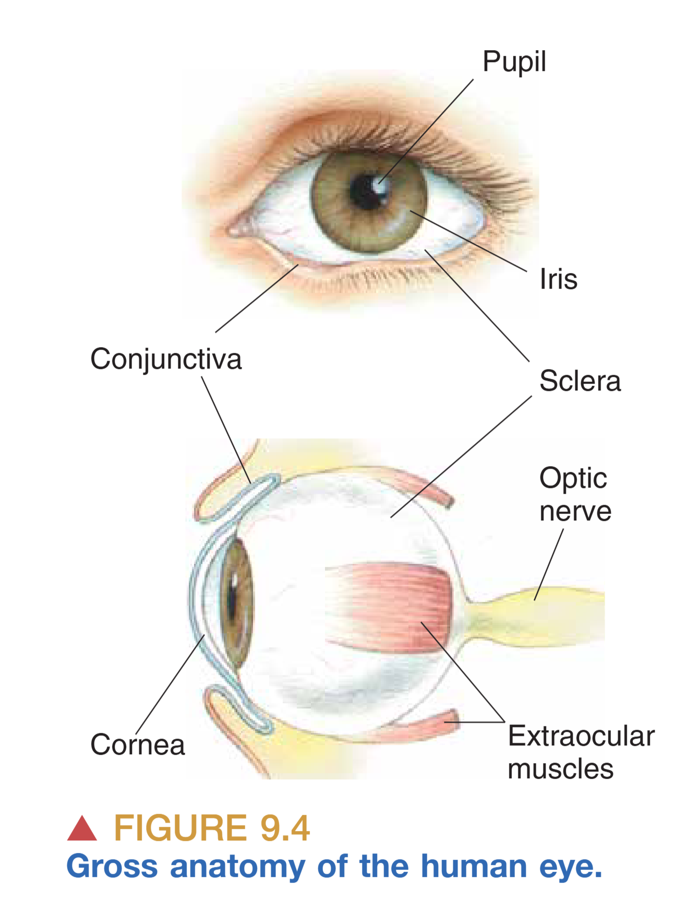
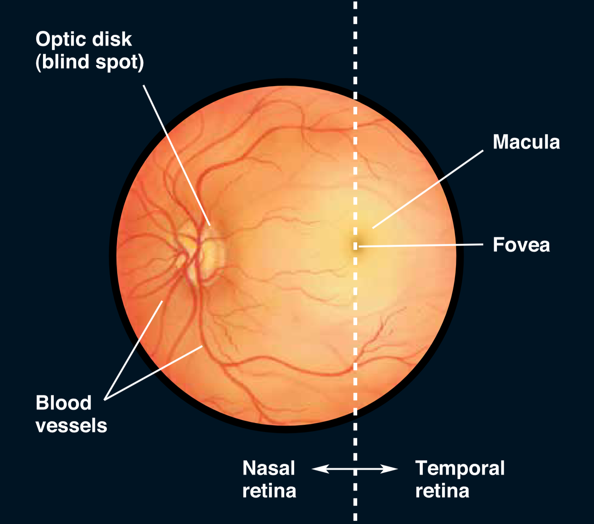
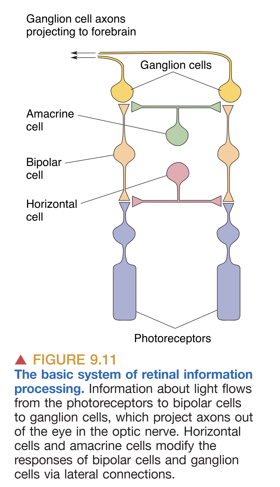
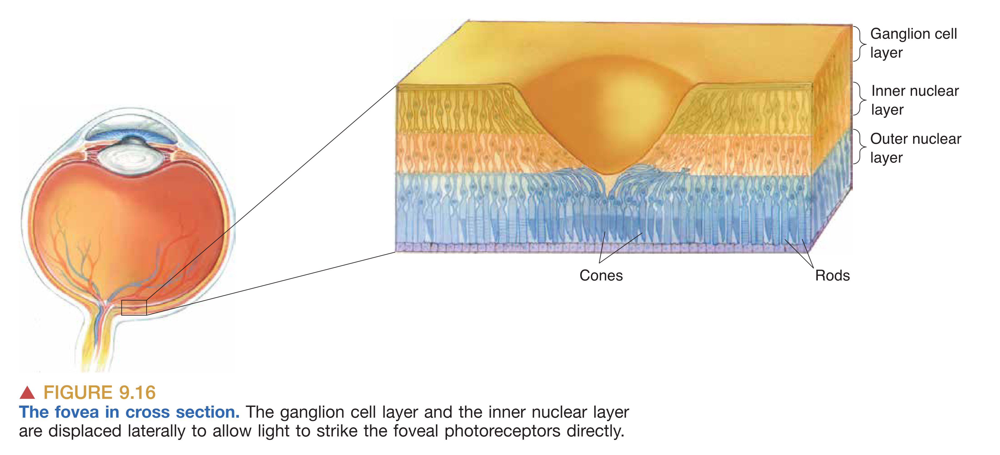
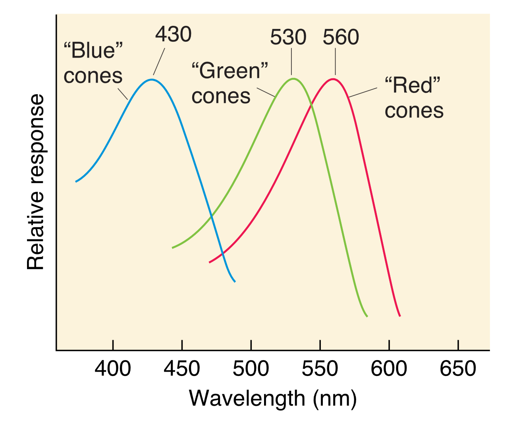
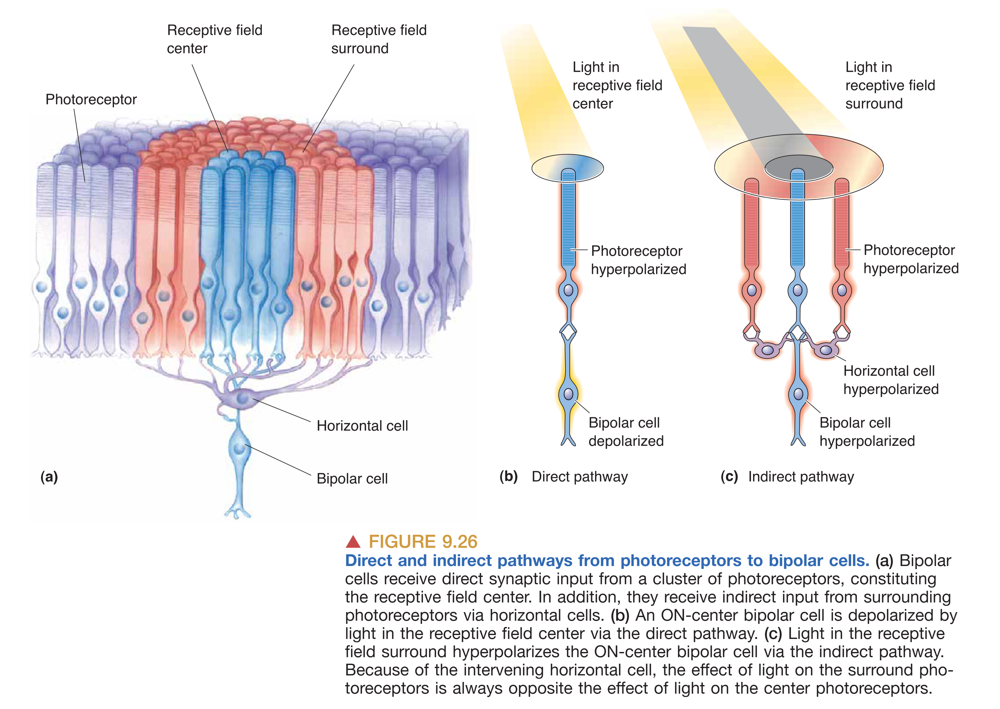
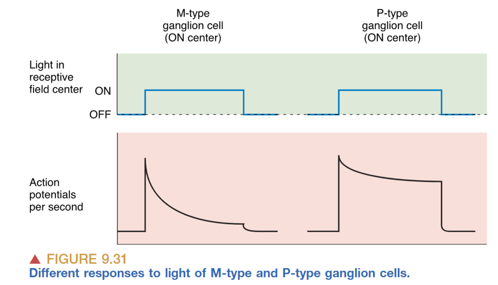

# The Eye and Vision: From Light to Neural Signal

## INTRODUCTION

人类的视觉系统展现出惊人的精密性，它使我们能够检测微小且临近的物体，并根据周围环境运动反射进入眼球的光线，从复杂的物理世界中构建出有意义的心理表征。视觉在大脑中的地位举足轻重，超过三分之一的人类大脑皮层（Cerebral cortex）都致力于视觉世界的分析。对于哺乳动物而言，视觉过程始于 **Eye (眼睛)**。位于眼球背部的 **Retina (视网膜)** 包含专门的 **Photoreceptor (光感受器)**，负责将光能转化为神经活动。视网膜的一个关键特性是能够灵敏地检测落在其不同部位的光强度差异。随后，视网膜神经元的轴突捆绑形成 **Optic nerves (视神经)**，将这些初步处理后的视觉信息以动作电位的形式分发到大脑的多个区域。这些通路在功能上存在分工：一部分视神经靶点负责调节受昼夜交替同步的生物节律，另一部分则参与控制眼球位置和光学特性。而在服务于视觉感知的主要通路中，第一个突触中继站位于背侧丘脑的 **Lateral geniculate nucleus (LGN, 外侧膝状体)**，从这里开始，信息进一步上升至大脑皮层，被最终解释、识别并转化为记忆。

## PROPERTIES OF LIGHT

### Light (光)
光是肉眼可见的电磁辐射（Electromagnetic radiation），通常被描述为具有 **Wavelength (波长)**、**Frequency (频率)** 和 **Amplitude (振幅)** 特性的能量波。

### Optics (光学)
虽然电磁波谱极其广阔，但人类肉眼仅能感知波长在 **400–700 nm** 之间的可见光谱，不同的波长在意识中被诠释为不同的颜色。光在环境中的行为主要包括 **Reflection (反射)**、**Absorption (吸收)** 和 **Refraction (折射)**。光学（Optics）这一学科专门研究光线及其相互作用，而眼睛成像的核心机制正是折射——即光线从一种透明介质进入另一种介质（如从空气进入角膜）时由于速度变化而发生的弯曲。

## THE STRUCTURE OF THE EYE

### Gross Anatomy of the Eye (眼球大体解剖)

从外部解剖结构来看，眼球的设计体现了保护与透光的统一。**Pupil (瞳孔)** 作为光线进入眼球并到达视网膜的开口，因视网膜中含有大量吸光色素而呈现深黑色。环绕瞳孔的 **Iris (虹膜)** 含有两组精密的肌肉，能通过收缩或舒张调节瞳孔大小，其色素分布决定了我们所说的眼睛色彩。覆盖在这些结构之上的玻璃样透明表面是 **Cornea (角膜)**，它作为眼球最外层的折射表面，具有包括上皮层、基质层和内皮层在内的精细层级。眼球的大部分壁层由坚韧的白色组织 **Sclera (巩膜)** 构成。附着在巩膜上的三对 **Extraocular muscles (眼外肌)** 负责在眼眶内精确移动眼球。此外，**Conjunctiva (结膜)** 这一薄膜从眼睑内侧折返并附着在巩膜上，提供了额外的保护与润滑。

### Ophthalmoscopic Appearance (检眼镜下的表现)
借助 **Ophthalmoscope (检眼镜)** 观察瞳孔内部，视网膜表面的血管分布是最显眼的特征，这些血管起始于 **Optic disk (视盘)**。视盘不仅是视网膜血管的出入点，也是视神经纤维离开视网膜汇集成视神经的出口；由于此处完全缺失光感受器，故形成了生理性 **Blind spot (盲点)**。在视网膜中心，可以观察到一个颜色较暗且偏黄的区域，即 **Macula (黄斑)**，它专门负责中央视觉（Central vision）。黄斑中心约 2 mm 的暗色凹陷被称为 **Fovea (中央凹)**，此处的视网膜结构被进一步精简以减少光线散射，是高分辨率视觉（High-acuity vision）的核心所在。

### Cross-Sectional Anatomy (横切面解剖)

眼球的横切面展示了光线穿越的复杂流体环境。**Aqueous humor (房水)** 是存在于角膜和晶状体之间的清亮水样流体，其不仅维持眼内压，还为无血管的角膜提供必要的营养。位于虹膜后方的 **Lens (晶状体)** 通过 **Suspensory ligaments (悬韧带)** 连接至 **Ciliary muscle (睫状肌)**。晶状体的透明度与弹性对于光线的精细聚焦至关重要。晶状体后方至视网膜之间的空间充满了 **Vitreous humor (玻璃体)**，这种胶状物质产生的压力能够确保视网膜紧贴眼底背景，并维持眼球的球形结构。此外，泪器系统作为辅助，通过侧上方的泪腺分泌泪液，并经由泪囊和鼻泪管引流，起到湿润和清洁作用。

## IMAGE FORMATION BY THE EYE

### Refraction by the Cornea and Accommodation (角膜折射与晶状体调节)
光线穿越角膜时产生的折射是成像的第一步，其折射程度取决于从折射表面到平行光汇聚点的 **Focal distance (焦距)**。眼睛的屈光能力主要由角膜提供，其屈光度（Diopter）约为 42 D。然而，角膜的折射力是固定的，为了看清 **9m 以内** 的近处物体，眼睛需要额外的调节能力。这一过程被称为 **Accommodation (调节)**，通过睫状肌的介入完成。当我们需要看近物时，睫状肌收缩使悬韧带放松，原本被拉紧的晶状体因自身弹性而变厚，增加了折射力，从而使光线精确聚焦于视网膜。随着年龄增长，晶状体弹性下降，导致眼睛的调节能力逐渐丧失，近点距离（Comfortable distance）变长，这一现象即为老花眼。

### Eye Disorders and Correction (眼科疾病与矫正)
眼球结构的任何微小偏差都可能导致视觉障碍。**Strabismus (斜视)** 源于双眼眼外肌的不平衡，表现为 **Esotropia (内斜视)** 或 **Exotropia (外斜视)**，长期不治可能导致 **Amblyopia (弱视)**。晶状体蛋白质变性会导致 **Cataract (白内障)**，使视线变得模糊。**Glaucoma (青光眼)** 通常由房水循环受阻导致眼内压升高，压迫视神经。**Detached retina (视网膜脱落)** 是视网膜与支撑组织分离的紧急状态，在高度近视者中较为常见。**Retinitis pigmentosa (色素性视网膜炎)** 作为一种遗传病，由视杆和视锥细胞退行性变引起，典型早期症状是夜盲和视野缩小。**Macular degeneration (黄斑变性)** 则因血管渗透等损伤导致中心视力丧失。现代医学利用凹透镜矫正近视（Myopia），凸透镜矫正远视（Hyperopia），并通过 **LASIK** 激光手术通过精准削薄角膜基底膜来持久改变屈光力。

### The Pupillary Light Reflex and Visual Field (瞳孔反射与视野)
瞳孔通过持续调整大小来适应环境光水平的多样性。**Pupillary light reflex (瞳孔对光反射)** 具有 **Consensual (互感性)**，即单侧光照会引起双侧瞳孔同步缩小，这种连接对评估脑干神经功能具有重要临床意义。视野（Visual Field）则定义了眼睛维持注视时所能感知的全部空间范围。视力的精准度，即 **Visual Acuity (视锐度)**，受到视网膜上光感受器密度（约 140µm 的局部排列限制）及光学成像质量的共同制约。

## MICROSCOPIC ANATOMY OF THE RETINA

视网膜在胚胎学上源自间脑，常被视为向外延伸的大脑部分。信息流的主要路径遵循从 **Photoreceptor (光感受器)** 到 **Bipolar cell (双极细胞)**，再到 **Ganglion cell (神经节细胞)** 的最直接通路。在此过程中，**Horizontal cells (水平细胞)** 接收受体输入并横向影响周围的双极细胞与受体；**Amacrine cells (无长突细胞)** 则接收双极细胞输入，横向整合神经节细胞与双极细胞的信号。

### Key Principles and Laminar Organization (分层组织原则)
视网膜的结构呈现出独特的“倒置”（Inside-out）特征，即光线必须先穿透神经节细胞和双极细胞层，才能到达最深处的光感受层。这种设计具有显著的进化优势：位于感光细胞下方的 **Pigmented epithelium (色素上皮)** 不仅能通过吸收透射光子来减少散射并提高清晰度，还承担着维护感光膜盘和色素再生的重担。相比之下，许多夜行性动物在受体下方拥有一种 **Tapetum lucidum (反光膜)**，它通过将光线反射回视网膜来显著提高弱光敏感度，其副作用是牺牲了视锐度并产生了 "Eyeshine" 现象。视网膜由外向内（从色素上皮向上）清晰地分为：含有感光膜盘的 **Outer segments 层**、含有受体胞体的 **Outer nuclear layer (外核层)**、突触交互的 **Outer plexiform layer (外网状层)**、包含二级神经元胞体的 **Inner nuclear layer (内核层)**、次级突触中继的 **Inner plexiform layer (内网状层)**，以及最内侧作为唯一输出源的 **Ganglion cell layer (神经节细胞层)**。在视网膜的所有细胞中，仅神经节细胞能产生动作电位，其余细胞均以分级膜电位的形式传递信号。

## PHOTORECEPTOR STRUCTURE

### Rods and Cones (视杆与视锥)

人类视网膜依赖 **Duplex retina (双重视网膜)** 完成全天候工作。约 9200 万个 **Rods (视杆细胞)** 拥有长圆柱形外段，富含感光膜盘，其敏感度是视锥的 1000 倍，专门负责微光下的 **Scotopic (暗视觉)**。约 500 万个 **Cones (视锥细胞)** 则拥有短尖形外段，负责白天的 **Photopic (明视觉)**，并承载了高分辨率和色彩感知的功能。在室内或黄昏等中等光照水平下，即 **Mesopic (间视觉)** 条件，视杆与视锥共同工作。

### Regional Differences (区域差异与视锐度)
视网膜结构在空间分布上极不均匀。**Fovea (中央凹)** 是视觉清晰度的顶点，此处高度富集视锥细胞且完全缺失视杆。为了移除路径干扰，此处的神经节细胞和双极细胞层向周边发生侧向移位，允许光线直接击中感光受体。相反在视网膜 **Periphery (外周)**，视杆细胞占据主导，多个光感受器通过汇聚（Convergence）向单个神经节细胞提供信息。这种排列方式赋予了外周视网膜极强的微光探测能力，但也显著降低了细节分辨力和色觉感知。

## PHOTOTRANSDUCTION (光转导机制)

### Phototransduction in Rods (视杆细胞的光转导)

光转导是利用光能改变膜电位的生物物理过程。在完全黑暗中，视杆细胞处于活跃状态，膜电位维持在约 **-30 mV**。这是由于胞内高浓度的 **cGMP** 保持了 **cGMP-gated Na+ channels** 的开放，产生了持续的 $Na^+$ 内流，即 **Dark Current (暗电流)**。此时，细胞去极化并持续释放神经递质 **Glutamate (谷氨酸)**。当光线照射时，会引发一系列复杂的生化级联反应：首先，光子被由 **Opsin (视蛋白)** 和 **Retinal (视黄醛)** 组成的 **Rhodopsin (视紫红质)** 吸收，引起视黄醛构象改变并激活视蛋白（此过程称为漂白）。随后，活化的视蛋白刺激 G 蛋白 **Transducin (转导蛋白)**，进而激活 **Phosphodiesterase (PDE, 磷酸二酯酶)**。PDE 迅速水解胞内的 cGMP，导致钠离子通道关闭，细胞发生 **Hyperpolarization (超极化)**，递质释放随之减少。这意味着神经系统通过监测递质释放的“减少”来解码光强增加的信息。

### Phototransduction in Cones and Color Perception
视锥细胞的光转导过程与视杆类似，但其拥有的三种具有不同光谱敏感度的视蛋白是 **Trichromacy Theory (三原色理论)** 的物理基础。人类通常具有对长、中、短波分别敏感的红、绿、蓝视锥细胞，大脑通过比较三者的相对激活程度来编码色彩。遗传学研究表明，红、绿色素基因位于 X 染色体，而三类视蛋白的序列高度同源。

### Adaptation (适应机制)
眼睛对环境中剧烈亮度变化的调节依赖多种 **Adaptation (适应)** 机制。**Dark Adaptation (暗适应)** 是一个耗时数分钟的过程，涉及瞳孔扩大和视紫红质的化学再生。而 **Light Adaptation (明适应)** 则更多依赖 **Calcium (钙离子)** 的负反馈调节。在强光下，$Ca^{2+}$ 进入通道减少，引起胞内 $Ca^{2+}$ 浓度下降，这会取消对 cGMP 合成酶的抑制，从而在维持通道基本开放的同时防止受体在光照下发生电气过饱和。

## RETINAL PROCESSING AND OUTPUT

### The Receptive Field and Bipolar Cell Logic
视觉信息的深层加工始于神经元的 **Receptive Field (感受野)**。视网膜上的每一个二级或三级神经元都对应着视网膜上的一个特定空间区域，只有落在该区域的光影变化才能影响该神经元的放电活动。在双极细胞层级，这种感受野被精细地划分为 **Center (中心)** 和 **Surround (周边)** 两个部分，并呈现出互为拮抗的逻辑。根据对光感受器释放的 **Glutamate (谷氨酸)** 的响应方式，双极细胞被分为 **OFF bipolar cells** 和 **ON bipolar cells** 两个大类。在黑暗中，光感受器持续去极化并大量释放谷氨酸。**OFF 双极细胞** 表达离子型谷氨酸受体，能够直接产生去极化兴奋电流；而 **ON 双极细胞** 则表达特殊的代谢型受体（mGluR6），谷氨酸在此处的作用反而是引起细胞超极化。

当光线照射感受野中心时，光感受器超极化，谷氨酸释放减少。对于 ON 双极细胞而言，这种递质的减少相当于“去抑制”，使其发生去极化反应；而对于 OFF 双极细胞，光照则使其失去兴奋性驱动而发生超极化。感受野的 **Surround (周边)** 逻辑则更为复杂，它通过 **Horizontal cells (水平细胞)** 的横向反馈介导。例如，当光线照射在 ON 双极细胞感受野的周边时，周边的光感受器超极化并引起水平细胞也随之超极化，这种侧向连接最终会导致双极细胞产生与中心光照相反的响应（即超极化）。这种 **Center-surround antagonism (中心-周边拮抗)** 结构构成了视网膜提取对比度信息的基石，确保神经元对边界清晰、对比显著的视觉特征产生最强烈的响应，而对大面积均匀且单一的光照保持迟钝。

### Ganglion Cell Receptive Fields and Contrast Emphasis

神经节细胞作为视网膜的最终输出单元，继承了双极细胞这种精致的中心-周边组织结构。正如其前级神经元一样，大多数神经节细胞对覆盖整个感受野的均匀光照变化并不敏感，它们的核心职能是实时检测落在感受野内部的 **亮度差异 (Illumination differences)**。研究表明，神经节细胞的这种组织方式极大地夸大了视觉空间中明暗交界处的对比度信息，这也是为什么我们对物体的轮廓和边缘格外敏感的原因。著名的错觉现象，如 **Checker-shadow illusion**，正是这种中心-周边拮抗机制在解释现实场景时产生的神经计算偏差。

### Diverse Ganglion Cell Types: M, P, and nonM-nonP
人类与猕猴的视网膜中存在着具有显著解剖与生理差异的神经节细胞群落。占总数约 90% 的 **P-type (Parvocellular)** 细胞体型较小，拥有较小的感受野，其典型特征是即便在长持续时间的光照下也能维持稳定的放电速率（Sustained discharge）。更为重要的是，P 型细胞对颜色具有极高的敏感度，许多 P 细胞展现出 **Color-opponency (颜色拮抗)** 特性，即它们能比较红/绿或蓝/黄两种波段的相对光强。

与之相对的是约占 5% 的 **M-type (Magnocellular)** 细胞，其胞体硕大且伸展出广阔的树突，从而拥有巨大的感受野。M 型细胞并不感知颜色，但它们对低对比度的微弱光影变化极其敏锐，并且会以暂态爆发（Transient burst）的方式对外界刺激做出响应。M 型细胞被认为是视觉系统中专门负责探测运动信息的高速公路。剩下约 5% 的 **NonM-nonP** 细胞则通常也具备复杂的颜色拮抗功能。这种颜色拮抗逻辑意味着，如果感受野中心的红色光照引起了细胞兴奋，那么落在周边的绿色光照则会因侧向抑制机制完美地抵消这种放电。这种红-绿或蓝-黄的拮抗机制正是我们在中枢水平上能够感知五彩斑斓世界的神经基础。

### ipRGCs and Parallel Processing
除了作为通路末端的传统神经节细胞，视网膜中还隐藏着一类特殊的细胞——**Intrinsically photosensitive retinal ganglion cells (ipRGCs, 视网膜内源性感光神经节细胞)**。这类细胞虽然数量稀少且树突分支广泛，但它们不仅接收外界输入，自身也表达了一种名为 **Melanopsin (视黑素)** 的感光色素，使其能直接对光产生去极化反应。ipRGCs 的时间常数极大，响应极慢，因此它们并不参与精细的图案视觉识别，而是扮演着生物钟调节者的角色，负责将环境亮度信息直接输送到下丘脑等部位，以同步我们的 **Circadian rhythms (昼夜节律)** 和调节瞳孔的缩放。

最终，视网膜展现出一种高度发达的 **Parallel Processing (平行处理)** 模式。这意味着大脑并不是依次处理视觉属性，而是通过截然不同的三条或多条神经通路，同时并行地分析空间的运动轨迹、物体的形状细节以及丰富的色彩分量。这种高度同步且专业化的信息分流确保了我们在感知复杂世界时既能捕捉瞬息万变的动态，又能洞察极致入微的细节。