# Motivation（动机）

> 动机并不是单一的“想做某事”，而是神经系统把内在需求、稳态偏离、奖赏相关的追逐驱动力与行为输出连接起来的过程：最底层可表现为感觉刺激触发的无意识反射，最高层则可表现为由 **frontal lobe（额叶）** 神经元启动的有意识运动。

## Key ideas

- **Homeostasis（稳态）** 是动机的基础框架；**Hypothalamus（下丘脑）** 把体内变量偏离转化为体液、内脏和行为三个层面的协同反应。
- 动机性行为并不只是在“缺什么补什么”；在摄食情境中，长期能量储备与一顿饭内的短期信号共同塑造行为。
- 长期摄食调控围绕 **leptin（瘦素）** 与下丘脑弓状核—室旁核—下丘脑外侧区回路展开；短期摄食调控则整合 **ghrelin、胃扩张、CCK、insulin** 等信号。
- **mesocorticolimbic dopamine system（中脑-皮层-边缘多巴胺系统）** 与强化、奖赏相关的追逐驱动力和行为固化有关，说明动机还包含“wanting（渴望）”这一成分。
- 饮水与体温调节提示：动机并不限于摄食，它也是下丘脑组织生存行为的一般方式。

## Abstract / 研究概要

动机（Motivation）可理解为机体为了满足内在需求而启动行为的过程。可将其置于稳态（Homeostasis）框架下讨论：当血容量、渗透压、能量储备或体温等变量偏离适宜范围时，下丘脑通过体液反应、内脏运动反应与躯体运动反应组织纠偏。摄食是这一框架中最典型的例子，其中长期调控围绕体脂储备与 leptin 信号展开，短期调控则围绕一顿饭内的饥饿信号与饱腹信号展开。与此同时，奖赏与强化回路说明，动机并不完全等同于稳态恢复：多巴胺系统更多关联奖赏相关的追逐驱动力，而 5-HT 系统则为食物与情绪之间的联系提供背景。除摄食外，饮水与体温调节也展示了下丘脑如何把生理偏差转译为行动。

## 1. 从“需要”到“行动”：动机的层级与基本定义

行为发起可以放在一个从低到高的层级上理解：最低层级是由感觉刺激引发的无意识反射，最高层级则是由 **frontal lobe（额叶）** 神经元启动的有意识动作。在这一连续体中，**voluntary movements（自愿运动）** 之所以发生，是因为机体需要被满足；换言之，动机不是附加在行为之外的标签，而是让行为得以被“发动”的条件。

如果从功能角度概括，动机性行为（motivated behavior）就是把内部需求转化为外部反应的神经过程。这个过程与下丘脑紧密联系：当机体偏离稳态时，下丘脑并不只“检测异常”，而是把异常组织成一套有方向的输出，使行为朝纠正偏差的方向推进。因此，动机既包含需求的产生，也包含对合适反应方式的选择。

> [!note]
> 对本章而言，最重要的出发点不是“人为什么会想要某物”，而是“当身体状态失衡时，神经系统如何把这种失衡转化为一套可执行的反应”。

## 2. 下丘脑、稳态与动机性行为

**Hypothalamus（下丘脑）** 是动机与稳态调节的枢纽。其基本逻辑是：下丘脑接收与体内状态有关的感觉转导信息，然后组织一套通常由三部分构成的反应。第一部分是 **Humoral response（体液反应）**，即刺激或抑制垂体激素释放；第二部分是 **Visceromotor response（内脏运动反应）**，即调整自主神经系统（ANS）的交感/副交感平衡；第三部分是 **Somatic motor response（躯体运动反应）**，即驱动机体采取合适的行为。

在这一框架下，动机性行为并不是与内分泌和自主神经反应分离的“高层心理现象”，而是三类输出中的行为性部分。许多纠正稳态偏离的行为与 **lateral hypothalamic area, LHA（下丘脑外侧区）** 有关；更概括地说，室周区和内侧区更偏向体液与内脏反应，而行为动作的最终发起更依赖外侧区。这一组织方式也解释了为什么同样是下丘脑损伤，不同区域会导致截然不同的摄食、饮水或体温反应。

## 3. 摄食行为的长期调控：体脂储备如何塑造动机

### 3.1 Lipostatic hypothesis 与 leptin 信号

关于长期摄食调控，可以围绕 **Lipostatic hypothesis（恒脂假说）** 展开：大脑监测脂肪储备，并试图把体重或体脂维持在某个设定值附近。与这一假说相配套的关键信号是 **leptin（瘦素）**。Leptin 由脂肪细胞释放进入血液，并作用于下丘脑 **arcuate nucleus（弓状核）** 上的 leptin 受体神经元，因此它可以被看作体脂水平进入脑内调控回路的入口信号。
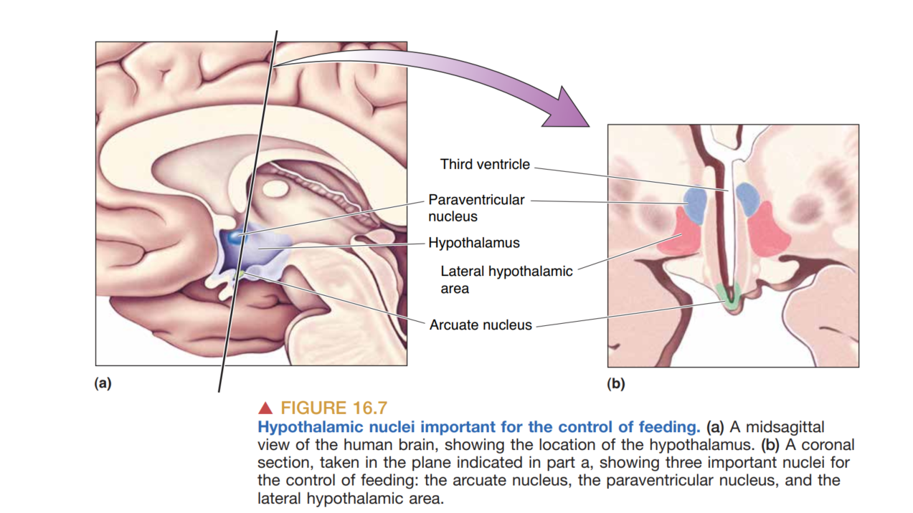
弓状核中至少包含两类对摄食具有相反作用的肽能神经元。其一是释放 **$\alpha$MSH** 与 **CART** 的神经元；当 leptin 水平升高时，这组神经元更活跃，形成与“少吃、代谢增加”一致的反应模式。其二是释放 **NPY** 与 **AgRP** 的神经元；当 leptin 水平下降时，它们被激活，形成与“多吃、代谢降低”一致的反应模式。因此，长期摄食调控并不是一个单向的抑制系统，而是两套相反的肽能信号在下丘脑回路中动态平衡的结果。

### 3.2 Leptin 升高：anorectic peptides 的模式
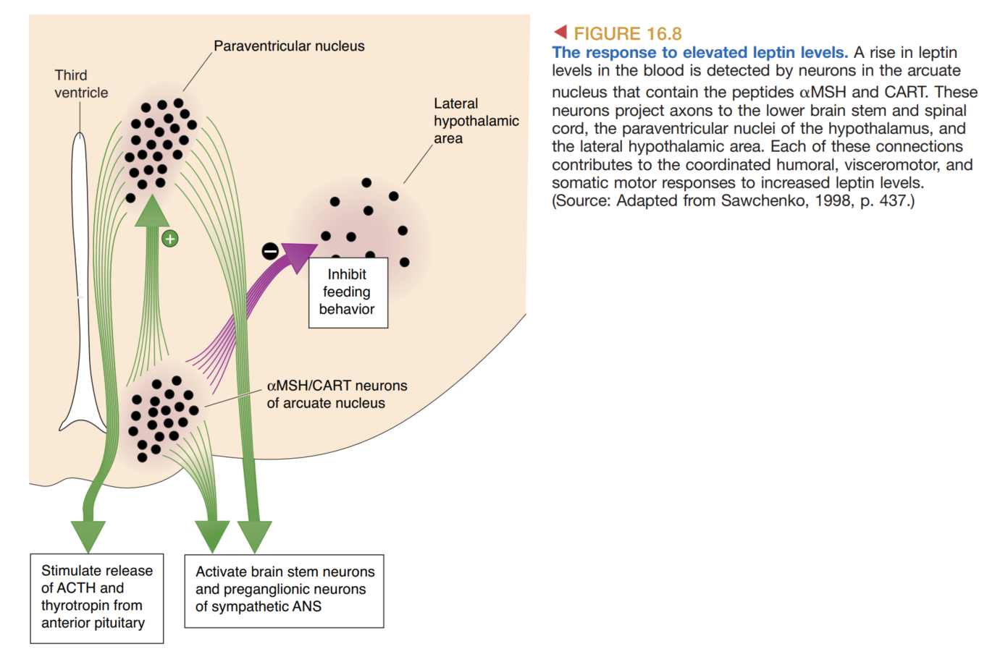
当 leptin 水平升高时，弓状核的 **$\alpha$MSH/CART** 神经元驱动一套典型的 **anorectic peptides（厌食肽）** 反应。这一反应可拆成三个层面：体液层面上，室旁核相关通路促进 **TSH** 与 **ACTH** 分泌；内脏层面上，交感神经张力增强；行为层面上，摄食行为下降。换句话说，高 leptin 状态不仅表示“体脂较多”，还意味着机体正在向“减少摄入、提高消耗”的方向调整。

这些信号部分通过 **paraventricular nucleus, PVN（室旁核）** 与 **lateral hypothalamic area（下丘脑外侧区）** 实现。就功能上说，PVN 更接近把代谢状态转化为内分泌输出，而 LHA 更接近把这些状态转化为进食行为是否被启动。因此，leptin 对摄食的抑制并不是单一核团的作用，而是多核团协调的结果。

### 3.3 Leptin 降低：orexigenic peptides 的模式
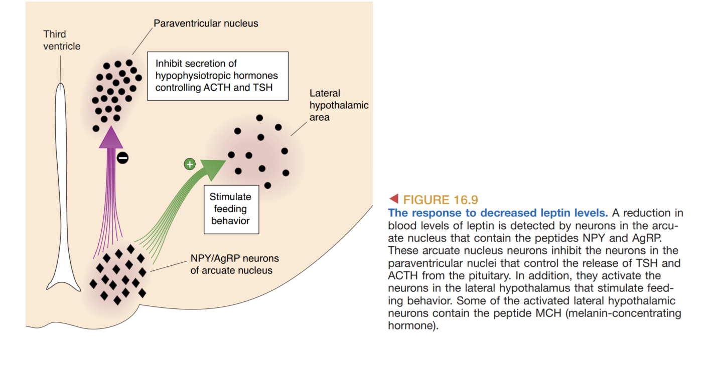
当 leptin 水平降低时，前述抑制模式被关停，同时另一类弓状核神经元被激活，即释放 **NPY（neuropeptide Y）** 与 **AgRP（agouti-related peptide）** 的神经元。这一组信号可概括为 **orexigenic peptides（促食欲肽）**。这一组信号会抑制室旁核中与 **TSH/ACTH** 释放相关的神经元、增强副交感神经活动，并激活下丘脑外侧区中促进摄食的神经元，最终表现为摄食增加、代谢下降。

这里的关键点不是某一种递质“单独导致饥饿”，而是低 leptin 状态重新配置了整个下丘脑网络，使内分泌、自主神经与行为三类输出同时朝能量获取方向偏移。因此，长期摄食调控本质上是一种全身资源管理，而不是孤立的“胃口变化”。

### 3.4 LHA 肽类、MC4 receptor 与损伤线索

**LHA（下丘脑外侧区）** 可被视为长期摄食调控的行为输出端。其中特别重要的两类肽是 **MCH（melanin-concentrating hormone，黑色素聚集激素）** 与 **orexin（食素/促食欲素，也称 hypocretin）**。前者与延长进食有关，倾向于**促进睡眠**，后者促进进食启动，并与觉醒相关。在 leptin 降低时，这两类肽信号都会增加；其中部分 MCH 神经元与大脑皮层存在广泛连接，因此该系统可能把能量状态变化传递到更大范围的脑网络，但具体机制在本章材料中未进一步展开。

在受体层面，**AgRP** 与 **$\alpha$MSH** 被记录为在 **MC4 receptor（MC4 受体）** 上呈拮抗关系，这为“促进进食”与“抑制进食”的竞争关系提供了分子层面的简化表述。病理与损伤线索也支持这一框架：双侧下丘脑小损伤即可显著改变后续摄食与脂肪储备；双侧 **lateral hypothalamus** 损伤可导致摄食显著减少（lateral hypothalamic syndrome），而双侧 **ventromedial hypothalamus** 损伤则与过度进食和肥胖相关。
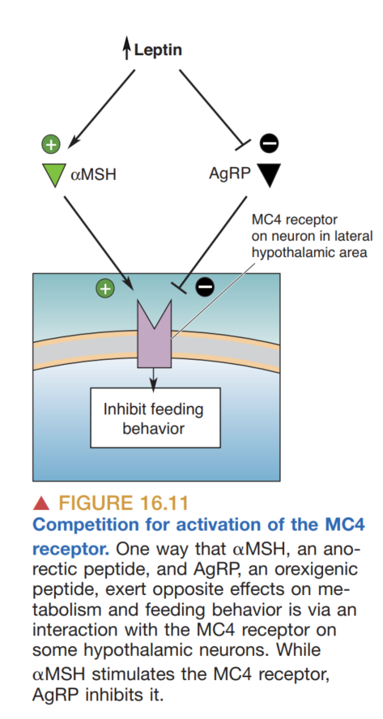
### 3.5 能量平衡情境

长期摄食调控还依赖基本的能量平衡背景。这里可区分 **prandial state（膳食状态）** 与 **postabsorptive state（吸收后状态）**：前者指血液中充满营养物质的状态，后者指两餐之间不进食的状态。这个区分的意义在于，它提醒我们：同一种食欲信号并不是在真空中起作用，而是在“刚进食完”与“长期未进食”的不同代谢背景下被解释。

## 4. 摄食行为的短期调控：一顿饭如何被启动与终止

### 4.1 三个阶段

一次进食过程可拆为三个连续阶段：**Cephalic phase（头期）**、**Gastric phase（胃期）** 与 **Substrate phase（底物期/肠期）**。头期由食物的视觉、嗅觉、味觉甚至“想到食物”触发，并伴随唾液与消化液分泌；此时副交感与 **enteric division（肠神经部）** 的活动已经开始为进食做准备。胃期对应咀嚼、吞咽以及胃内容物增加时的反应，而底物期则对应营养物质开始进入血液后的状态变化。

这个分期强调：短期摄食调控并不是“吃到饱才出现反馈”，而是在进食前、进食中、吸收后都存在信号更新。也因此，一顿饭的起点和终点都不是单一分子决定，而是多类信号逐步接力的结果。
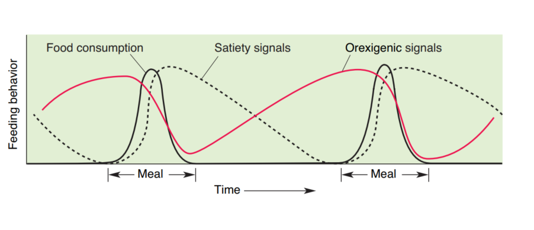
### 4.2 Orexigenic signal：ghrelin

短期促食欲信号中，最典型的是 **Ghrelin（促生长激素释放素）**。空腹时胃释放 ghrelin；其升高可激活弓状核中含 **NPY/AgRP** 的神经元，因此与“饭前启动摄食”的状态相联系。材料甚至以拟声方式强调 ghrelin 与“肚子咕咕叫”的直观关联，说明它可被视为短期饥饿的代表性信号。

### 4.3 Satiety signals：胃扩张、CCK 与 insulin

与 ghrelin 相对，短期饱腹信号来自多层次反馈。其一是 **Gastric distension（胃扩张）**：胃壁拉伸会激活机械感受性轴突，多数通过 **vagus nerve（迷走神经）** 上行至延髓的 **nucleus of the solitary tract / solitary tract nucleus（孤束核）**，从而抑制摄食行为。其二是 **CCK（cholecystokinin，胆囊收缩素）**：CCK 来自肠道上皮细胞与部分 enteric nervous system 神经元，尤其在脂肪刺激下释放，并主要通过迷走神经感觉轴发挥饱腹作用，减少进食频率与进食量。

其三是 **Insulin（胰岛素）**。Insulin 由胰腺 $\beta$ 细胞释放，也是重要的代谢激素；它可直接作用于下丘脑弓状核和腹内侧核以抑制摄食。另有课堂补充指出，insulin 在头期、胃期和底物期都可出现阶段性上升，并在底物期达到最高峰。这提示 insulin 既属于代谢激素，也参与对一顿饭内摄食行为的动态调节。
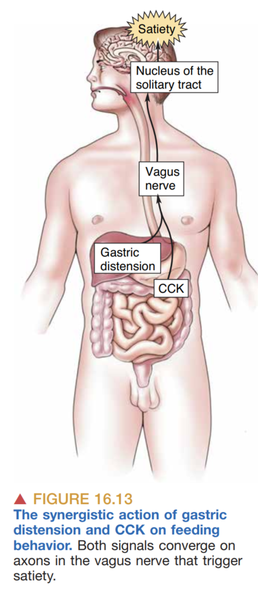
### 4.4 其他短期因素

**Marijuana** 可通过 **CB1 受体** 增加食欲。这一条虽然在整章中所占篇幅不大，但它提醒我们：短期摄食调控并不只受经典内脏信号控制，奖赏与药理因素同样可以改变进食阈值。

## 5. 为什么我们会吃：奖赏、强化与情绪

### 5.1 Reinforcement and Reward

在“Why do we eat?”这个问题上，摄食可以从单纯能量补给扩展到奖赏与强化层面。**electrical self-stimulation（自我刺激）** 现象提示，只要某些脑区被激活，动物就会重复执行导致该刺激出现的行为；因此，奖赏并不只是体验上的“好”，它还能强化（reinforce）一个行为习惯，使其更容易再次发生。

### 5.2 Dopamine 与 wanting
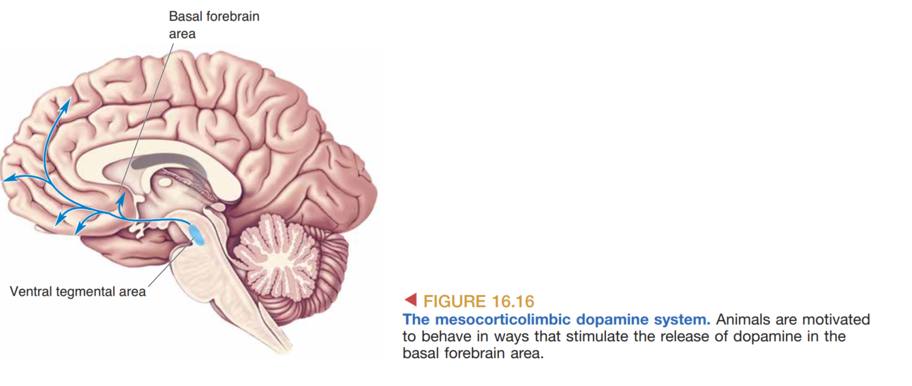
与这种强化最相关的通路是 **mesocorticolimbic dopamine system（中脑-皮层-边缘多巴胺系统）**，起源于 **VTA（腹侧被盖区）**。这条通路与动机、奖赏和成瘾联系在一起，同时也需要区分 **Liking（愉悦感）** 与 **Wanting（渴望）**：在这一整理框架中，多巴胺更接近“想要、追求奖赏”的行为驱动力，而不完全等于奖赏本身的快感体验。因此，动机并不只涉及是否获得愉悦，也涉及机体是否会持续朝某个目标投入行为。

### 5.3 Serotonin、食物与情绪

**5-HT（Serotonin，五羟色胺）** 构成“食物—情绪”之间的重要连接点：5-HT 来源于饮食中的 **tryptophan（色氨酸）**，而色氨酸在血液中的水平会随饮食中碳水化合物的比例变化。由此，食物组成可能通过改变脑内 5-HT 相关过程而影响情绪。脑内 5-HT 调节异常也被认为与进食障碍有关，因此动机不仅是奖赏问题，也与情绪背景有关。
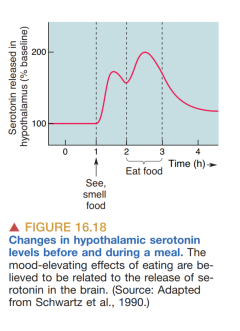
## 6. 其他动机行为：饮水与体温调节

### 6.1 饮水
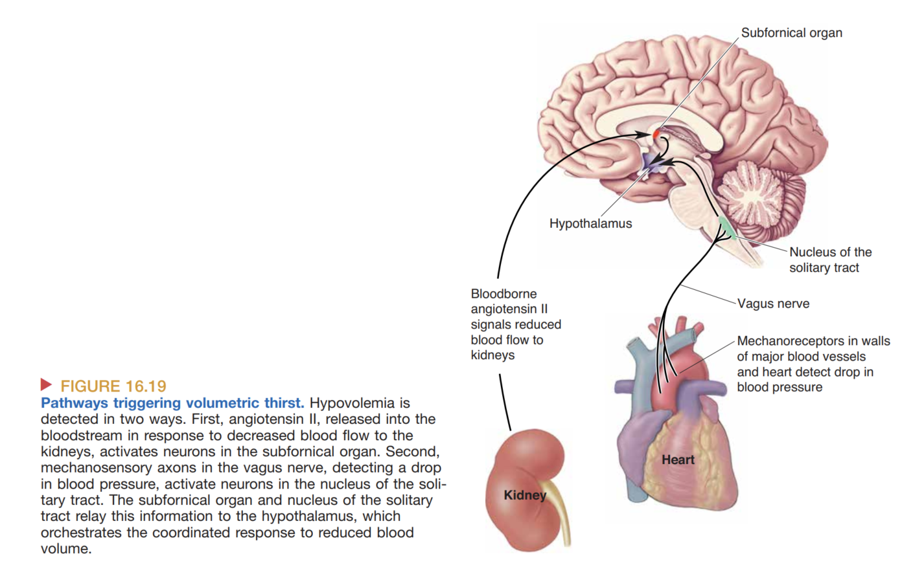
饮水行为可分为两种主要生理触发。第一类是 **volumetric thirst（容量性口渴）**，与 **hypovolemia（血容量不足）** 有关。课堂补充指出，这一过程可通过肾素—血管紧张素系统激活 **subfornical organ（穹窿下器）**，再引发下丘脑与 **ADH（抗利尿激素）** 相关反应。第二类是 **osmometric thirst（渗透性口渴）**，与血液高渗相关；这类信号可由缺乏血脑屏障的 **OVLT（血管终板器）** 感受，并进一步驱动下丘脑反应。
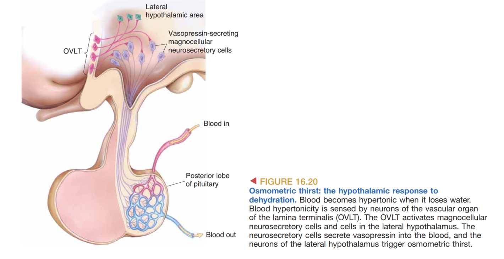
这两类口渴说明，饮水行为并非来自统一的“主观想喝水”感受，而是来自不同生理偏差进入不同感受器与脑区后的汇聚输出。它们再次体现了下丘脑在动机中的通用角色：把内环境失衡翻译成行动。

### 6.2 体温

体温调节同样展示了下丘脑如何组织动机反应。体温升高由 **anterior hypothalamus（下丘脑前部）** 的 warm-sensitive neurons 检测，并伴随 **TSH** 释放减少；体温降低则由 cold-sensitive neurons 检测，并伴随相反变化。课堂补充进一步概括：体液与内脏运动反应更多由室周和内侧下丘脑组织，而行为行动则依赖外侧下丘脑。因此，寻找阴凉、靠近热源、减少或增加活动等行为，可以被理解为与激素和自主神经变化并列的一组纠偏输出。

## Conclude
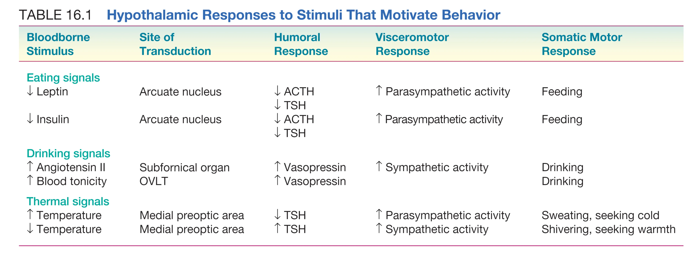
该图对应“Hypothalamic Responses to Stimuli That Motivate Behavior”，用于概括饮水、体温等不同动机行为所涉及的下丘脑反应。