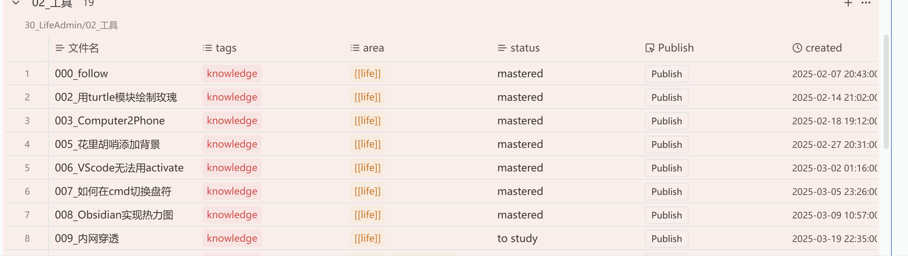

不知不觉，从hexo转移到astro已经好几个月了，但并没有着手更新几篇文章，由于我在这一段时间基本着重在obsidian本地写笔记(虽然依旧很多时间用来折腾)，懒得通过繁琐的复制粘贴、处理附件的路径等问题。关于为什么将博客框架从hexo转到astro，大概率是因为cool吧，偶然间看到很不错的博客模板[^2]，所以就好奇了解了一下（虽然最后也没有用上）。由于我不是开发者，其实这样的转化对我影响很小。但抱着来都来了的心态，就挑选了一个还算可以的模板，即我目前使用的是`typography`[^1]，将过去的部分笔记迁移了过来，然后就搁置了。。。

由于了解到components插件可以自定义一个Javascript脚本来运行一些功能，所以完全可以写一个从obsidian直接发布到blog的脚本（如`publish_to_blog`），可将其放在components的脚本文件夹下。于是直接使用antigravity来实现以下功能：通过脚本将文章内容“清洗”并“搬运”到 Astro 项目目录，最后触发 Git 推送。
输出文件将放在astro\src\content\posts中，笔记文件夹采用 `YYYY_MM_DD_标题` 的格式，笔记固定为index.md。图片与笔记存放于相同目录，对于`![[image.png]]` 格式图片，找到图片在 Vault 中的真实路径，**复制**该图片到博客的目标文件夹中，并将链接修改为标准 Markdown 相对路径 ``。去除双向链接的中括号 `[[...]]`，只保留文本。


属性的mapping：
```text
title: 取去掉数字的文件名，或者读取 Frontmatter 中的 title（如果有）。 
pubDate: 读取 created，转换为 YYYY-MM-DD 格式。 
categories: 读取 area。难点处理：area 里通常是 [[life]] 这种双链格式。脚本需要用正则（Regex）去除 [[ 和 ]]，只保留文本。 
tags: 读取 subject。如果需要映射到 Astro 的 tags，同样清洗文本。 
slug: 读取 Frontmatter 中的 slug（如果有）如果没有则置空 
description: 读取description，如果没有则置空
```

最终可以在dashboard中添加一个按钮来为特定笔记触发`publish_to_blog`的功能：

点击即可出发推送当前文章，真正实现从笔记书写到发布的All-in-one。
[^1]: [typography](https://github.com/moeyua/astro-theme-typography)

[^2]: [Mizuki:优雅的Astro博客模板，开源！_哔哩哔哩_bilibili](https://www.bilibili.com/video/BV1aZbezkE7s/)