# The Central Visual System: From Thalamus to Visual Perception

## INTRODUCTION

视网膜信号的产生仅仅是视觉处理的序章。人类之所以能够从物理世界的光影中感知到深度、运动和复杂的物体形状，并在意识中赋予其意义，完全依赖于中枢视觉系统（Central visual system）对这些原始电信号进行的高度精确的处理与重建。这一系统在解剖结构与生理功能上展现出极强的组织逻辑，核心原则在于 **Parallel processing (平行处理)** 与 **Topographic mapping (拓扑映射)** 的有机结合。视觉信息从视网膜出发，通过 **Retinofugal projection (视网膜离心投射)** 路径跨越视交叉，进入丘脑的重要中继站——**Lateral geniculate nucleus (LGN, 外侧膝状体)**。在这里，信息经过初步分类后，经由 **Optic radiation (视放射)** 投射至位于枕叶的初级视觉皮层（V1）。V1 不仅是特征提取的起点，更是后续背侧流（Dorsal stream）与腹侧流（Ventral stream）两大处理系统的分水岭，分别承担着空间导引与物体识别的认知重任。

## THE RETINOFUGAL PROJECTION
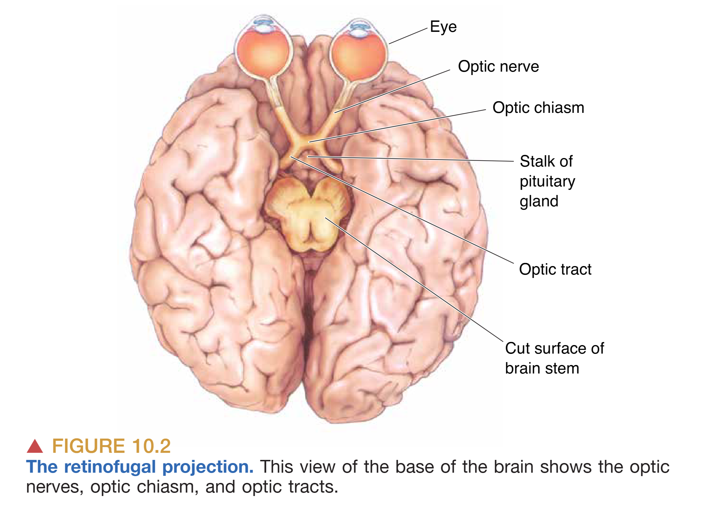
中枢视觉通路的第一个关键阶段是 **Retinofugal projection**，旨在将信息从视网膜有效分发至大脑各靶区。这一投影路径由视神经、视交叉及视束共同构成。轴突从视神经乳头（Optic disk）汇聚形成视神经，随后穿过眼眶后部的脂肪组织，通过头骨底部的孔洞进入颅腔。这些轴突束最终在蝶鞍上方、垂体柄前方汇聚形成 **Optic Chiasm (视交叉)**。视交叉的解剖设计极具生理智慧：来自 **Nasal retina (鼻侧视网膜)** 的轴突会在此跨越中线，进入对侧大脑；而来自 **Temporal retina (颞侧视网膜)** 的轴突则保持在同侧。这种部分交叉（Partial Decussation）的布局确保了中枢视觉系统遵循“全视野分流”原则——即左半视野（Left visual hemifield）的信息全部投向右半脑，而右半视野的信息则全部投向左半脑。这也意味着，即使是单眼看到的世界，也会根据视网膜部位的不同被拆分并分发到两个大脑半球。

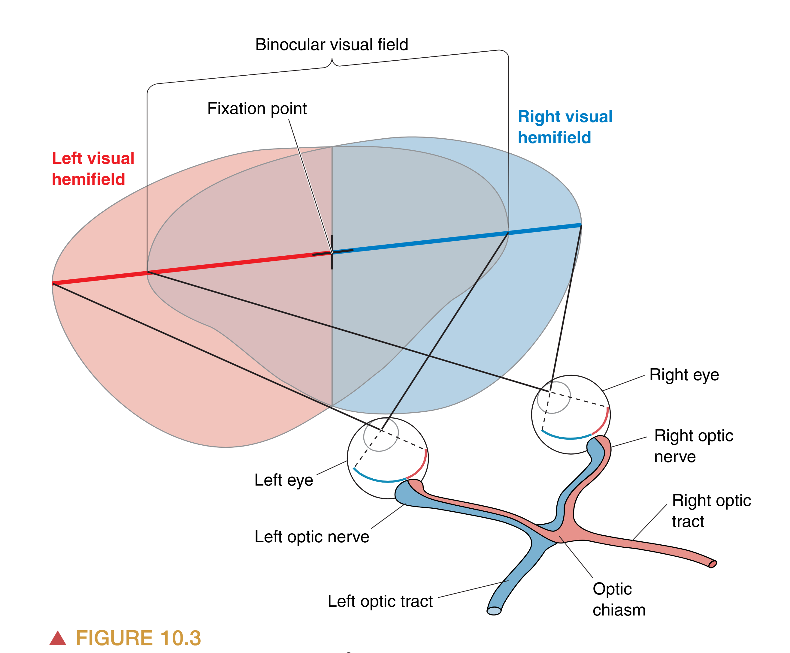
离开视交叉后，重新组合的轴突形成了 **Optic Tracts (视束)**。虽然大多数轴突（约 90%）都投射到丘脑的 LGN，但仍有部分关键分支通往非丘脑区域。例如，投射到下丘脑视交叉上核（SCN）的轴突为生物钟提供了必要的环境光同步信号，调节睡眠与觉醒的昼夜节律；投射到前顶盖（Pretectum）的分支则负责控制瞳孔对光反射。此外，约 10% 的神经节细胞投射至上丘（Superior Colliculus），构建了所谓的视网膜-顶盖通路（Retinotectal projection）。上丘通过这些输入实时生成视觉世界的空间坐标映射，不仅能协同眼外的方向性运动，还能根据突发的视觉刺激迅速引导人们的注意力转向，实现本能的定向反射。
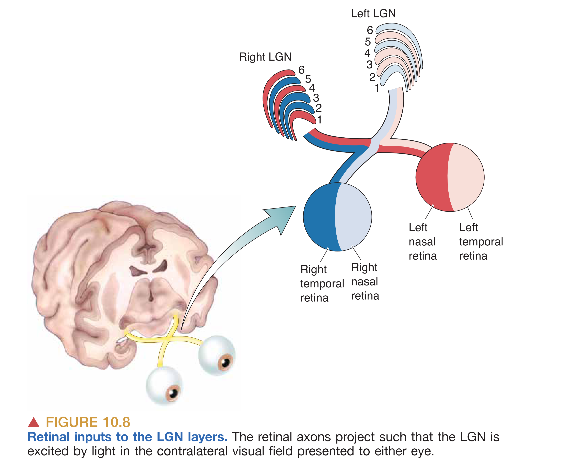
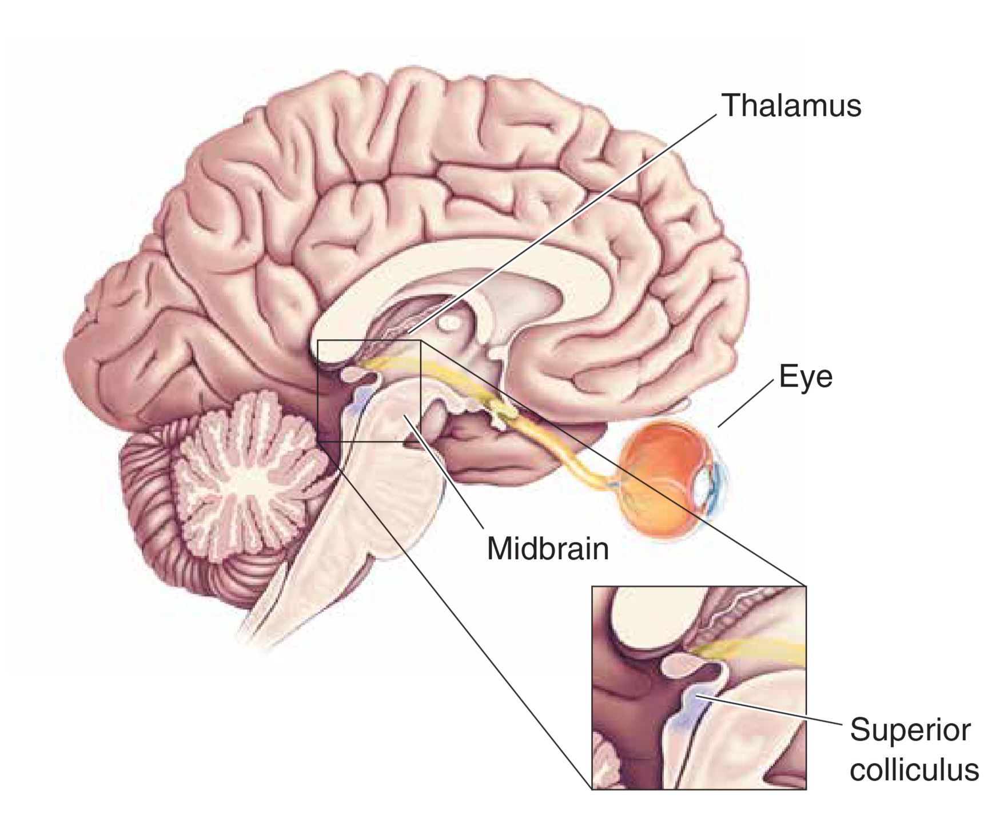
## THE LATERAL GENICULATE NUCLEUS (LGN)

丘脑的 **LGN** 通常被视为视觉信息进入皮层前的“守门人”。在灵长类动物中，LGN 呈现出极其规整的六层细胞排列结构，每一层都严格遵循眼别分离和细胞类型分离的原则。从解剖学角度看，第 1、4、6 层接收来自对侧眼的输入，而第 2、3、5 层则接收来自同侧眼的输入。这种层次化的排列，使得两眼信号在进入皮层前仍保持着物理上的独立性。
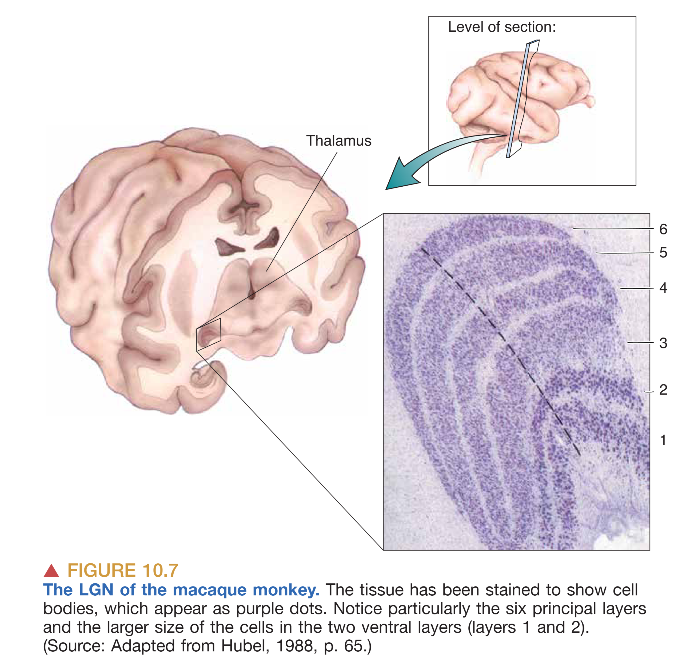
除了按来源眼分层，LGN 还根据下游处理需求对信息流进行了分选。最腹侧的两层（第 1 和第 2 层）含有胞体较大的神经元，被称为 **Magnocellular LGN layers (大细胞层)**，专门接收来自 M 型 RGCs 的输入，负责探测运动和快速变化的对比度。而背侧的四层（第 3 至第 6 层）则含有小型胞体，被称为 **Parvocellular LGN layers (小细胞层)**，接收 P 型 RGCs 的输入，致力于高空间分辨率的特征提取和色彩解析。此外，在各层之间还穿插着被称为 **Koniocellular layers (核颗粒层)** 的区域，这些甚至比小细胞层更细小的细胞主要处理 nonM-nonP 型信号。有趣的是，LGN 并非一个简单的中继站，它接收了极其庞大的非视网膜输入，其中来自初级视觉皮层（V1）的反馈轴突甚至占了 LGN 总输入的 80% 左右。来自脑干的神经信号也能在此调节视觉输入的强度，这意味着 LGN 可能是调节注意力和警觉性的关键环节。
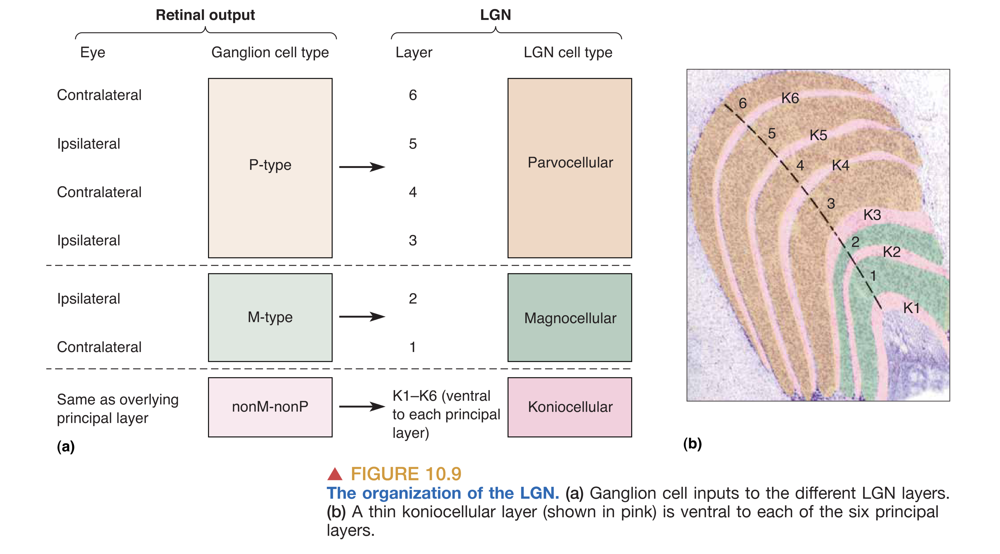
## ANATOMY OF THE STRIATE CORTEX

从 LGN 发出的轴突经由视放射抵达枕叶。这里的初级视觉皮层（V1）由于在特定的 Nissl 染色下会呈现出明显的纹状结构，因此也被称为 **Striate cortex**。V1 的组织逻辑深刻反映了视觉处理的精密性。
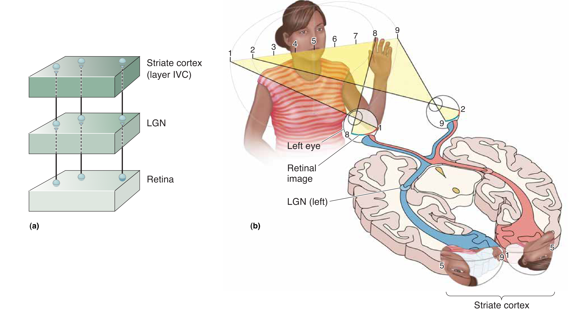
### Retinotopy and Laminar Organization
V1 与视网膜之间维持着严格的 **Retinotopy (视网膜拓扑映射)**，即视网膜上位置相邻的细胞，其在皮层上的投射也保持相邻位置。这种拓扑结构确保了视觉世界的空间关系在神经网络中得到了真实保存。然而，这种映射并非线性等比例，而是表现出显著的皮层放大（Cortical Magnification）效应：中央凹（Fovea）区域由于感光器密度极高且涉及精细辨识，在 V1 中占据的处理面积远超其视网膜面积占比。

从层级结构上看，V1 依哺乳动物新皮层通则分为六层，厚度约 2 mm。其中 **Layer IV** 是信息的收纳枢纽，细分为 A、B、C 三个部分。**Layer IVC** 是主要的传入入口，大细胞通路（M-pathway）的信息流主要进入 IVC$\alpha$ 层，而小细胞通路（P-pathway）则进入 IVC$\beta$ 层。核颗粒细胞层则绕过 IV 层，直接投射至 I 层和 III 层。这种精细的分层确保了不同属性的信号在局部回路中能被分类加工。在神经元类型方面，主要包括能够将轴突送出皮层的锥体细胞（Pyramidal cells）和分布在 IVC 层、专司局部连接的星状突起细胞（Spiny stellate cells）。

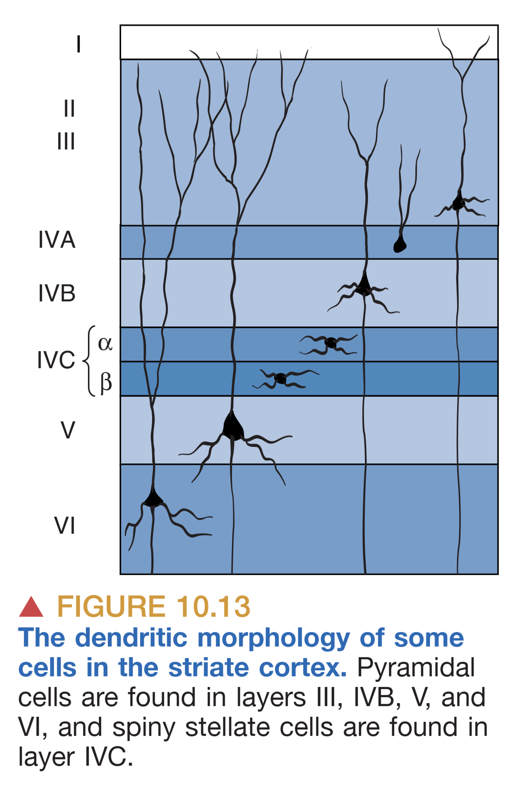
### Columns and Blobs
Hubel 和 Wiesel 的开创性研究揭示了皮层内部更为惊人的组织结构。在 **Layer IVC**，虽然两眼信号都已抵达，但并未发生立即的混合。利用放射性脯氨酸示踪发现，来自左眼和右眼的输入会以约 0.5 mm 的间隔交替排列，形成像斑马纹一样的 **Ocular dominance columns (眼优势柱)**。这种按眼分区的结构直到信息流向更浅的层级（如 II、III 层）时才开始融合。
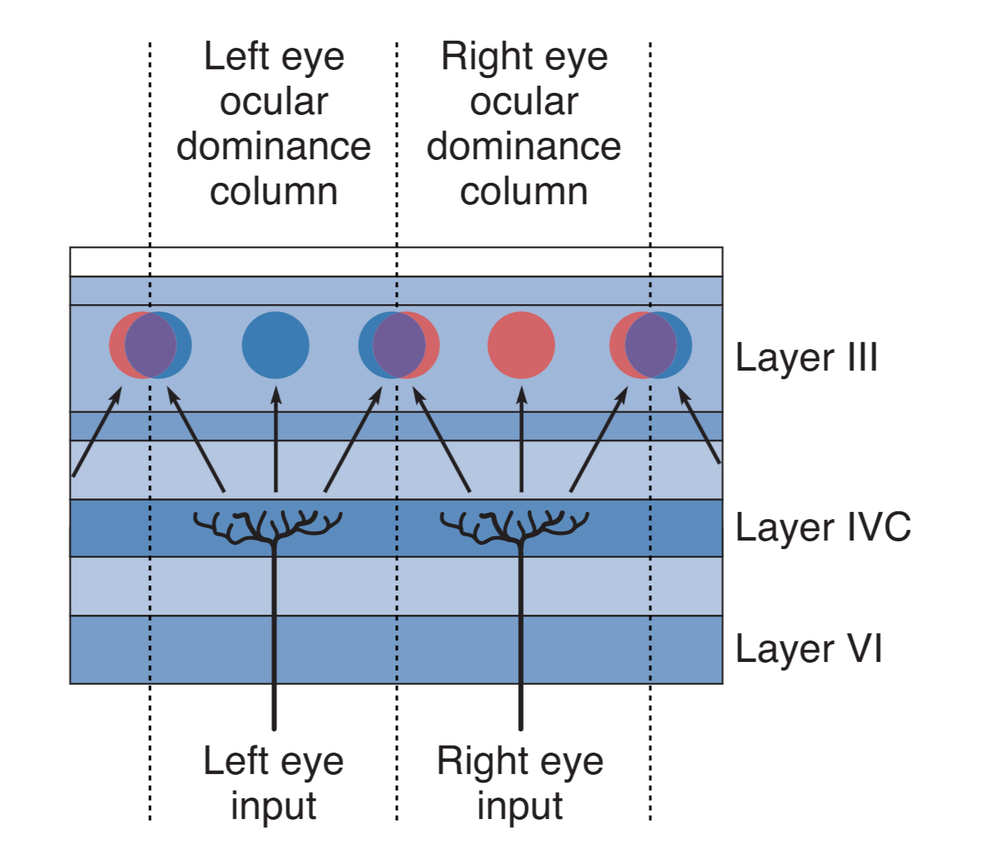
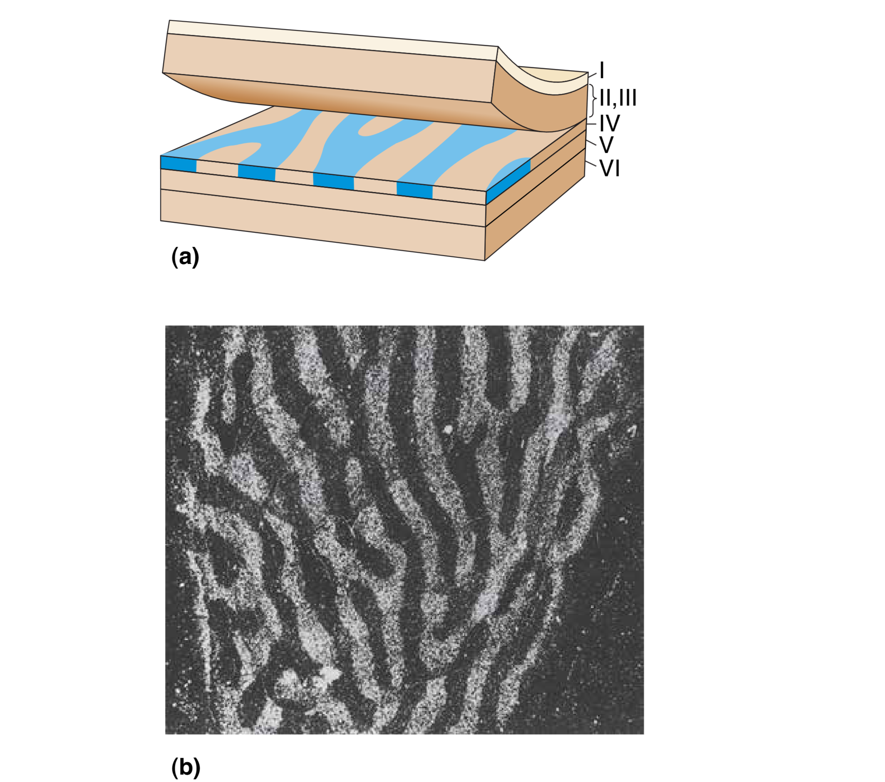

从 **Layer IVC** 开始，轴突通过两种主要的连接方式向其他层级扩散：**Radial connections (径向连接)** 沿着垂直于表面的方向向上延伸，确保了机能柱内部信息的纵向传递；而位于 III 层等位置的锥体细胞轴突则产生大量的 **Horizontal connections (水平连接)**，在层内进行横向的信号整合。在这一过程中，大细胞通路与小细胞通路维持着显著的解剖隔离：来自大细胞层的信号（IVC$\alpha$）主要投射至 **Layer IVB**，而来自小细胞层的信号（IVC$\beta$）则主要投射至 **Layer III** 的斑块间区域。
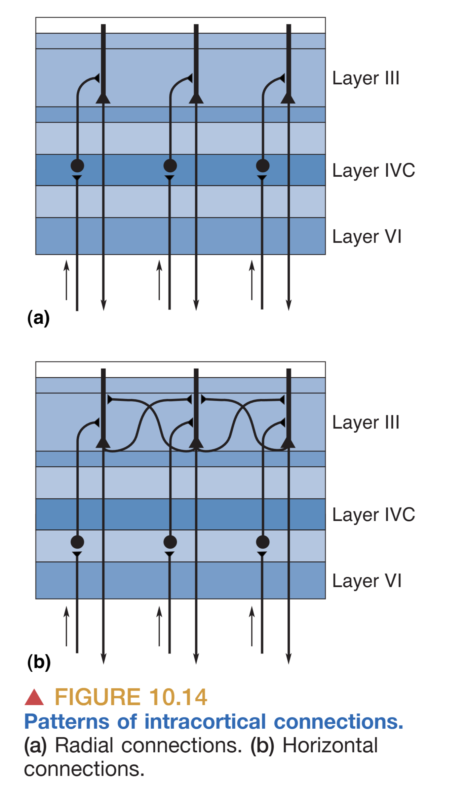
此外，在 II 层和 III 层中，通过细胞色素氧化酶（Cytochrome oxidase）染色可以观察到均匀分布的圆柱状斑块，称为 **Blobs**。由于这些区域富含代谢酶，它们被认为是视觉皮层中负责能量消耗较大的专门化处理中心。这些斑块不仅接收来自核颗粒层的直接输入，还整合了来自 IVC$\alpha$ 和 IVC$\beta$ 的跨层信号，专门服务于 **Color (颜色)** 属性的处理。相比之下，斑块之间的区域（Interblobs）则更多参与形状和方向的提取，这种精细的解剖划分标志着视觉皮层内部功能的高度特化。
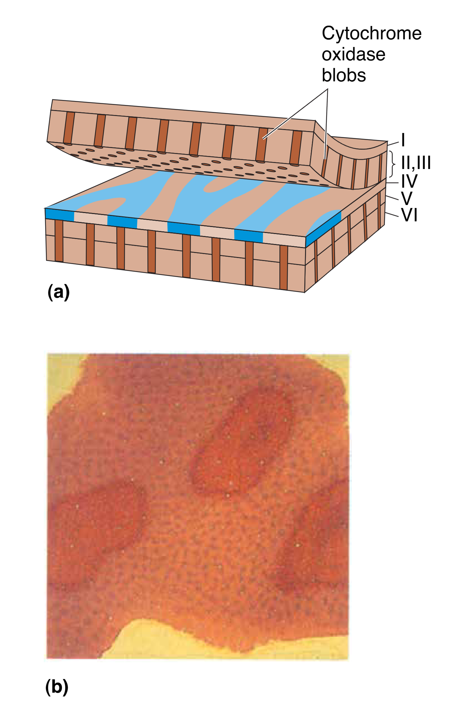

## INPUTS AND OUTPUTS OF THE STRIATE CORTEX

纹状皮层的结构不仅在于其内部的分层，更在于其高度组织化的输入与输出路径。作为视觉皮层最主要的信息入口，来自丘脑 LGN 的轴突展现出严格的层级选择性。大部分 LGN 轴突终结于 **Layer IVC**，但在此内部依然维持着大细胞通路与小细胞通路的“平行化”：大细胞层轴突主要投射至 IVC$\alpha$，而小细胞层轴突则主要进入 IVC$\beta$。这种隔离确保了关于运动和细节的原始信号在进入皮层的第一站仍是分流处理的。与此同时，来自 LGN 核颗粒层（Koniocellular）的输入则展现出不同的投射策略，它们往往绕过 IV 层，直接抵达更浅层的 **Layers II 和 III**，特别是在斑块（Blobs）区域进行突触联系。

在输出方面，纹状皮层通过不同层级的锥体细胞（Pyramidal cells）将处理后的信号分发至大脑各处，其投射靶点与其所在的层位精密对应。**Layers II、III 和 IVB** 的锥体细胞主要担负着皮层间的沟通重任，它们的轴突会穿过白质，投射至更高级的视觉皮层区域（如 V2 或背侧/腹侧流通路）。相比之下，深层的神经元则主要负责对皮层下结构的调控：**Layer V** 的神经元产生长距离投射，直达上丘（Superior colliculus）和脑桥（Pons），从而参与眼动控制与视觉注意力的物理引导；而 **Layer VI** 则产生一个极其庞大的反馈（Feedback）系统，将轴突逆向投射回 LGN。这种皮层对侧向膝状体的反馈机制，赋予了大脑“主动选择”输入信号的能力，使得高级皮层能够根据当前的认知状态调节低级中继站的增益。
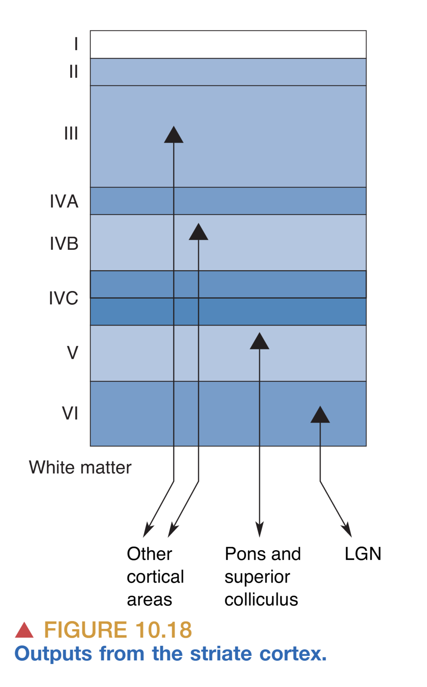
## PHYSIOLOGY OF THE STRIATE CORTEX

在 V1，视觉处理经历了从“光点”到“特征”的惊人飞跃。与视网膜或 LGN 仅对单纯的中心-周边光照（点对点）反应不同，V1 细胞表现出了极强的选择性。

### Orientation and Direction Selectivity
V1 中最引人瞩目的生理发现是 **Orientation Selectivity (方向选择性)**。Hubel 和 Wiesel 发现，V1 内的大多数神经元对点状光源反应平平，但对具有特定倾斜角度的长形光条（如垂直或 45 度角）表现出极其强烈的爆发性放电。这种方向偏好在垂直于皮层表面的柱状结构（Orientation Columns）中保持一致。这意味着，当你将电极从皮层表面径向推入深层时，遇到的一系列神经元都会对同一个角度的光条敏感。而一旦电极沿皮层表面水平移动，神经元的首选方向就会发生规律性的旋转。这种机能柱的设计说明，大脑将同一个视野点位的所有方向偏好都密集地打包在了一起。
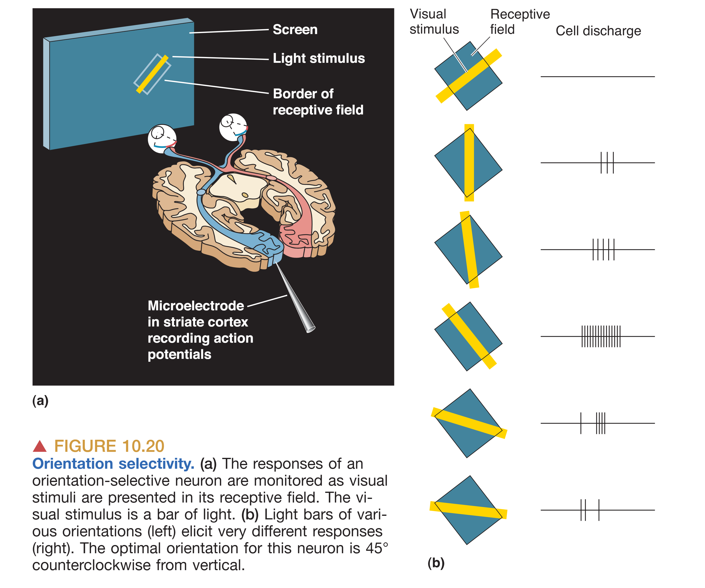
除了方向，部分 V1 神经元（尤其是在 IVB 层）还具备 **Direction Selectivity (方向运动选择性)**，它们仅在光条朝特定方向（如向左移动而非向右）划过感受野时才有反应。这被认为是大细胞通路专门用于分析物体运动轨迹的硬件基础。
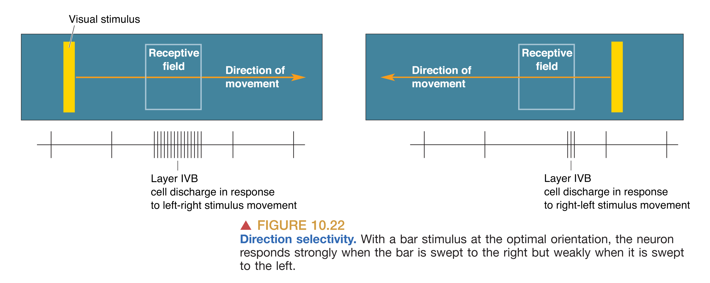
### Simple and Complex Cells

纹状皮层中神经元对特征提取的深度，很大程度上取决于其感受野内部的空间逻辑。Hubel 和 Wiesel 根据神经元对刺激位置的敏感程度，将其划分为简单细胞与复杂细胞。**Simple Cells (简单细胞)** 具有极其明确且彼此分离的 ON/OFF 空间分区。这些分区通常沿着特定的轴向延伸，表现为一条狭长的兴奋区，其两侧并列着平行的拮抗抑制区（或反之）。这种线性的中心-周边拮抗结构，使得简单细胞不仅展现出强烈的方向选择性，还表现出极高的 **Positional sensitivity (位置敏感性)**：只有当特定角度的光条精确落在感受野的 ON 区中心时，细胞才会产生最强放电；如果光条稍微偏移进入侧边的抑制区，放电就会被立即抑制。这种特性使简单细胞能够像一把“精密的卡尺”，不仅提取边缘的方向，还锁定边缘在视网膜上的绝对坐标。在层级分布上，这类细胞在 **Layer IVC$\alpha$** 以及输出层中较为常见。

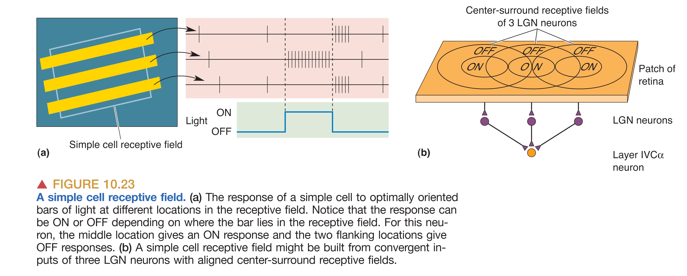
相比之下，**Complex Cells (复杂细胞)** 代表了更高级的视觉抽象。与简单细胞不同，复杂细胞并不具备逻辑清晰的 ON/OFF 空间分区。虽然它们同样对特定倾斜角度的光条有极强的偏好，但它们展现了显著的视角不变性或 **Position invariance (位置不变性)**：只要刺激的方向正确，无论光条位于感受野内的哪个具体点位，甚至是在感受野范围内发生平移，复杂细胞都会保持稳定的放电。在理论模型中，这种复杂的性质被认为源于 **Hierarchical convergence (级联汇聚)**，即一个复杂细胞接收了多个具有相同方位偏好、但感受野位置略有偏移的简单细胞的汇聚输入。通过这种“池化”处理，复杂细胞能够从繁琐的空间坐标中剥离出纯粹的“形状”属性。这类细胞广泛分布于 **Layers II 和 III** 的斑块间区域，是视觉系统进行复杂物体轮廓分析与识别的关键基石。
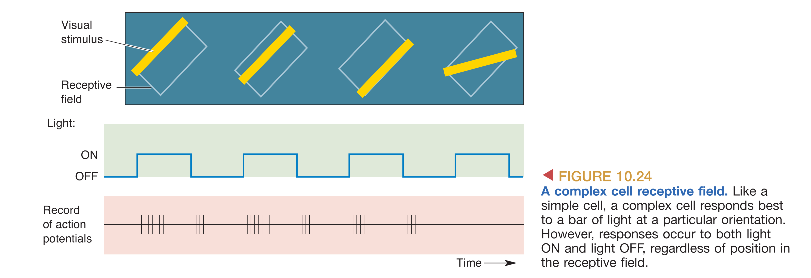
## PARALLEL PATHWAYS AND CORTICAL MODULES

视觉加工并非线性的串联，而是高度并行的。大脑将视觉世界拆解为三条主要流水线并行处理。**Magnocellular Pathway** 追求速度，通过 M 型细胞 -> 大细胞层 -> IVC$\alpha$ -> IVB 的路径，专门解析运动信息。**Parvo-interblob Pathway** 追求精度，通过 P 型细胞 -> 小细胞层 -> IVC$\beta$ -> Interblobs 的路径，专注于物体的精细边界与静态形状。而 **Blob Pathway** 则追求色彩，经由核颗粒层向斑块区域提供输入的，并在此分析波长信息。

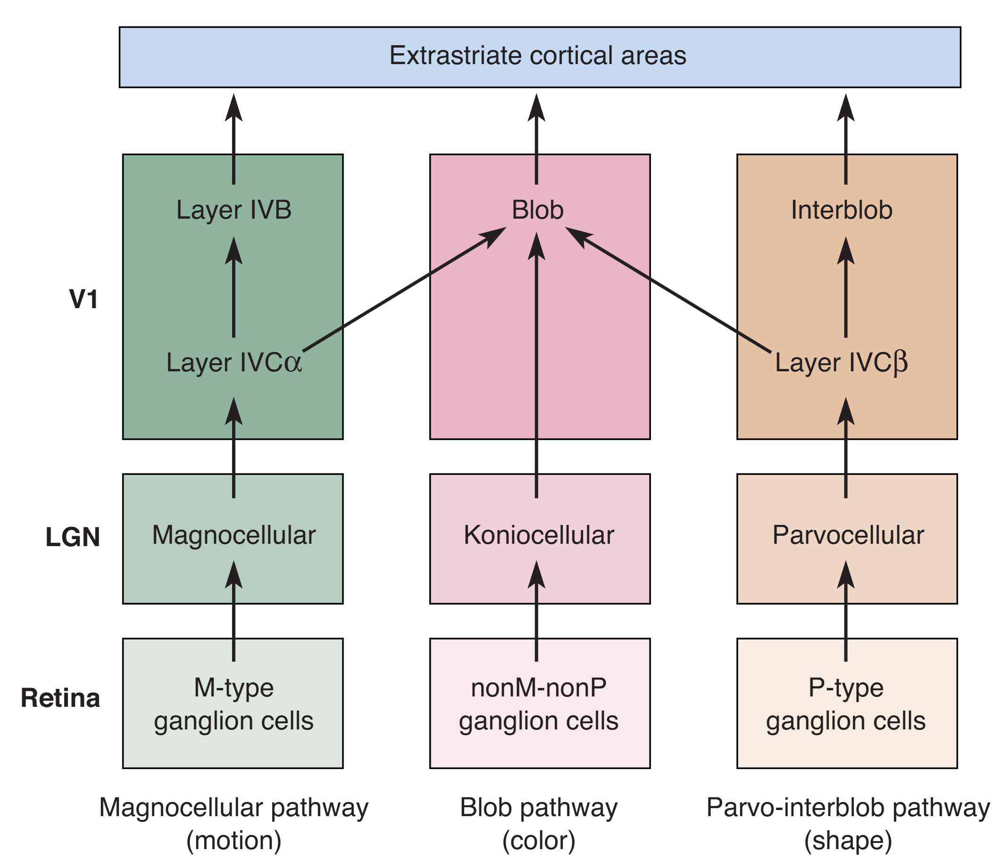

这些不同的功能单元最终被整合成一个功能完备的最小处理单位——**Cortical Module**。在一个约 2x2 mm 的皮层区域内，包含了一对完整的眼优势柱、所有 360 度覆盖的方向柱以及若干个颜色斑块。每一个这样的模块，就像是视觉皮层中的一台微型高性能电脑，独立负责分析视野中特定微小区域内所有的视觉属性。皮层就是由数以千计的这种重复模块拼接而成的宏大机能阵列。
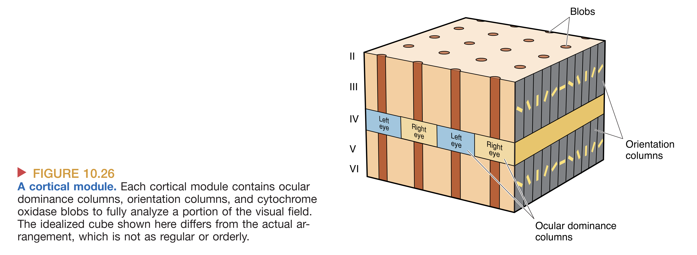
## BEYOND THE STRIATE CORTEX

视觉处理并不仅限于 V1。信息在离开 V1 后，沿着物理路径分化为背侧流与腹侧流，深入更高级的联合皮层以进行复杂的语义和空间分析。
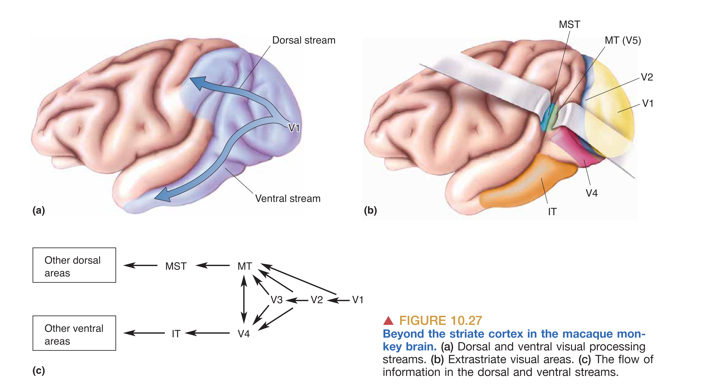
### The Dorsal Stream: Motion and Guidance
背侧流向顶叶延伸，主要由大细胞通路的衍生路径构成。其核心区域是 **Area MT (V5)**。该区域的细胞对运动的方向表现出惊人的敏感度，甚至能识别复杂的整体运动趋势，而非仅仅是局部的光影飘过。损伤 MT 会导致严重的运动盲（Akinetopsia），患者会发现由于无法感知动作的连续性，世界变得像一串断断续续的幻灯片。更高级的 **MST** 区则负责分析旋转和缩放运动，这对于个体在环境中的导航（Navigation）以及追踪运动目标时的眼动引导至关重要。
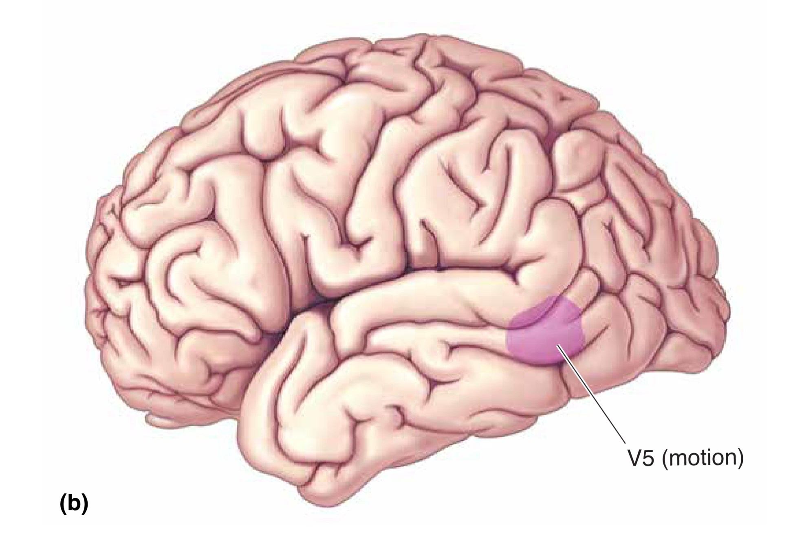

### The Ventral Stream: Object and Face Recognition
腹侧流向颞叶延伸，主要源自小细胞和斑块通路。其主要区域之一是 **Area V4**，在该区域，细胞开始对复杂的几何形状进行初步解析，且对颜色的恒常性感知起着至关重要作用。损伤 V4 常引起全色盲（Achromatopsia），患者的世界将失去色彩，仅剩下灰度。更深层的 **Area IT (颞下皮层)** 则是视觉感知的高级终点。这里存在对复杂物体（如工具、建筑物）甚至特定生物学对象有强烈反应的神经元。最著名的现象是对面孔的特异性识别：当梭状回（Fusiform gyrus）受损时，会产生面孔失认症（Prosopagnosia），患者虽然能量视物体，却认不出亲友甚至镜中的自己。这说明，视觉系统最终成功地将光子的震动转化为了深刻的社会契约与身份认同。
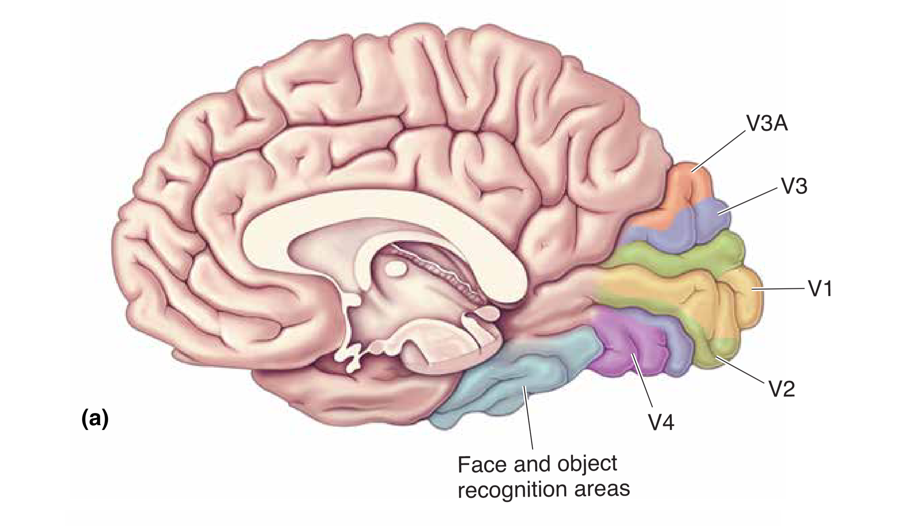
## FROM SINGLE NEURONS TO PERCEPTION

中枢视觉系统展现了从局部到整体、从物理到概念的惊人飞跃。这一过程遵循着清晰的感受野层级演变（Receptive Field Hierarchy）：从视网膜的点状对映，到 V1 的线段方位提取，再到 V4 的简单几何块，最后在 IT 区达成对复杂物体（如面孔）的闭环识别。这种级联处理（Hierarchical integration）辅以高度发达的并行路径，构成了人类目前已知最为精密的信息处理系统。这种组织原则不仅定义了我们如何“看”世界，也为听觉、触觉等其他感觉系统的神经构效提供了通用的生物学蓝图。

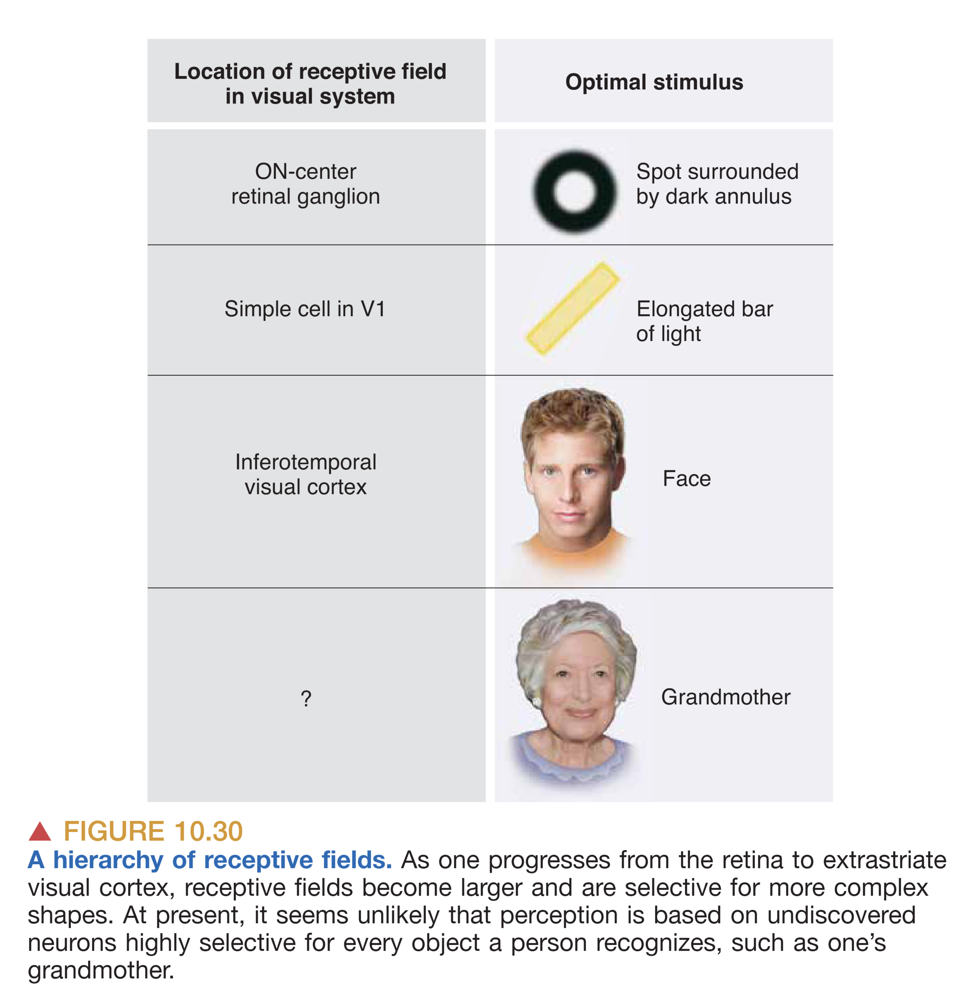