# The Auditory and Vestibular Systems: Sensing Sound and Balance

听觉（Audition）与平衡觉（Vestibular sense）构成了神经系统中最精密且反应最迅速的机械感知系统。这两个系统在解剖演化上具有共同的起源，均位于内耳的迷路结构（Labyrinth）中，并共享了极其相似的机械动力学转化原理：通过**Hair Cells (毛细胞)** 将微小的压力波动或位移转化为电转导信号。听觉系统使我们能够探测并解析空气介质中的压力波，而前庭系统则负责监测重力、线性加速度以及头部的三维旋转，共同维系着生物体的空间方位感与动态平衡。

## The Nature of Sound (声音的物理本质与感知维度)
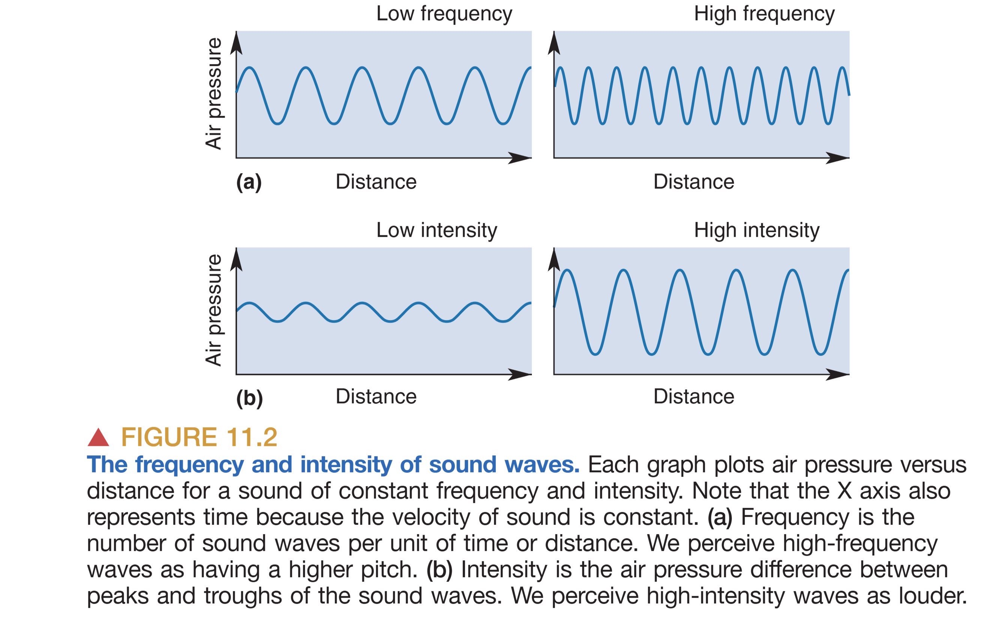
声音在本质上并非物质的移动，而是一种在弹性介质（如空气或水）中传播的周期性压力波。这种波动由介质分子的压缩（Compression）和稀疏（Rarefaction）交替驱动。其传播速度受介质物理性质的影响显著：在空气中约为 340 m/s，而在密度更大的水中则超过 1000 m/s。

我们对声音的感知主要由频率和振幅两个维度定义。**Frequency (频率)** 指的是声波每秒振动的次数，以赫兹（Hz）为单位，它决定了主观感知的 **Pitch (音高)**。人类的听觉感知范围跨度极大，通常分布在 20 Hz 至 20,000 Hz 之间，且在中频段（如语言频率）最为敏感。**Amplitude (振幅)** 则是压力波从波峰到波谷的强度差异，直接对应于我们感知的 **Loudness (响度)**。一个有趣的现象是，低频高幅的声音不仅能被听觉捕捉，还常能引起胸腔的物理共振，反映了声音作为一种机械能量的本质。

## Anatomy of the Auditory Apparatus (听觉系统的结构与力学转换)

听觉器官的核心挑战在于如何将空气中这种能量稀薄的机械波，高效地传递到阻抗极大的内耳液体中。这一转换过程涉及外耳的收集、中耳的阻抗匹配放大以及内耳的最终频率解吸。
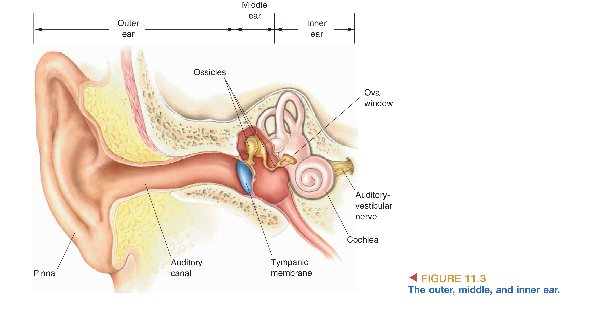
### The Outer and Middle Ear (外耳与中耳的机械转换)
外耳由皮肤覆盖的软骨结构 **Pinna (耳廓)** 组成，其复杂的褶皱不仅有助于收集声波，还通过反射干涉模式辅助声音的垂直定位。声波进入 **Auditory Canal (耳道)** 后撞击 **Tympanic Membrane (鼓膜/耳膜)**，使其产生机械振动。

中耳是一个充满空气的小室，内部精密排列着三块听小骨：**Malleus (锤骨)**、**Incus (砧骨)** 与 **Stapes (镫骨)**。由于声波从空气进入液体（内耳液）时，约 99.9% 的能量会因阻抗不匹配而被反射。中耳通过 **Impedance Matching (阻抗匹配)** 机制巧妙地克服了这一物理瓶颈。首先，听小骨链利用杠杆原理（锤骨与砧骨刚性连接，砧骨与镫骨柔性衔接），将鼓膜的大振幅震动转化为镫骨在 **Oval Window (卵圆窗)** 处小幅而强力的压缩。其次，鼓膜的有效面积远大于卵圆窗的面积。在这两者的共同作用下，卵圆窗处的压力被放大了约 20 倍，确保了机械能能有效地驱动内耳液体移动。
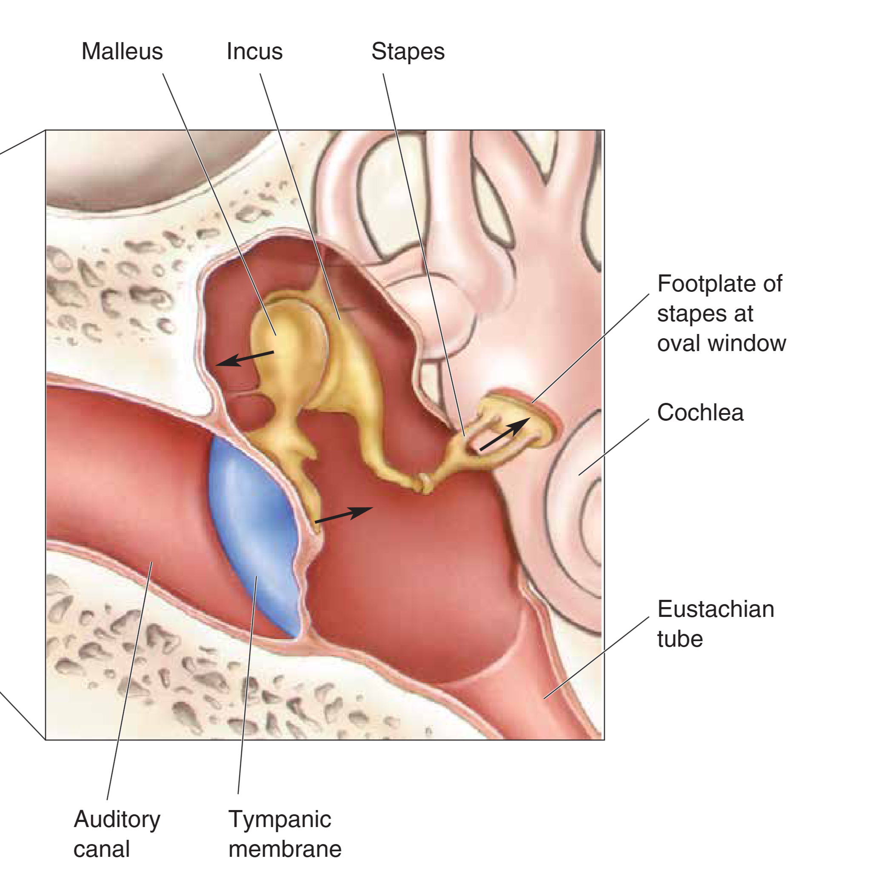
此外，中耳通过 **Eustachian Tube (咽鼓管)** 与鼻腔相连，确保了鼓膜内外两侧的气压平衡。而在面对突发性或持续的高强度噪音时，**Tensor Tympani (鼓膜张肌)** 与 **Stapedius (镫骨肌)** 会产生 **Attenuation Reflex (衰减反射)**。通过收缩使听小骨链变得刚硬，显著降低传导至内耳的能量，起到保护毛细胞、提高高频选择性以及抑制自身发声（如咀嚼声）干扰的功能。

### The Inner Ear: The Cochlea and Tonotopy (内耳：耳蜗与音调拓扑)

**Cochlea (耳蜗)** 是听觉的终极频率分析仪。其内部由膜结构分隔为三个充满液体的阶梯（Scala）：**Scala Vestibuli (前庭阶)**、**Scala Media (中阶)** 和 **Scala Tympani (鼓阶)**。其中前庭阶与鼓阶含有成分类似脑脊液的 **Perilymph (外淋巴)**，而中阶则包含高钾低钠的 **Endolymph (内淋巴)**。这种独特的离子环境由 **Stria Vascularis (血管纹)** 维持，并产生了一个相对于外淋巴约 +80 mV 的 **Endocochlear Potential (耳蜗内电位)**，为后续的信号转导提供了强大的跨膜电驱动力。

基底膜（Basilar membrane）的解剖特性是频率解析的关键。物理学家 Georg von Békésy 发现，基底膜从底部（Base）到蜗顶（Apex）呈现出显著的物理梯度：底端狭窄且坚硬（Narrow and stiff），顶端宽阔且松软（Wide and floppy）。当镫骨推动卵圆窗时，不可压缩的液体推动基底膜产生 **Traveling Wave (行波)**。这种行波在基底膜的特定部位产生最大振幅——高频声音在底端达到峰值，而低频声音则能传播至顶端。这种空间位置与频率的一一对应关系构成了 **Tonotopy (音调拓扑)** 的基础，使得耳蜗在机械层面就完成了一次实时的傅里叶分析。
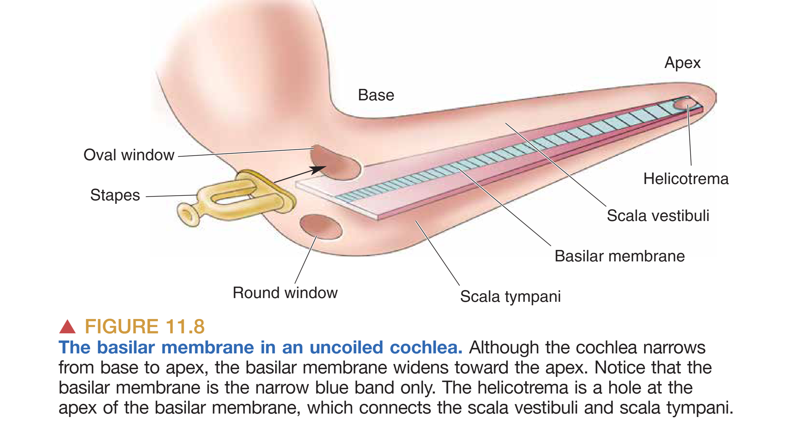
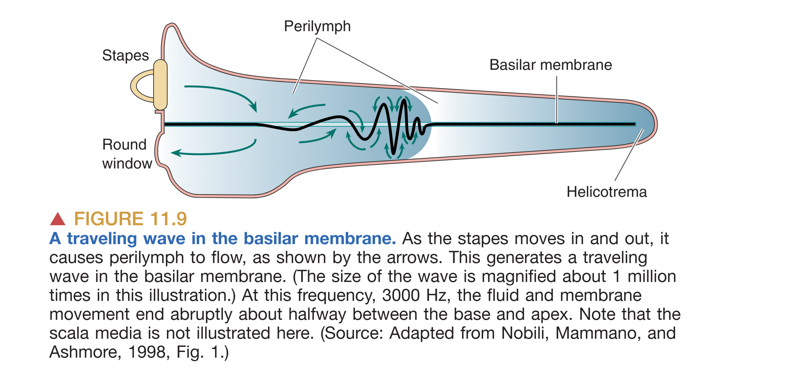
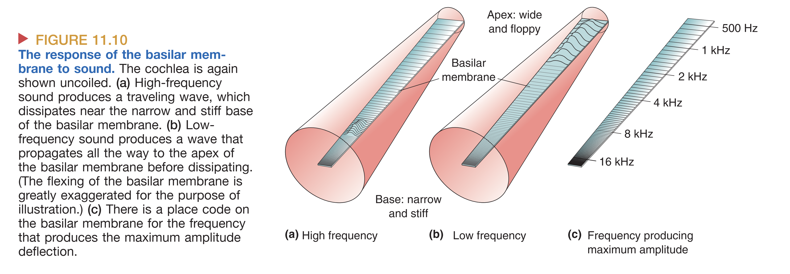
## The Organ of Corti and Hair Cell Transduction (柯蒂氏器与电信号转导)

**Organ of Corti (柯蒂氏器)** 是坐落在基底膜上的动力转换核心。它依赖两类功能各异的毛细胞完成信号的物理放大与生物电转换。
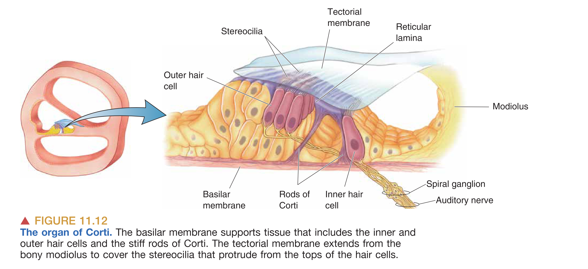
### Inner and Outer Hair Cells (内毛细胞与外毛细胞)
**Inner Hair Cells (IHCs, 内毛细胞)** 虽然数量较少（约 4500 个），但却承担了约 95% 传入中枢的听觉信号传输。它们作为主要的听觉传感器，受支配于密集的螺旋神经节纤维。相比之下，多达 12,000-20,000 个的 **Outer Hair Cells (OHCs, 外毛细胞)** 排列成三行，虽然并非主要的信号上传者，但它们是听觉系统实现高灵敏度与高频率分辨的关键所在。

### Molecular Mechanism of Transduction (转导的分子机制)
转导过程发生于毛细胞顶端的 **Stereocilia (静纤毛)**。这些纤毛以高度递增的方式排列，并由 **Tip Links (顶链)** 相互连接。当基底膜因声波发生位移时，毛细胞与上方的 **Tectorial Membrane (盖膜)** 产生相对剪切力，导致纤毛向长端偏转。
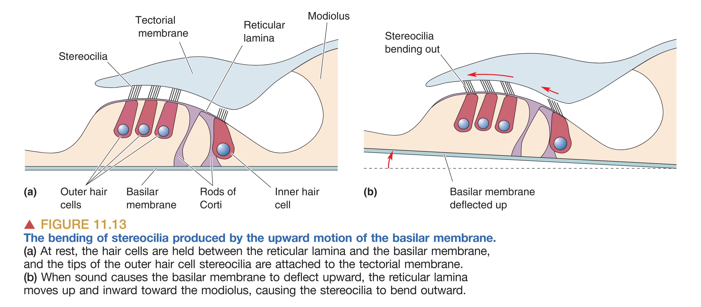
这一运动通过顶链拉伸开启了机械门控通道（如 **TMC1**）。由于内淋巴具有极高的钾电位，$K^+$ 顺电梯度迅速涌入毛细胞导致去极化（注意这与大多数神经元 $K^+$ 外流相反）。去极化随之开启电压门控钙通道，触发神经递质（谷氨酸）向 **Spiral Ganglion (螺旋神经节)** 细胞释放。若纤毛向短端偏转，通道关闭，细胞则发生超极化。
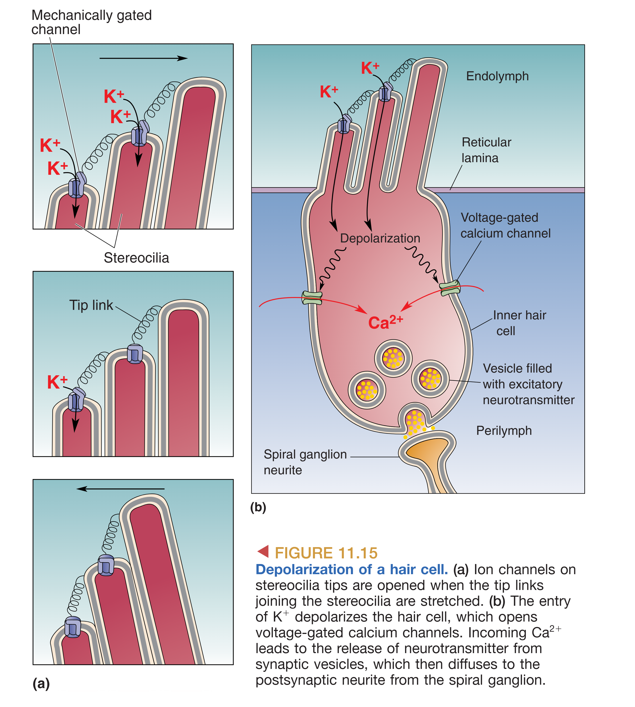

### Hair Cells and the Axons of the Auditory Nerve (毛细胞与听神经纤维的连接)
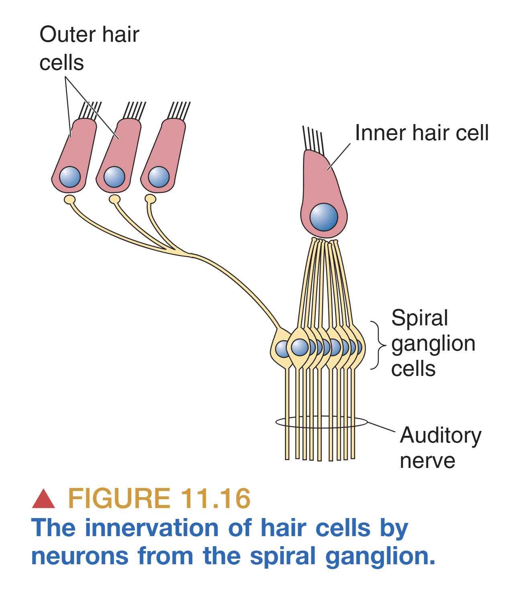
虽然耳蜗中外毛细胞的数量约是内毛细胞的三倍，但在信息的传递分工上呈现出极端的不对称性。**Spiral Ganglion (螺旋神经节)** 作为听觉通路的第一个神经元核团，其 95% 的输入直接来源于内毛细胞。具体而言，一个内毛细胞往往与约 10 个螺旋神经节细胞的树突建立突触联系，这种“一对多”的散发模式确保了声音信息的并行处理与高度精确的表征。

相比之下，剩下的 5% 螺旋神经节纤维则负责支配庞大的外毛细胞群体。一个螺旋神经节细胞通常会分出许多分支，同时支配数个甚至数十个外毛细胞。这种连接模式的巨大差异进一步锁定了内毛细胞作为“主要信号传感器”的地位，而外毛细胞则更多地参与到局部力学调节中。

### Amplification by Outer Hair Cells (外毛细胞的放大作用与耳蜗放大器)
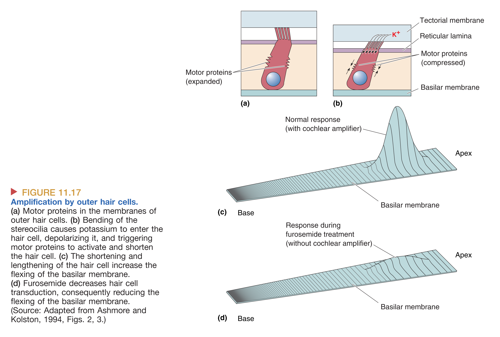
外毛细胞不仅仅是无动于衷的感受器，它们是活跃的机械调节器。它们的核心贡献在于 **Cochlear Amplifier (耳蜗放大器)** 机制。这种放大作用依赖于其侧膜上密布的马达蛋白 **Prestin**。当外毛细胞在声波驱动下发生去极化时，Prestin 会引起细胞长度的快速缩短；而超极化时则引起细胞伸长。这种与声波频率同步的主动机械变形会直接施力于基底膜，极大程度上增强了基底膜的振动幅度。

值得注意的是，这种放大作用并非盲目的，它受到中枢神经系统的精密调控。来自脑干的下行反馈纤维（主要通过 **Olivocochlear Bundle, 橄榄耳蜗束**）直接终止于外毛细胞。通过这种 **Centrifugal Feedback (离心中枢反馈)**，大脑可以动态调整外毛细胞的伸缩能力，从而在复杂的背景噪声中选择性地增强某些频率段的灵敏度，或是通过减弱放大来避免强噪音对内耳的物理损伤。这也是我们在社交场合（鸡尾酒会效应）中能够专注听取特定声音的一种外周调节机制。
## Central Auditory Pathways and Processing (中枢听觉通路与信息处理)

听觉信息的处理遵循从特征提取到多感官整合的级联通路。其显著特点是双耳信息的早期交汇。

**Spiral Ganglion (螺旋神经节)** 的轴突汇聚成 **Auditory Nerve (听神经, VIII)**，首站到达延髓的 **Cochlear Nuclei (耳蜗核)**。此处的信息仍维持同侧性。但在下一级，即 **Superior Olive (上橄榄核)**，来自双耳的信息实现了首次汇聚，这对于空间定位至关重要。随后的信号经由侧索（Lateral lemniscus）上传至中脑的 **Inferior Colliculus (下丘)**。下丘不仅是所有核心上行通路的交汇点，负责复杂声音模式的整合，还将轴突投射至 **Superior Colliculus (上丘)** 以辅助视听整合，并投射至小脑参与协调。最后，主要信息经由丘脑的 **MGN (内侧膝状体)** 投射至颞叶的 **Primary Auditory Cortex (A1, 初级听觉皮层)**。
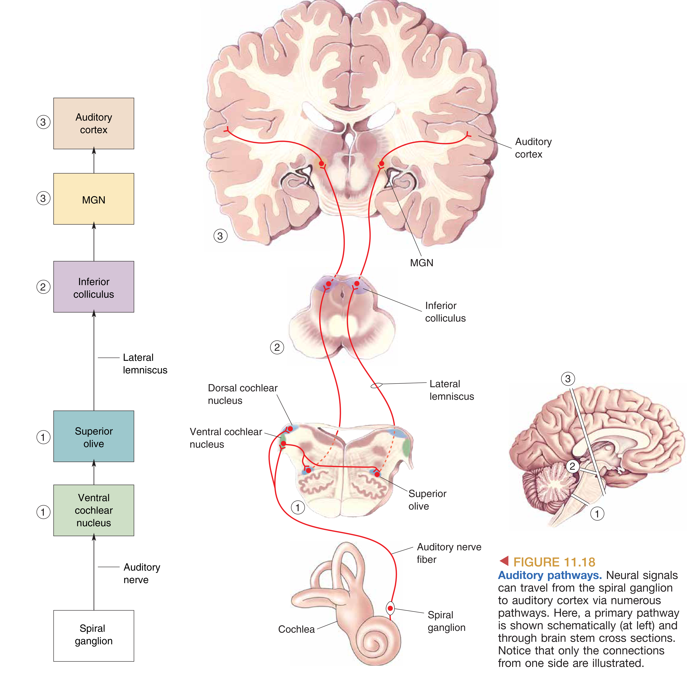
值得注意的是，听觉系统中存在广泛的 **Centrifugal Pathways (下行反馈通路)**。例如，听觉皮层会向 MGN 和下丘发送反馈纤维，而脑干神经元甚至会发出轴突直接接触外毛细胞，从而动态调节耳蜗的灵敏度和频率选择性。这种双向调节机制使得系统能够根据注意力或环境背景实时优化感知性能。

### Frequency and Intensity Coding (频率与强度的神经编码)

中枢神经系统对声音信息的表征主要从强度和频率两个基本维度展开。这种编码机制既依赖于单个神经元的电生理特性，也依赖于神经元群体在解剖空间上的分布模式。
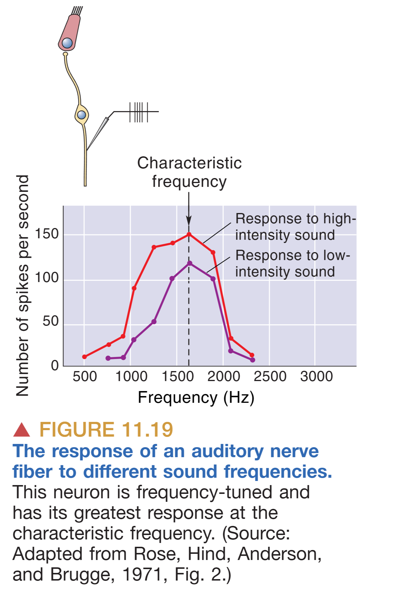
**声音强度的编码 (Intensity Coding)** 表现为一种非线性的协同效应。当声波刺激增强时，基底膜的振幅增大，导致毛细胞产生更深层的去极化，进而诱发螺旋神经节细胞产生更高频率的动作电位，这被称为 **Rate Coding (频率率值编码)**。然而，单个神经元的发放频率存在物理上限，因此系统还引入了 **Recruitment (动员机制/群峰编码)**。随着响度增加，基底膜上的行波会波及更广的区域，激活更多具有相近特征频率的神经纤维。因此，中枢通过识别单一纤维的放电率以及被激活纤维的总数，来联合判定声音的能量强度。
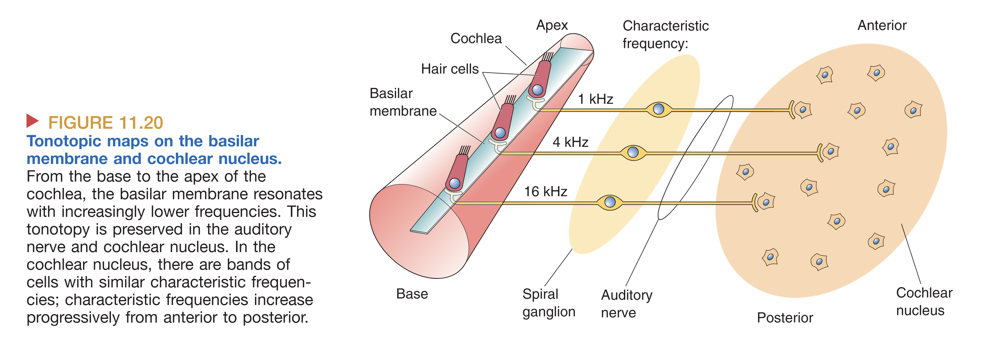
**声音频率的编码 (Frequency Coding)** 则采取了“空间模式”与“时间结构”并行的双重策略。
1. **Tonotopy (音调拓扑/位置编码)** 是基于耳蜗物理特性的空间图谱。从基底膜的底部到顶部，每一处都对应一个 **Characteristic Frequency (特征频率)**。这种频率与解剖位置的映射关系从听神经开始，被精准地保留至耳蜗核、下丘乃至初级听觉皮层。然而，位置编码在极高强度音下会因基底膜振动范围过大（调谐曲线变宽）而导致精度下降。
2. **Phase Locking (相位锁定)** 提供了高精度的时间编码。对于 5 kHz 以下的声音，神经元往往在声波周期的特定相位（如峰值处）产生放电。虽然单个神经元由于不应期的限制无法跟随高达数千赫兹的快速振动，但通过 **Volley Principle (齐射原理)**，一组神经元能够通过交替放电，集体“复刻”出声波的完整时间波形。
3. **频率转换点**: 在 5 kHz 这个分界点以上，神经元的电生理限制使其无法再维持相位锁定，此时系统完全转向依赖音调拓扑图谱来解析频率。
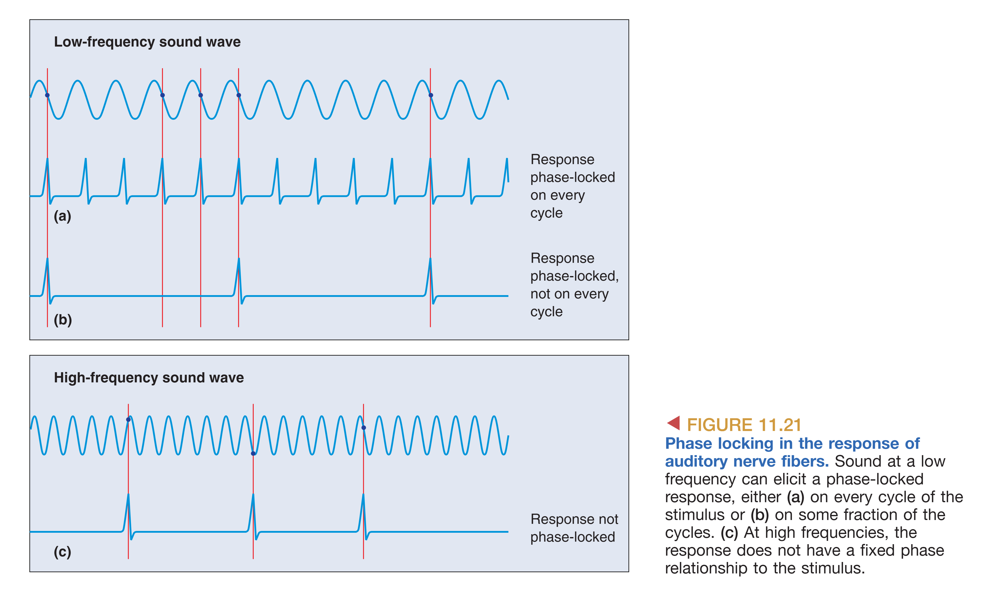
### Sound Localization (多维空间的声音定位)
在水平面上，神经系统采用双元机制：低频声音依赖 **Interaural Time Delay (ITD, 双耳时间差)**，上橄榄核的内侧部（MSO）利用计算延迟线模型感知微秒级的到时差；高频声音则由于头部的“声影”效应，导致两耳间产生 **Interaural Intensity Difference (IID, 双耳强度差)**。
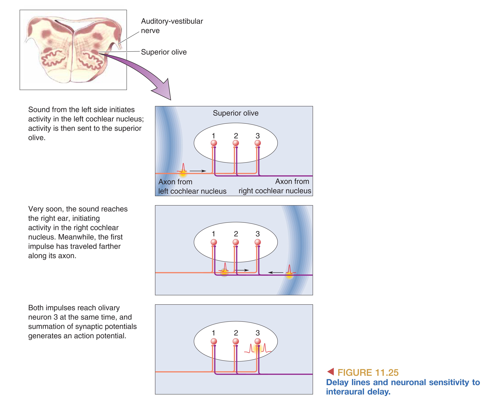
垂直面上的定位则主要归功于耳廓。声波在耳廓内的复杂反射产生了依赖频率的衰减模式，这些“谱线切迹”提供了判定声音高度的关键线索。
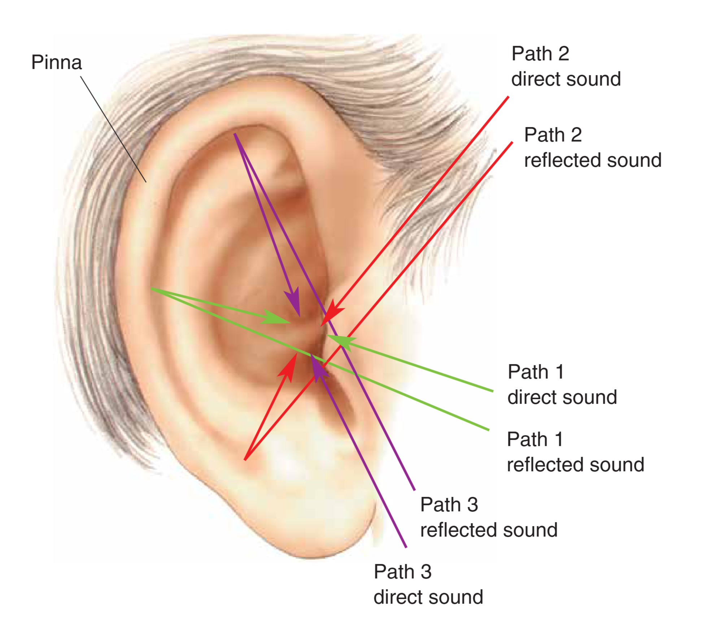

### Auditory Cortex (听觉皮层：声音信息的终极解析)

听觉通路的终点是位于颞叶（Temporal Lobe）上缘、侧脑室外侧裂深处的 **Primary Auditory Cortex (A1, 初级听觉皮层)**，在解剖学上对应于 Brodmann 41 区。A1 的组织架构在许多方面与初级视皮层（V1）平行，高度体现了神经系统的 **Columnar Organization (功能柱状结构)**。

在 A1 中，最显著的组织原则是 **Tonotopy (音调拓扑)** 的延续。对特定频率敏感的神经元在皮层表面形成平行的 **Isofrequency Bands (等频带)**（类似于 V1 的方位柱）。而在垂直于皮层表面的方向上，神经元共享相似的频率优先级。除了频率映射，A1 还包含处理双耳互动的特殊细胞群：**EE Cells**（双耳兴奋型，即受两侧耳朵声音激活）和 **EI Cells**（一侧兴奋/一侧抑制型，即受对侧声音激活受同侧声音抑制）。这种类似于“冰块模型（Ice Cube Model）”的精细排布，使得听皮层能够不仅解析声音的物理属性，还能识别复杂的频率调制频率（FM）及声音的时间序列模式。
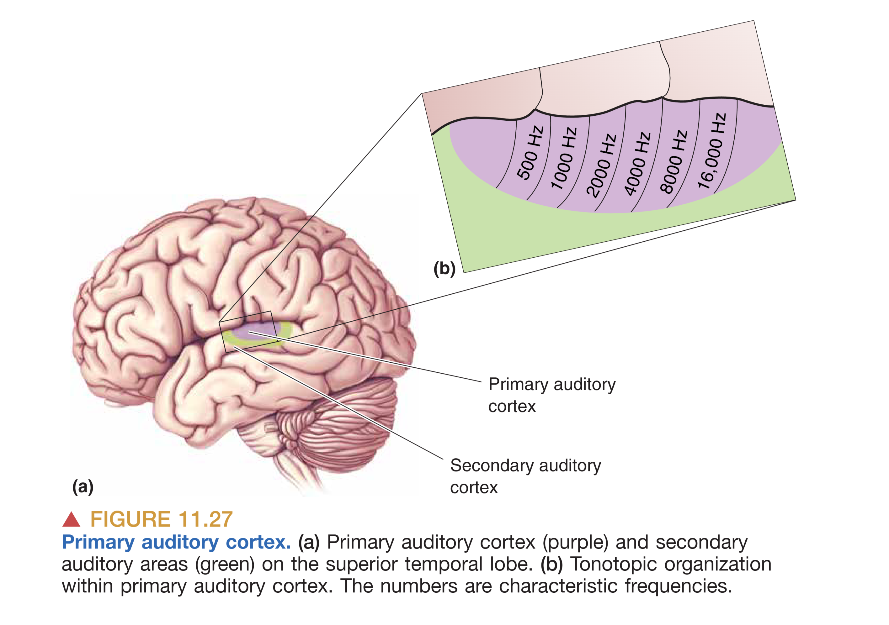
**高级处理与损伤后果**：
超越 A1 的信息流向 **Secondary Auditory Areas (次级听觉区)**，包括围绕 A1 的 **Belt (带状区)** 和 **Parabelt (副带状区)**，在此处，声音信息开始与语言、音乐等高级认知功能整合。
从临床角度看，由于听觉系统在脑干早期就实现了双耳信息的交叉整合，**Unilateral Lesion (单侧听皮层受损)** 的后果与单侧视皮层损伤截然不同——它通常不会导致单耳失聪，而主要表现为在嘈杂背景下对声源方位感知的严重受损（Localization deficits）。这种双侧代表性赋予了听觉系统极高的鲁棒性。
## The Vestibular System (前庭系统：动态平衡与空间定向)

前庭系统专门负责监测头部的平衡态与动力学特征，在维系姿势稳定和视觉清晰方面不可或缺。
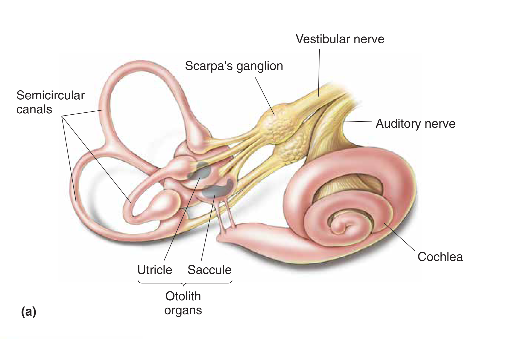
### The Otolith Organs: Gravity and Linear Acceleration (耳石器：重力与线性加速度)
**Utricle (椭圆囊)** 和 **Saccule (球囊)** 是检测直线运动偏差的主要器官。其内部的 **Macula (斑)** 覆盖着一层附着有 **Otoliths (耳石, 碳酸钙晶体)** 的胶质层。当头部相对于重力发生倾斜，或是在直线加速（如电梯启动或汽车加速）时，重的耳石因惯性发生位移，牵拉下方毛细胞的纤毛。由于纤毛的排列方向覆盖了所有维度，神经系统能够精确推算出头部在三维空间中的重力向量改变。
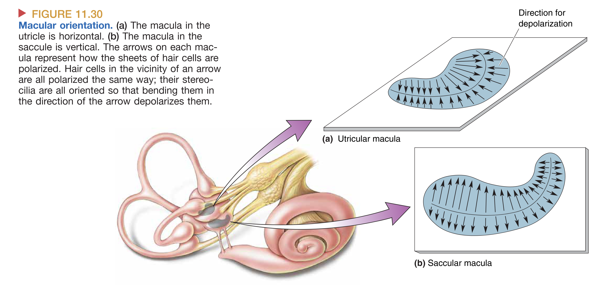
### The Semicircular Canals: Angular Acceleration (半规管：角加速度)
三个相互垂直的 **Semicircular Canals (半规管)** 被用于感测头部的旋转（角加速度）。运动时，管内的管腔保持静止（由液体惯性导致），导致相对移动的液体推动 **Ampulla (壶腹)** 中的 **Cupula (壶腹帽)**。这一机械偏转激发了内部毛细胞的放电。三对半规管（左右成对，镜像安排）通过推拉机制（Push-pull mechanism），能够感知任何维度的旋转变化。
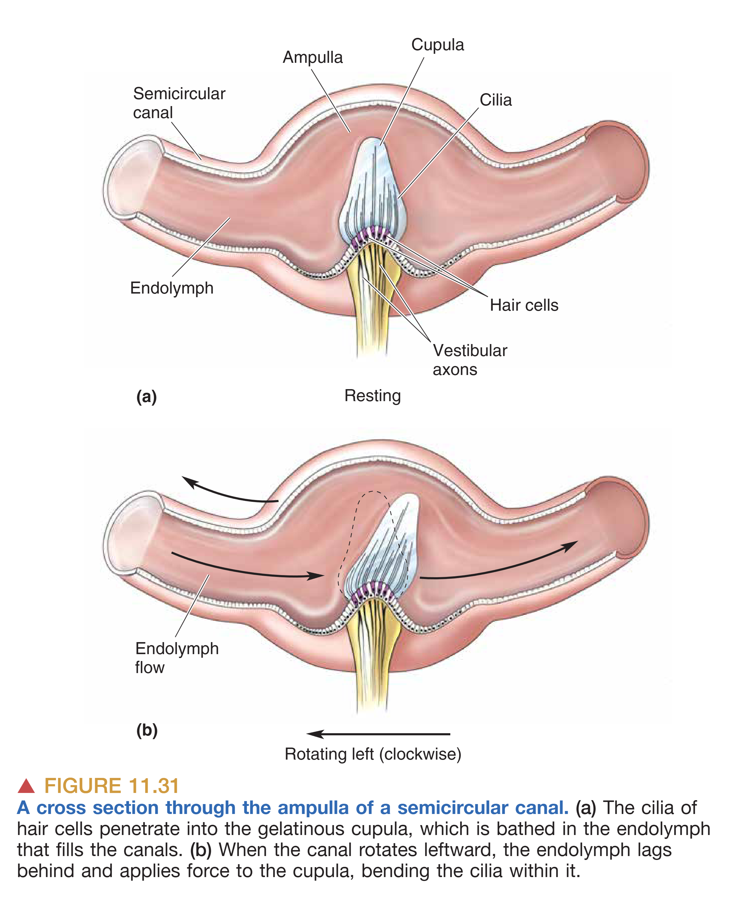
### Vestibulo-Ocular Reflex (VOR, 前庭眼动反射)
VOR 是进化上极其古老且反应最快的神经反射之一，其任务是在头部运动时让眼球以等速但反向的路径运动，以保持视网膜上成像的连续性与稳定性。该反射仅通过“三突触弧”即可完成：半规管毛细胞 -> 前庭核 -> 动眼神经核（支配眼外肌）。在临床上，由于 VOR 高度依赖脑干功能的完整性，它常被用于昏迷病人的神经系统评估（如娃娃眼征监测）。
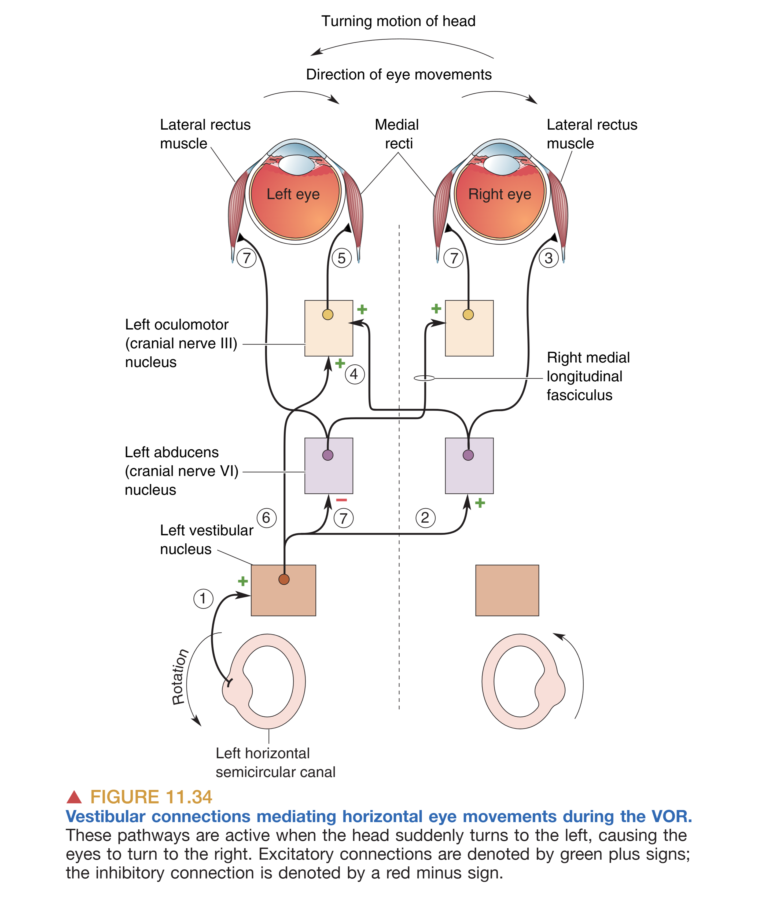