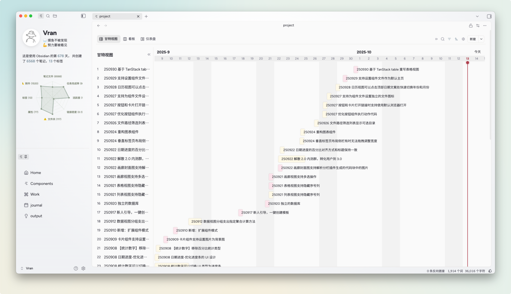
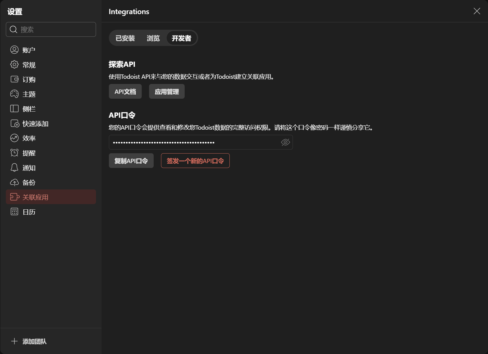

去年有一段时间，要做的事情很多，导致我总是忘记一些事情，所以就找了一些GTD工具，苹果的清单、飞书任务、滴答清单等等，我都体验了一下，由于我不使用苹果电脑，所以苹果的清单只在手机上显示，而工作时我不太喜欢查看手机，导致更新任务很迟滞；飞书的任务其实是可行的，自由度很高，有多种可视化方式，比如列表、看板、仪表盘等，还可以设置每日推送，但由于缺少标签等信息，在新建一些任务后，好不容易分完组，结果换一种显示方式发现分的组完全没有用，所有的任务只在一个视图中是有序的，其他视图完全混在一起了，所以我之后就放弃了飞书。滴答清单的功能很多，可以具体对某个时间段进行规划，我也尝试了几天，终究因为滞后而放弃。

为什么这些GTD工具对我来说并不好用呢？首先是我没有定时查看软件的习惯，导致更新很容易中断。但打开软件查看本身就是一个繁琐的过程，或多或少会额外分担一部分精力，于是除了飞书之外的其他软件最后都懒得打开了，甚至飞书也很少查看tasks，只会查看calendar以及聊天。所以软件的用途分离也是阻挡我用的好的一个因素。

正巧Obsidian购买的components一直在更新，去年10月份的3.0版本支持，3.0在我看来最大的更新就在项目管理上，不仅推出了可交互的项目管理甘特视图，而且在项目管理上也更近一步，推出了自动化任务发布与管理的工具。我第一次直观地觉得用obsidian管理项目也能这么好用，后续就在obsidian上进行任务管理，其中设置相当简单，没有任务优先度的设置，也不设置任务的截止时间等信息，仅仅依靠`status`属性来管理，根据duration来判断任务过去的时间。只要控制`doing`中的任务的数量，即可满足我目前阶段的需求。

然而，obsidian的同步问题一直让我头大，由于库越来越大，使用坚果云同步过程产生的冲突问题越来越严重，且我在多端同步出现空文件或者文件丢失的问题。由于我基本都是在本地使用，所以逐渐放弃了同步。所以本地的obsidian任务基本离开之后就不可见了。这是如果能将obsidian的项目笔记同步到支持多端的GTD应用就完美了。由于components支持自定义javascript脚本，也通过vibe coding成功实现obsidian笔记的Github自动化发布，有了这个经验，就可以写一个脚本实现obsidian的笔记与GTD软件的同步。

第一选择当然是飞书，因为飞书目前对我是不可缺少的，如果仅仅作为查看任务以及更新任务的软件，飞书可以比较好的完成任务，并且该过程不需要其他软件。但飞书的api过程比较繁琐，所以我暂且使用Todoist这个软件，寻找这个软件的api十分方便。

之后我使用Antigravity新建了两个脚本：`PushToDoist.js` 以及 `PullTodoist`。
可将api保存到一个文件中，创建以下函数来call api:
```javascript
async function callApi(options) {
    const method = options.method || 'GET';
    console.log(`[SyncToDoist] API Call: ${method} ${options.url}`);

    try {
        if (typeof requestUrl === 'undefined') {
            throw new Error("requestUrl is not defined. This script must run inside Obsidian.");
        }
        const res = await requestUrl(options);
        return res.json;
    } catch (err) {
        console.error(`[SyncToDoist] API Error (${options.url}):`, err);
        throw err;
    }
}
```

Url设置为`https://api.todoist.com/api/v1/tasks`，method可为`DELETE`, `POST`, `GET`

首次Push会在文件开头的YAML中创建一个`todoist_id`，并通过API在todoist中创建任务。若 ID 已存在，调用“更新”接口，确保 Todoist 侧的标题和标签与本地笔记随时一致。当笔记的 `status` 为 `cancel` 时，点击推送按钮会立即调用 Todoist 的 `DELETE` 接口彻底删除该任务。而pull则适用于手机端更新了任务状态，在本地obsidian中实现一键更新，该过程扫描整个project文件夹下所有带有 `todoist_id` 且本地还是 `todo/doing` 的笔记，如果某个 `todoist_id` 在 Todoist 的“未完成”清单里找不到了，脚本就认为该任务已在云端完成，从而自动修改本地笔记的 `status: done` 并补上 `doneTime`。由此可实现obsidian到Todoist的简单同步。