# Chemical Control of the Brain and Behavior

## Introduction

中枢神经系统的通信并不止于瞬时、局部、点对点（Point-to-point）的突触传递。谷氨酸（Glutamate）与 GABA 介导的快速信号构成了神经网络计算的基础，但当行为需要被塑造为一种“状态”（state）——例如持续的警觉、睡眠、压力、饥渴、性动机或情绪背景——大脑往往依赖更慢、更弥散、覆盖更广的化学控制机制。这些机制可以被理解为在更大的空间与时间尺度上运行的三类输出：其一是 **Secretory Hypothalamus (分泌性下丘脑)** 通过血液分泌激素，改变全身的“体液背景（hormonal soup）”；其二是 **Autonomic Nervous System (ANS, 自主神经系统)** 以双神经元通路接管内脏与腺体；其三是 **Diffuse Modulatory Systems (弥散性调制系统)** 由少量核团发出广泛投射，通过 **Volume Transmission (容积传输)** 在全脑范围调节唤醒、注意、学习、痛觉与情绪等网络属性。

## The Secretory Hypothalamus

下丘脑（Hypothalamus）构成第三脑室（Third ventricle）的壁，位于背侧丘脑（dorsal thalamus）之下，是维持 **Homeostasis (稳态)** 的关键中枢：它通过监测体温、血容量与血压、渗透压、能量储备等变量，协调机体对外界变化的适应性反应。每侧下丘脑常被划分为外侧区（lateral zone）、内侧区（medial zone）与 **Periventricular Zone (室周区)**；外侧与内侧区与脑干（brain stem）及端脑（telencephalon）广泛相连，而室周区更突出地承担分泌与整合功能。

室周区中，一群细胞形成 **SCN (suprachiasmatic nucleus, 视交叉上核)**，它将昼夜节律与明暗周期同步（见 [[Chapter19_Sleep]]）；同一区域的其他细胞还能调控 ANS 的交感与副交感传出平衡。更关键的是，室周区包含一类 *neurosecretory neurons (神经分泌神经元)*，其轴突向垂体柄（pituitary stalk）延伸，并将激素释放到血液中，从而把神经活动转译为体液信号。

### Pathways to the Pituitary

下丘脑通过 **Pituitary Gland (垂体)** 把神经系统与内分泌系统连接起来。其控制路径分为垂体后叶与垂体前叶两条：后叶是下丘脑组织的直接延伸，采用“轴突运输 → 释放到后叶毛细血管”的方式；前叶是独立的腺体，受下丘脑释放入 **Portal Circulation (门脉循环)** 的 **Hypophysiotropic Hormones (促垂体激素)** 调控，进而分泌多种激素影响全身靶腺。

#### Hypothalamic Control of the Posterior Pituitary

垂体后叶（**Posterior Pituitary, 垂体后叶**）本质上是下丘脑神经组织的延伸。最大的神经分泌细胞——**Magnocellular Neurosecretory Cells (大细胞神经分泌细胞)**——将轴突沿垂体柄下行至后叶，并把神经激素（neurohormone）释放入后叶毛细血管。代表性的两种神经激素都是由 9 个氨基酸构成的肽：**Oxytocin (催产素/缩宫素)** 与 **Vasopressin (血管加压素)**。催产素在子宫收缩与排乳“射乳反射（letdown reflex）”中不可或缺，同时其在性行为与亲密互动中的上调与社会联结（social bonding）相关，因此常被通俗称为“love hormone”（可见 [[Chapter17_Sex]] 的伴侣依恋讨论）。血管加压素主要作用于肾脏，促进水分保留并减少尿液生成，从而调节血容量与盐浓度；在这一生理语境下它也被称为 **Antidiuretic Hormone (ADH, 抗利尿激素)**。
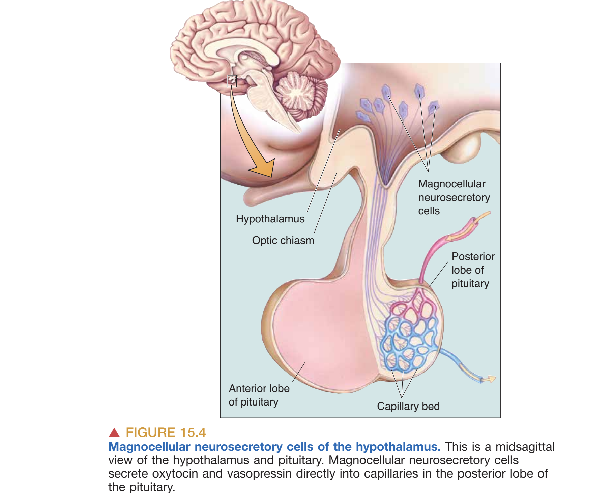
当血容量与血压下降时，脑与肾的通信呈现出清晰的双向反馈。肾脏将酶 **Renin (肾素)** 释放入血，使肝脏产生的 **Angiotensinogen (血管紧张素原)** 先转化为血管紧张素 I，继而裂解为 **Angiotensin II (血管紧张素 II)**。Angiotensin II 一方面直接作用于肾与血管，另一方面还会被端脑中缺乏血脑屏障的 **Subfornical Organ (SFO, 穹窿下器)** 感受到；SFO 的神经元随后投射至下丘脑，驱动口渴与相关的体液调节反应（与 [[A_Neurobiology_016_Motivation]] 中的容量性口渴信号可互相印证）。
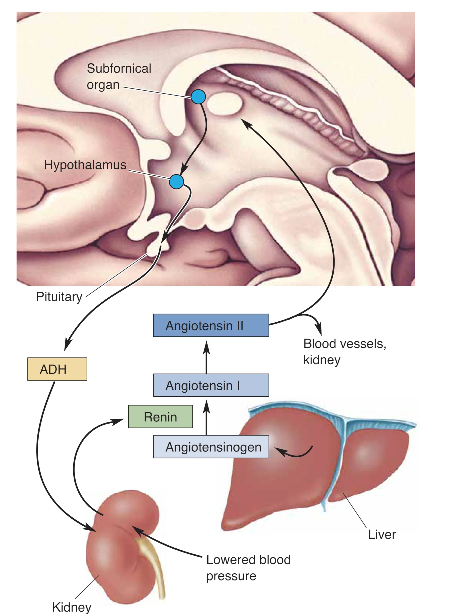

#### Hypothalamic Control of the Anterior Pituitary

垂体前叶（**Anterior Pituitary, 垂体前叶**）并非脑组织，而是一个内分泌腺体，能合成并分泌多种激素来调控全身腺体分泌。就层级控制而言，下丘脑才是内分泌系统意义上的“master gland”。这种控制依赖 **Parvocellular Neurosecretory Cells (小细胞神经分泌细胞)**：它们释放的促垂体激素进入下丘脑—垂体门脉系统，随后抵达前叶，刺激或抑制特定垂体激素释放；这些垂体激素进入体循环后再作用于外周靶器官。
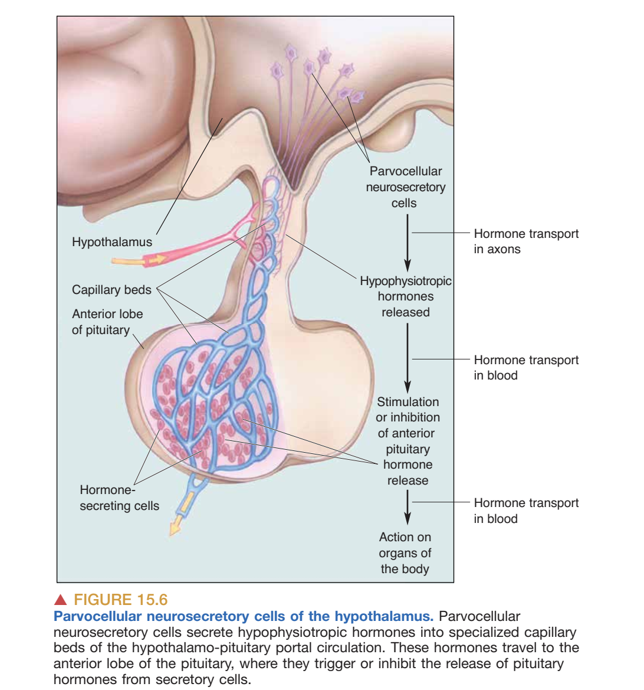
在压力应答中，这一路径构成经典的 **HPA Axis (Hypothalamus–Pituitary–Adrenal axis, 下丘脑-垂体-肾上腺轴)**：室周下丘脑释放 **CRH (corticotropin-releasing hormone, 促肾上腺皮质激素释放激素)** 至门脉循环，诱发垂体释放 **ACTH (adrenocorticotropic hormone, 促肾上腺皮质激素)** 入体循环，最终刺激肾上腺皮质释放 **Cortisol (皮质醇)**。皮质醇属于 **Steroid (类固醇激素)**，与胆固醇相关且脂溶性强，因此相对容易穿过血脑屏障（BBB），既可作用于下丘脑神经元，也可影响其他脑区，从而在能量动员、免疫调节与行为状态上产生广泛影响。
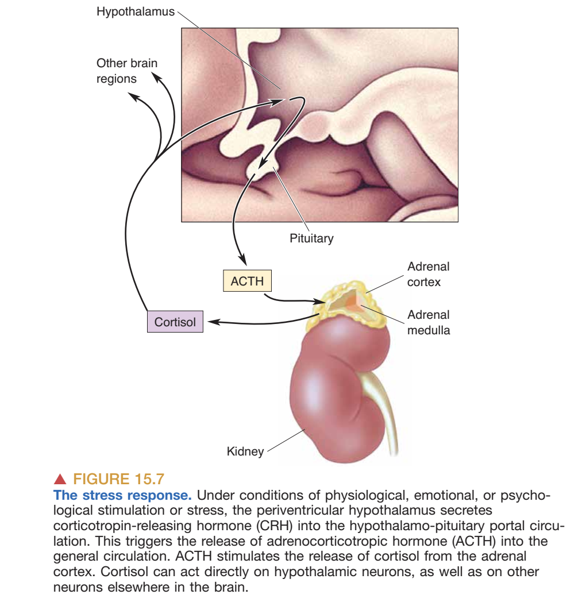
皮质醇的急性升高有适应性意义，但长期高水平皮质醇会损伤海马（Hippocampus）神经元并导致记忆受损，体现为慢性压力对认知的代价，并与 **Cushing’s Disease (库欣病/皮质醇过多相关综合征)** 的部分症状相关（如体重增加、免疫抑制、失眠以及记忆受损等，且可对全脑功能产生影响）。反向的失衡同样具有临床意义：长期使用强的松 **Prednisone**（合成皮质醇）可通过负反馈抑制肾上腺功能，导致 adrenal insufficiency（肾上腺功能不全）；而 **Addison’s disease (艾迪生病)** 则代表原发性皮质功能不全所带来的系统性低皮质醇状态。

## The Autonomic Nervous System (ANS)

除了调配“激素汤”，室周下丘脑还调控 **Autonomic Nervous System (ANS, 自主神经系统)**，使内脏器官的功能状态与行为情境匹配。ANS 与躯体运动系统共同构成 CNS 的全部输出，但其环路组织更复杂：ANS 的“下运动神经元”细胞体位于 CNS 外的 **Autonomic Ganglia (自主神经节)**，这些节后神经元（postganglionic neurons）受 CNS 内节前神经元（preganglionic neurons；位于脊髓与脑干）驱动，从而形成典型的双神经元通路并支配平滑肌、心肌与腺体。

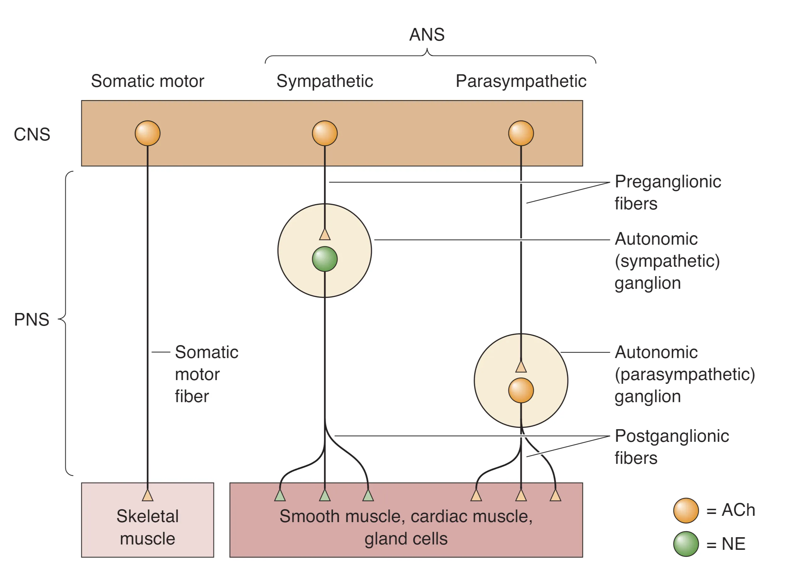

### Functional Divisions

ANS 主要由两条在功能上相对拮抗的分支构成：**Sympathetic Division (交感神经)** 与 **Parasympathetic Division (副交感神经)**。交感系统常在“4F”场景中占优——Fight, Flight, Fright, and Sex——其典型效应包括心率与血压上升、消化抑制以及葡萄糖储备动员；副交感系统更偏向“Rest and Digest”，使心率减慢、血压下降、消化功能增强并减少出汗，从而促进能量摄取与储存。

在解剖组织上，交感节前神经元位于脊髓的中间外侧灰质（intermediolateral gray matter），轴突经腹根（ventral roots）离开脊髓并进入椎旁交感链（sympathetic chain）或腹腔等部位的神经节；副交感节前神经元则主要位于脑干核团与脊髓骶段，其对内脏的广泛调控与迷走神经（vagus nerve）密切相关。不同分支在“节后神经元离靶器官的远近”以及“节后递质类型”上也呈现系统性差异。

### The Enteric Division

作为 ANS 的第三个重要组成部分，**Enteric Division (肠神经部)** 被称为“little brain（小脑/第二大脑）”。它嵌入食管、胃、肠道、胰腺与胆囊等消化道壁内，规模并不小，约包含 5 亿个神经元；其由肌间神经丛 **Myenteric (Auerbach’s) Plexus (奥尔巴赫神经丛)** 与黏膜下神经丛 **Submucous (Meissner’s) Plexus (迈斯纳神经丛)** 两套复杂网络构成，网络中包含感觉神经、中间神经元与自主运动神经元，能够自主协调从口到肛的食物运输与消化过程。其高度自主性意味着，即便切断与脑的连接，复杂的蠕动反射仍可维持。
+
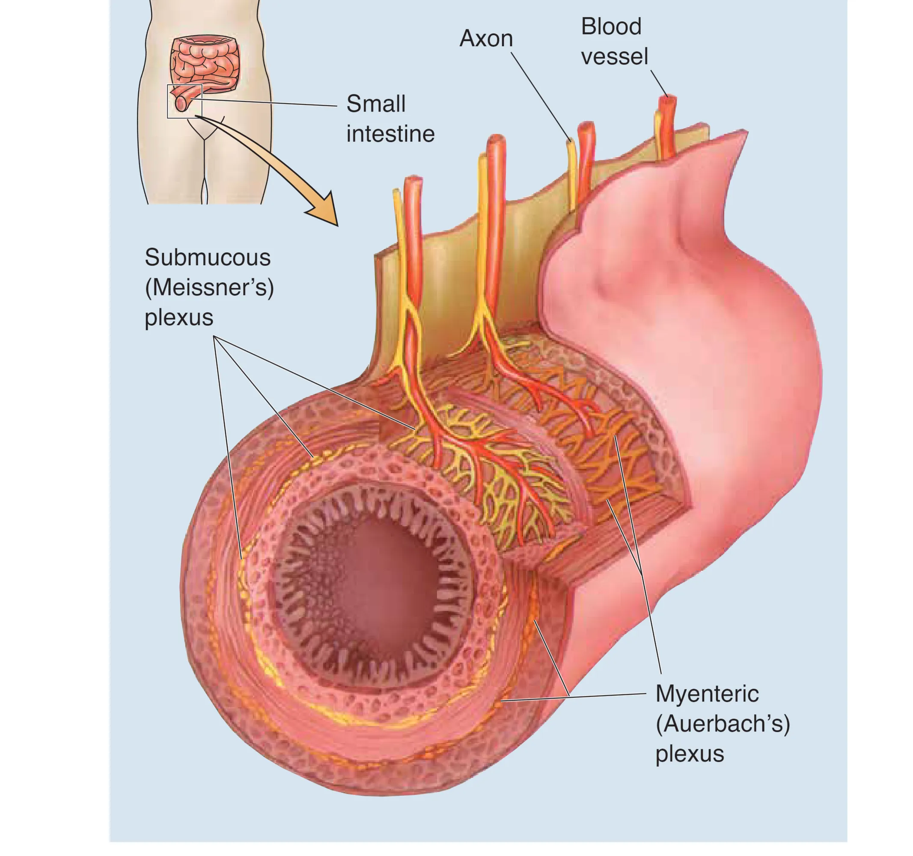

在中枢层面的调控中，下丘脑被视为自主节前神经元的主要调节者（main regulator of the autonomic preganglionic neuron）。此外，位于延髓并与下丘脑相连的 **Nucleus of the Solitary Tract (孤束核)** 是内脏信息整合与自主调控的重要中枢之一。

### Neurotransmitters and the Pharmacology of Autonomic Function

ANS 外周神经元的主要递质是 **Acetylcholine (ACh, 乙酰胆碱)**：交感与副交感的节前神经元都释放 ACh。ACh 可作用于两类受体——离子型 **nAChR (nicotinic ACh receptor, 烟碱型受体)** 多与快速 EPSP 相关，而代谢型 **mAChR (muscarinic ACh receptor, 毒蕈碱型受体)** 通过 GPCR 产生相对缓慢而持久的效应。

在节后环节，副交感节后神经元主要释放 ACh，并几乎完全通过 mAChR 产生局部作用；交感节后神经元在多数部位以 **Norepinephrine (NE, 去甲肾上腺素)** 为递质，其影响可更弥散，甚至进入血液循环而广泛作用。临床上，**Atropine (阿托品)** 阻断 mAChR 后会抑制副交感效应，使交感效应相对占优，常表现为心率加快与瞳孔散大。

## The Diffuse Modulatory Systems of the Brain

弥散性调制系统（Diffuse Modulatory Systems）是脑内另一类“扩展时空”的化学控制。尽管这些系统使用的递质不同（典型包括 NE、5-HT、DA 与 ACh），它们共享若干结构性原则：每个系统的核心（core）通常只有数千个神经元；多数起源于脑干中心区域；每个神经元的轴突高度分支，单个细胞可影响超过 100,000 个突触后神经元；并且许多突触释放的递质进入细胞外液后可扩散到更大范围，从而形成 **Volume Transmission (容积传输)**。因此，这些系统更像“全局增益旋钮（gain control）”，改变网络的反应阈值与可塑性，而非直接编码某个具体感觉或运动指令。

### Noradrenergic Locus Coeruleus (LC)

去甲肾上腺素能蓝斑核（**Locus Coeruleus, LC**）位于脑桥（pons），含有神经黑色素（neuromelanin），左右对称。尽管每侧 LC 约仅 12,000 个神经元，其投射却可覆盖脊髓、小脑、丘脑、下丘脑与新皮层等多个层级，并参与注意（attention）、唤醒（arousal）与睡眠-觉醒节律的调控，同时与学习记忆、焦虑与疼痛、情绪以及脑代谢等过程相关。当个体遭遇新奇或意外刺激时，LC 往往表现出阵发性活跃，从而快速重置警觉状态。
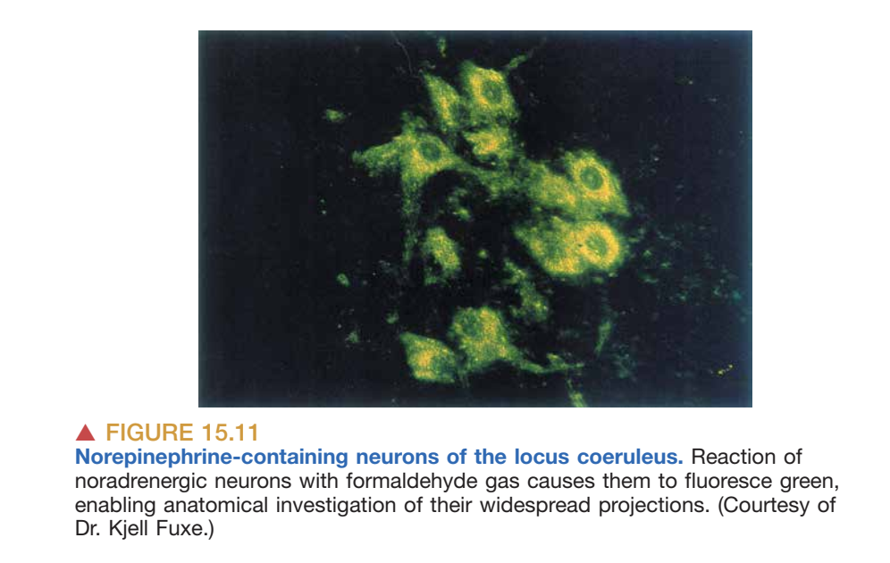
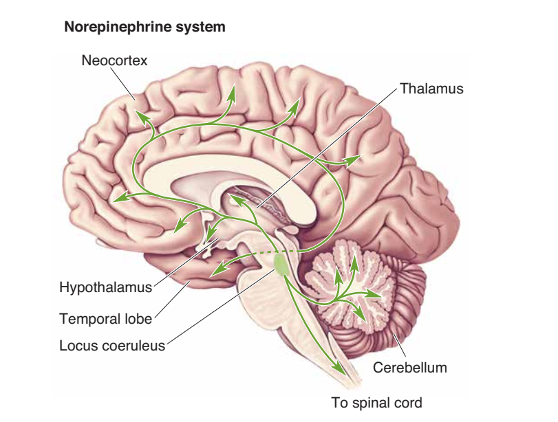

### Serotonergic Raphe Nuclei

5-HT（serotonin）神经元主要聚集在 9 个中缝核（**Raphe nuclei, 中缝核群**）中，沿脑干正中线分布并向 CNS 各层级广泛投射。延髓相关中缝核可向脊髓投射并参与疼痛调制；脑桥与中脑层级的中缝核则以类似 LC 的弥散方式影响大部分脑区。LC 与 raphe 系统常被共同纳入 **Ascending Reticular Activating System (ARAS, 上行网状激活系统)**：该系统在觉醒时放电最快、在睡眠时最低，从而为觉醒状态维持提供化学基础。与代谢状态的联系也可通过饮食与色氨酸（Tryptophan）入脑竞争体现：高碳水饮食往往提升脑内 5-HT 水平，而高蛋白饮食会增加氨基酸竞争，从而降低色氨酸入脑并减少 5-HT 合成潜力。

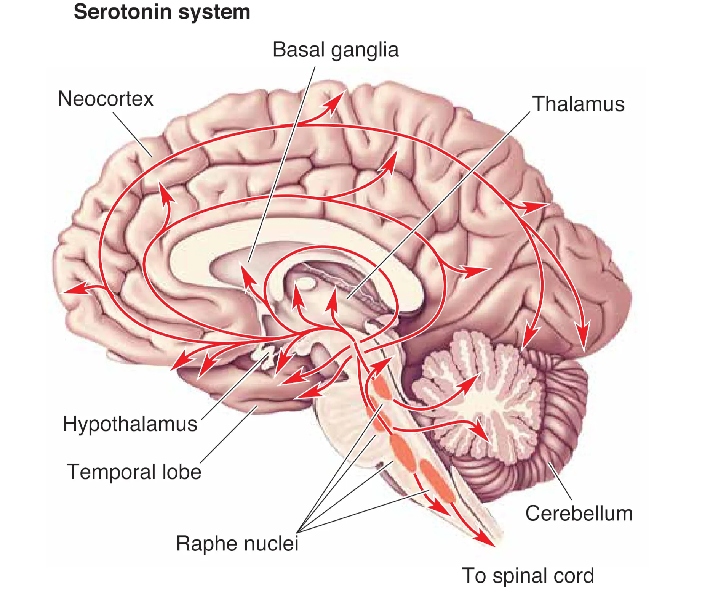

### Dopaminergic Substantia Nigra (SN) and Ventral Tegmental Area (VTA)

多巴胺能调制系统的关键起源位于中脑（midbrain）。一条核心通路来自 **Substantia Nigra (SN, 黑质)** 并投射至纹状体（striatum，包括尾状核与壳核），以尚未完全清楚的机制促进随意运动的启动；该系统退行性变与帕金森病（Parkinson’s disease, PD）密切相关。另一条通路来自 **Ventral Tegmental Area (VTA, 腹侧被盖区)** 并投射至前额叶与边缘系统在内的端脑区域，常被称为 **Mesocorticolimbic Dopamine System (中皮质-边缘多巴胺系统)**，是奖赏、强化、动机与成瘾的重要神经基础。
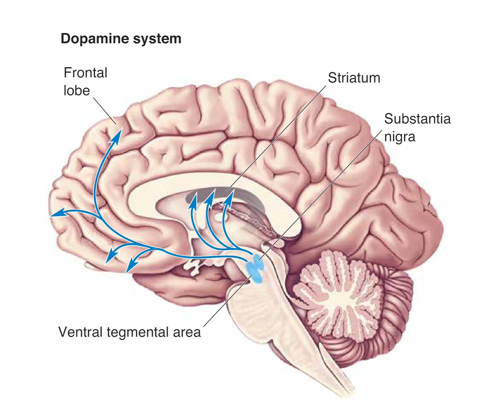

### Cholinergic Basal Forebrain and Brain Stem Complexes

胆碱能弥散系统主要包括 **Basal Forebrain Complex (基底前脑复合体)** 与脑干的 **Pontomesencephalotegmental Complex (脑桥-中脑被盖复合体)**。基底前脑复合体中的内侧隔核（medial septal nuclei）为海马提供胆碱能支配，而 Meynert 基底核（basal nucleus of Meynert）为新皮层提供主要胆碱能输入；它们与学习、记忆与皮层唤醒密切相关，并在 **Alzheimer’s Disease (阿尔茨海默病)** 早期出现显著退化。脑桥-中脑被盖复合体主要作用于背侧丘脑（dorsal thalamus），并与去甲肾上腺素与 5-HT 系统协同，调节感觉中继核团的兴奋性。
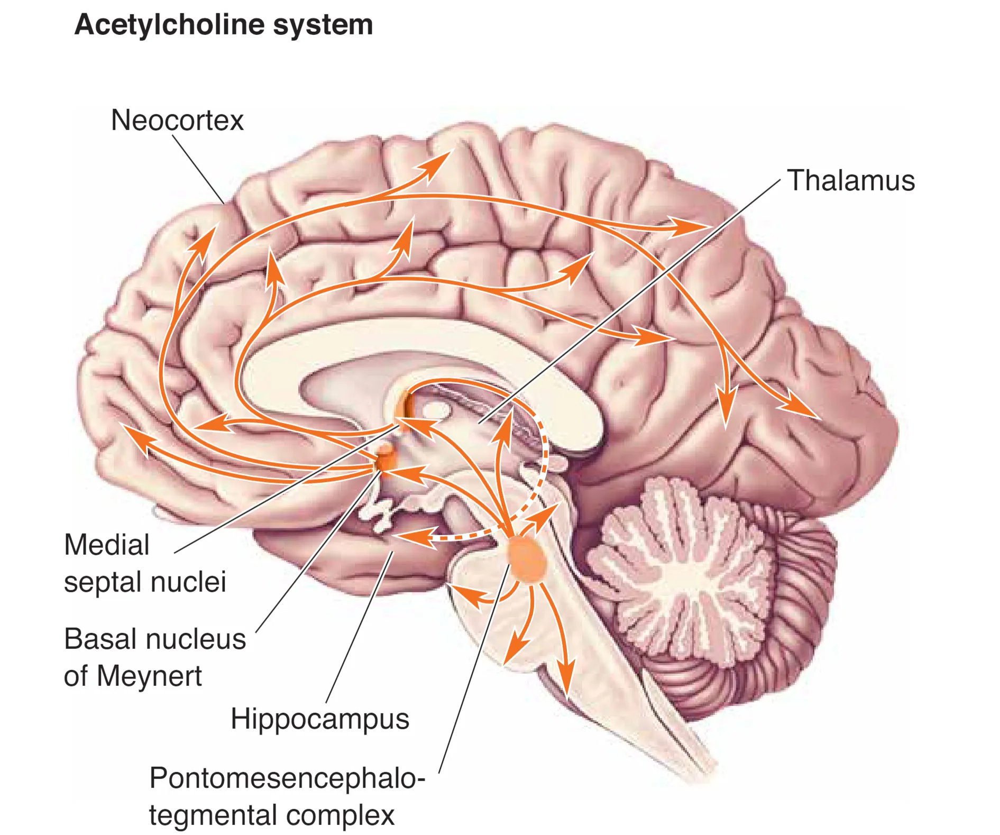

## Pharmacology and Drug Action

精神活性药物（Psychoactive drugs）都作用于中枢神经系统，而其中相当一部分效应可以被理解为对弥散性调制系统（尤其是去甲肾上腺素、多巴胺与 5-HT 系统）化学突触传递的干预。

在致幻剂（Hallucinogens）中，**Lysergic Acid Diethylamide (LSD, 麦角二乙胺)** 的化学结构与 5-HT 相似，被认为是 5-HT 受体的强效激动剂。一个具有解释力的机制强调其对中缝核 5-HT 神经元突触前末梢受体的作用：当 LSD 激活这些受体时，会显著抑制中缝核神经元放电，形成负反馈式抑制；研究者同时也关注 LSD 在大脑皮层的直接作用，这些作用共同导致知觉与现实感的扭曲。

在兴奋剂（Stimulants）中，强力的 **Cocaine (可卡因)** 与 **Amphetamine (安非他命)** 都会影响由去甲肾上腺素能与多巴胺能系统形成的突触，阻断 **catecholamine uptake (儿茶酚胺再摄取/重摄取)**，从而增强 NE 与 DA 的突触信号。主观上它们可带来警觉性提高、自信增强以及欣快感（euphoria），但外周层面具有明显的 **Sympathomimetic (拟交感)** 效应，表现为心率与血压升高、瞳孔散大等；过量摄入可使心血管压力急剧上升并导致心力衰竭，这解释了多起大剂量使用后的意外死亡。
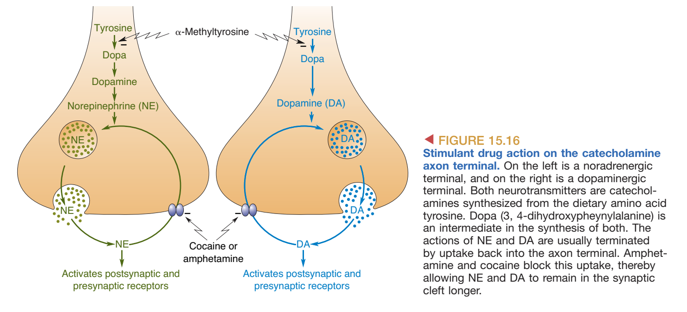
总之，点对点突触通信更像“精确连线的电报码”，负责快速与局部的信息传递；弥散性调制系统更像“全局增益旋钮”，通过少量核心神经元与容积传输改变大范围网络的反应性；分泌性下丘脑经由血液的内分泌输出则把调控延伸到全身，使行为与内脏状态在同一套化学语言中被统一协调。