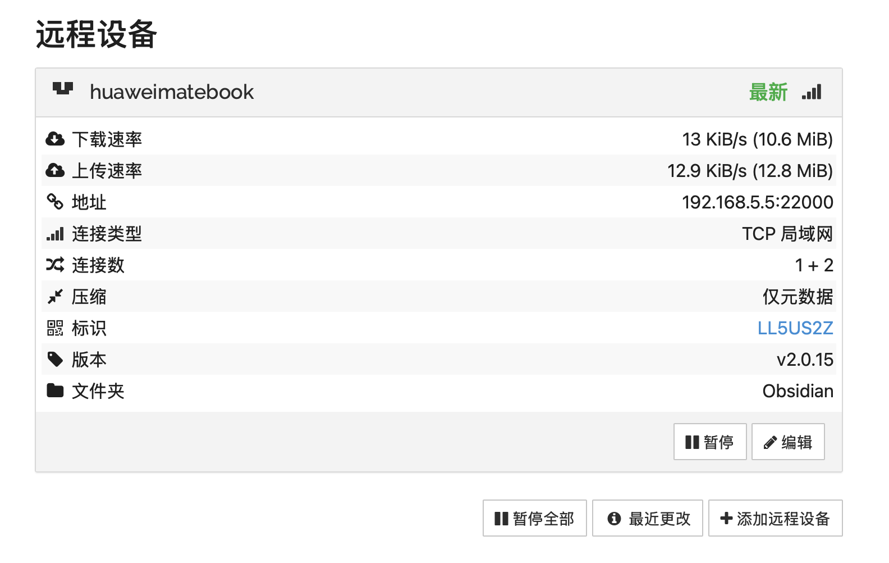

Syncthing 是一款非常强大的开源同步工具。它的逻辑是：**将两台设备关联，然后指定一个文件夹让它们保持镜像一致。**

以下是 Windows 和 Mac 之间使用 Syncthing 同步 Obsidian 的完整详细教程：
## 第一步：安装客户端

为了获得最好的原生体验，建议使用以下包装版客户端：
- **Windows 端：** 下载并安装 [SyncTrayzor](https://github.com/GermanCoding/SyncTrayzor/releases)。它能让 Syncthing 像普通软件一样运行在系统托盘，且自带文件监控。
- **Mac 端：** 下载并安装 [Syncthing-macOS](https://github.com/syncthing/syncthing-macos/releases)。它提供了一个标准的 macOS 菜单栏图标。

## 第二步：设备互联
安装完成后，在两台电脑上分别打开软件。它们都会弹出一个网页管理界面。
1. **获取 ID：** 在 **Windows** 的 Syncthing 界面，点击右上角的 **“操作 (Actions)” -> “显示 ID (Show ID)”**，复制那一串长代码。
2. **添加设备：** 回到 **Mac** 的界面，在右下角点击 **“添加远程设备 (Add Remote Device)”**。
    - 在 **设备 ID** 处粘贴刚才复制的代码。
    - 给设备起个名字（比如 "My-Windows-PC"）。
    - 点击 **保存 (Save)**。
3. **确认连接：** 几秒钟后，你的 **Windows** 界面上方会弹出一个黄色横条，询问是否允许 Mac 连接。点击 **“添加设备”** 即可。
    - _此时，两台设备已经建立了安全连接。_


## 第三步：设置同步文件夹

1. **在 Windows 上新建/选择文件夹：**
    - 在左侧点击 **“添加文件夹”**。
    - **文件夹标签：** 写 `Obsidian`。
    - **文件夹路径：** 选择存放笔记的文件夹。
    - 切换到 **“共享 (Sharing)”** 选项卡，勾选 **Mac 设备**。
    - 点击 **保存**
2. **在 Mac 上接收：**
    - Mac 的网页界面会弹出提示：“Windows 想要共享文件夹 Obsidian”。点击 **“添加”**。
    - 选择 Mac 上对应的存放路径。

## 第四步：关键设置

这是确保同步不冲突的关键，**请务必操作**：
1. **忽略文件（Ignore Patterns）：**
    在两台电脑的文件夹设置中，点击 **“忽略模式”** 选项卡，输入以下内容并保存：
    ```text
    .obsidian/workspace.json
    .DS_Store
    ```
2. **开启版本控制（可选但建议）：**
    在文件夹设置的 **“文件版本控制”** 选项卡中，选择 **“简易版本控制”**，保留数量设为 5。
    可以在 `.stversions` 文件夹里找回旧版本。

## 第五步：日常使用逻辑
- **自动同步：** 只要两台电脑都开着软件且在联网（无需同一局域网，只要能上互联网即可，Syncthing 会通过中继服务器发现对方），同步就是全自动的。
- **离线处理：**
    - 如果在 Mac 离线写了 10 篇笔记。
    - 回到家，打开 Mac，再打开 Windows。
    - Syncthing 会瞬间发现差异，并将那 10 篇笔记推送到 Windows。
- **冲突解决：** 如果万一发生了冲突（两边同时改了同一个字），Syncthing 会生成一个带有 `sync-conflict` 字样的副本文件，手动合并一下删除即可，**绝不会丢失数据**。