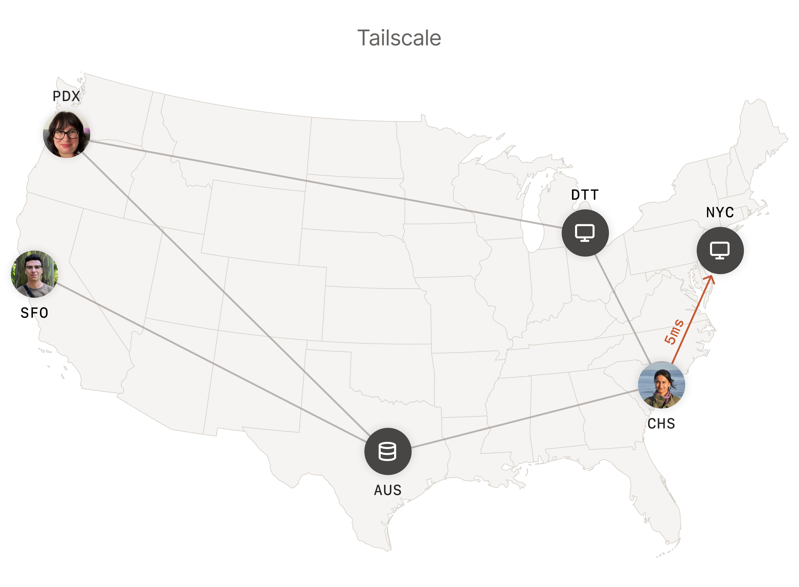

> Tailscale的配置非常简单，登陆，连接，完事


## 核心步骤概览

1.  **安装与组网**: 在所有设备（Windows 工作机、Mac）上安装并登录 Tailscale，形成虚拟局域网。
2.  **部署 SSH 服务**: 在 Windows 工作机上部署并启动 OpenSSH 服务器。
3.  **配置免密登录**: 在 Mac 上生成 SSH 密钥对，并将公钥配置到 Windows 工作机。
4.  **验证与优化**: 测试连接，并配置别名以简化操作。

## 详细操作指南

### 1. Tailscale 组网

-   在所有目标设备（包括 Windows 工作机和 Mac）上，从 [Tailscale 官网](https://tailscale.com/) 下载并安装客户端。
-   使用**同一个**认证账户（如 Google、Microsoft 或 GitHub）登录所有设备。
-   登录成功后，所有设备都会出现在 [Tailscale Admin Console](https://login.tailscale.com/admin/machines) 中，并被分配一个唯一的 `100.x.y.z` IP 地址。记下 Windows 工作机的这个 IP。

### 2. 在 Windows 工作机上部署 OpenSSH 服务

由于 Windows 自带的 OpenSSH Server 可能存在版本冲突或安装缓慢的问题，推荐使用“绿色版”手动安装：

1.  **下载离线包**: 从 [OpenSSH for Windows 的 GitHub Releases 页面](https://github.com/PowerShell/Win32-OpenSSH/releases) 下载最新版的 `OpenSSH-Win64.zip`。
2.  **解压文件**: 将压缩包解压到一个干净的目录，例如 `C:\OpenSSH-Server`。
3.  **注册并启动服务**: 以**管理员身份**打开 PowerShell，执行以下命令：
    ```powershell
    cd C:\OpenSSH-Server
    .\install-sshd.ps1
    .\ssh-keygen.exe -A
    Start-Service sshd
    Set-Service -Name sshd -StartupType 'Automatic'
    ```
4.  **放行防火墙**: 确保 Windows 防火墙允许 TCP 22 端口的入站连接：
    ```powershell
    New-NetFirewallRule -Name sshd -DisplayName 'OpenSSH Server (sshd)' -Enabled True -Direction Inbound -Protocol TCP -Action Allow -LocalPort 22
    ```

### 3. 配置 Mac 到 Windows 的 SSH 免密登录

#### 在 Mac 端 (发起端)

1.  **生成密钥对** (如果尚未生成):
    ```bash
    ssh-keygen -t ed25519
    # 一路回车使用默认设置
    ```
2.  **获取公钥内容**:
    ```bash
    cat ~/.ssh/id_ed25519.pub
    # 复制输出的整行内容
    ```

#### 在 Windows 端 (被控端)

> **重要**: 如果使用的是 `Administrator` 账户，必须将公钥放入特定的 `C:\ProgramData\ssh\administrators_authorized_keys` 文件中。

1.  **创建公钥文件**:
    ```powershell
    # 确保目录存在
    New-Item -ItemType Directory -Path "C:\ProgramData\ssh" -Force
    # 将下面引号内的内容替换为你从 Mac 复制的公钥
    $pubKey = "ssh-ed25519 AAAAC3Nza...你的完整公钥"
    $pubKey | Out-File -FilePath "C:\ProgramData\ssh\administrators_authorized_keys" -Encoding ascii
    ```
2.  **严格修正文件权限** (此步至关重要):
    ```powershell
    $adminKeyPath = "C:\ProgramData\ssh\administrators_authorized_keys"
    icacls $adminKeyPath /inheritance:r
    icacls $adminKeyPath /grant "SYSTEM:(F)"
    icacls $adminKeyPath /grant "BUILTIN\Administrators:(F)"
    ```

### 4. 验证与优化

1.  **测试连接**: 在 Mac 终端尝试连接：
    ```bash
    ssh Administrator@<Windows_Tailscale_IP>
    # 应该无需密码直接登录
    ```
2.  **配置 SSH 别名**: 为了方便，可以在 Mac 的 `~/.ssh/config` 文件中添加一个主机别名：
    ```plaintext
    Host work
        HostName <Windows_Tailscale_IP>
        User Administrator
        IdentityFile ~/.ssh/id_ed25519
    ```
    配置完成后，只需输入 `ssh work` 即可连接。

## 常见问题排查

-   **服务无法启动**: 检查 `C:\Windows\System32\OpenSSH\sshd.exe -T` 的输出，通常为 DLL 冲突或权限问题。建议使用绿色版安装。
-   **免密登录失败**: 使用 `ssh -v` 命令查看详细日志。最常见的原因是公钥未放在正确位置（特别是 `Administrator` 账户）或文件权限过于宽松。
-   **用户名确认**: 在 Windows 上运行 `whoami` 来确认正确的登录用户名。

## 进阶应用

-   **文件传输**: 使用支持 SFTP 的客户端（如 Cyberduck）通过 Tailscale IP 直接访问 Windows 文件系统。
-   **远程开发**: 在 VS Code 中使用 "Remote - SSH" 插件，直接在 Mac 上编辑和运行 Windows 工作机上的代码。
-   **远程控制**: 通过 SSH 执行 `shutdown` 命令远程重启或关机。