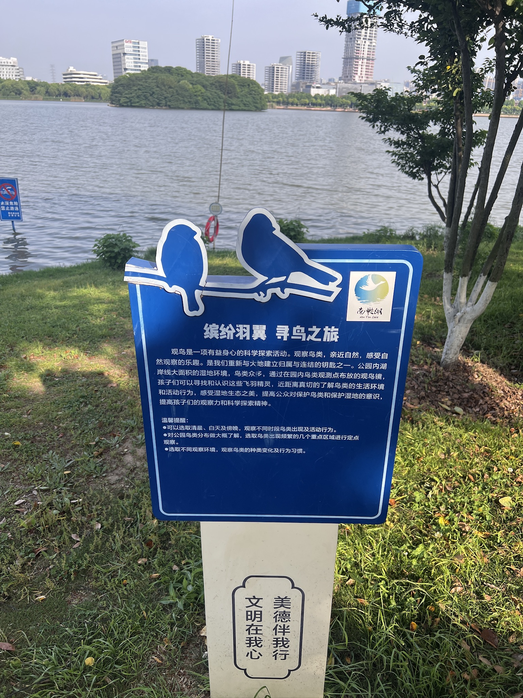
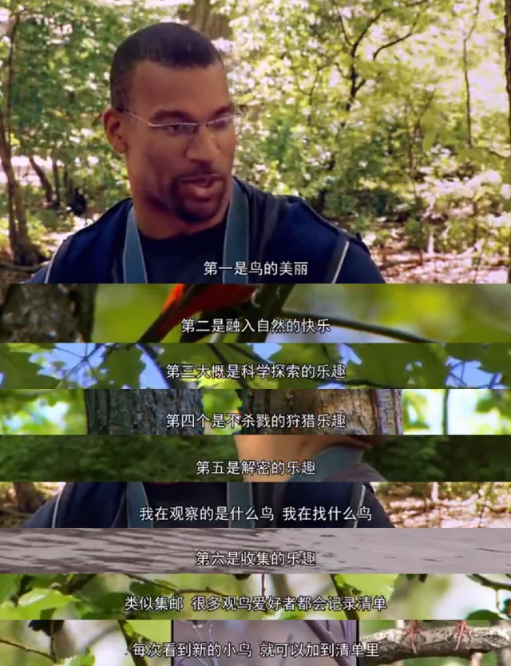
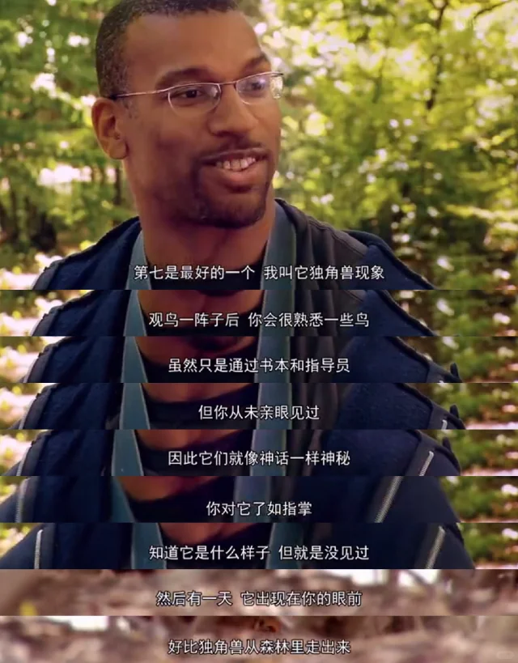
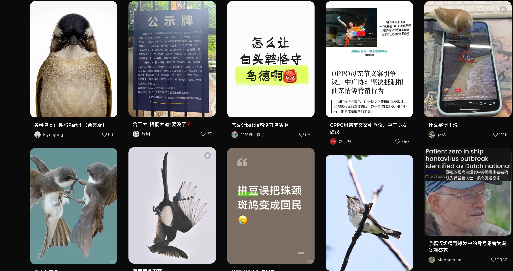
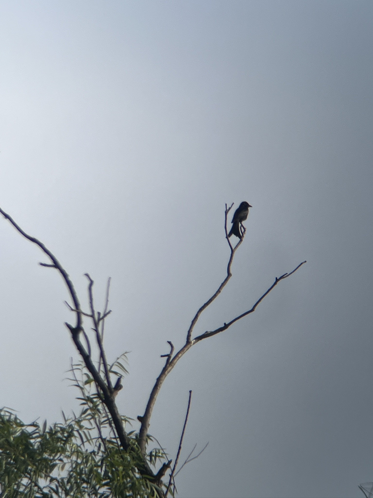

最近一个多月迷上了观鸟，契机其实是清明前的一次公园遛弯，我与女友开始关注公园中有什么鸟。当时我还没入门，甚至珠颈斑鸠的名字也叫不出来，不认识喜鹊，也不知道乌鸫，即使这些鸟是我平时经常看见的鸟。女友其实关注了好几年了，虽然没有购买设备，但比我强很多。当时我们边走边聊，这是什么，那是什么，使用懂老师来辨认手机中模糊的鸟影，甚至看到了我们都不知道的鸟（某种柳莺，拍的照非常模糊）。

观鸟确实有某种魔力，我过年时从家里顺走了一个中长焦相机，但一直没有派上用场。我第一次使用它是在清明假期，当时女友配上了望远镜，而我使用相机来记录，添加了不少新鸟种（虽然也基本是当地菜鸟）。加新的兴奋感确实让人着迷，我乐此不疲的浏览着鸟相关的帖子，了解合肥和南京可能出现的鸟种，观看相关视频云观鸟，以及看一些电影或者纪录片，比如观鸟大年以及中央公园效应，其中我对观鸟大年这样的竞赛热情不高，只是感叹其中参赛者的狂热以及观鸟这项运动的普及。相比之下，中央公园效应这个纪录片给了我更多触动，鸟有什么好看的？黑人小哥简直是我的嘴替：

我的小红书主页已经是一个合格鸟人的主页了😢：

五一女友送我了一个望远镜，我的新鲜劲现在还没褪去，基本每天都会拿着在学校逛逛。在某种程度上，观鸟成了我摆脱外界世界烦恼的途径，漫步时耳朵和眼睛都全面调动，但目前我的热情主要在于找新鸟种的过程，集邮确实是一个很容易上头的事，无论是在游戏中还是现实中。我在听一个播客时有一个资深观鸟老师分享观鸟的两种状态：发烧阶段以及退烧阶段，发烧阶段就是很狂热的去加新，而退烧阶段则是更多的关注身边的鸟类为其做一些有意义的事情。我目前就是处于发烧阶段，但加新毕竟是有瓶颈的，我希望未来能够保持这个爱好，进入退烧阶段。
今日加新的黑卷尾：
