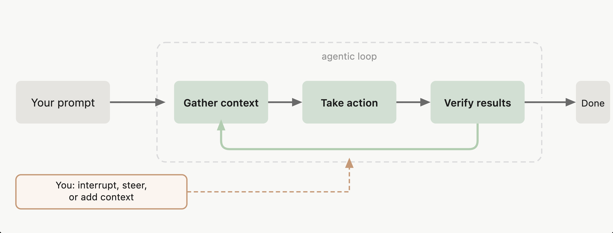
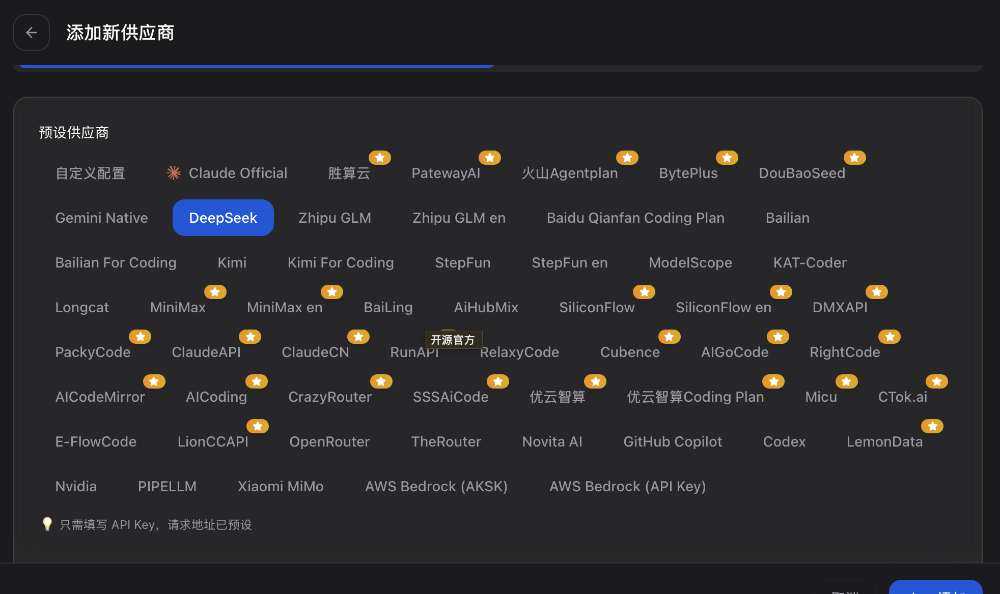

> Claude Code 是一个代理编码工具，可以读取代码库、编辑文件、运行命令，并与开发工具集成。可在终端、IDE、桌面应用和浏览器中使用。

# Claude code 如何工作

当给claude code一个任务时，它会经历三个阶段：**收集上下文**、**采取行动**和**验证结果**。Claude 根据从前一步学到的内容决定每一步需要什么，将数十个操作链接在一起并沿途进行纠正。代理循环由两个组件驱动：模型进行推理和工具采取行动。Claude code通过各种模型来理解代码并推理任务，而工具则赋予它成为代理的能力，有了工具，模型才能够读取代码、编辑文件、运行命令、搜索网络并与外部服务交互。每个工具使用都会返回信息，反馈到循环中，告知 模型 的下一个决定。

当在目录中运行 `claude` 时，claude code可以访问：
- 项目：当前目录以及目录中的子文件
- 终端：可以从命令行运行的任何命令
- Git状态：当前分支、未提交的更改和最近的提交历史。
- CLAUDE.md: 一个 markdown 文件，可以在其中存储项目特定的说明、约定和 Claude 应该在每个会话中了解的上下文。
- 自动内存
- 配置的skills MCP

工作时，cc将对话保留到本地，每条消息、工具使用和结果都被写入 `~/.claude/projects/` 下的纯文本 JSONL 文件，这使得回退、恢复和分叉会话成为可能。在 Claude 进行代码更改之前，它还会对受影响的文件进行快照，在需要时可以恢复。

使用 `claude --continue` 或 `claude --resume` 恢复会话会在相同的会话 ID 下重新打开它，并将新消息附加到现有对话。使用 `--fork-session` 或 `/branch` 分叉会将历史复制到新的会话 ID 中，保持原始会话不变。

关于上下文，运行 `/context` 以查看什么在占用空间，使用`/compact`压缩上下文

# 如何安装Claude Code
```
curl -fsSL https://claude.ai/install.sh | bash
```

# 如何配置模型
使用[ccswitch](https://github.com/farion1231/cc-switch) 这个工具，安装完成后，打开软件，添加新供应商，比如deepseek

由于请求地址以及模型映射已经比较完善了，所以填入API key即可。

# 参考
- [概述 - Claude Code Docs](https://code.claude.com/docs/zh-CN/overview)