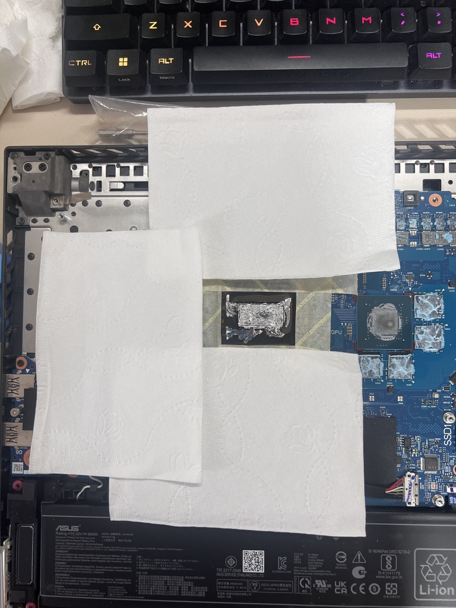
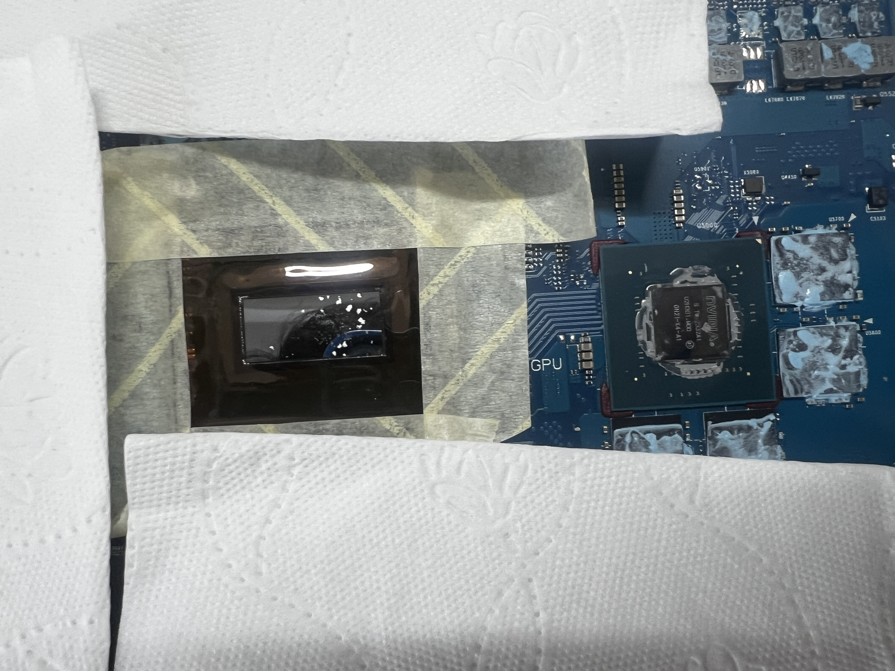
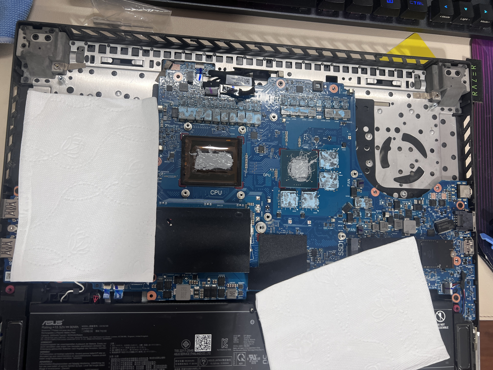
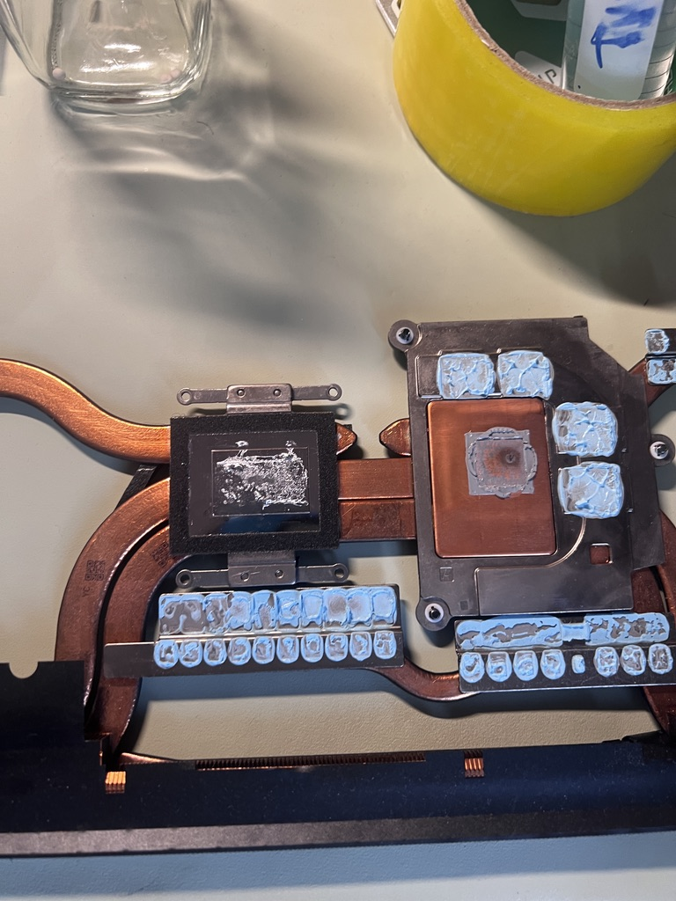
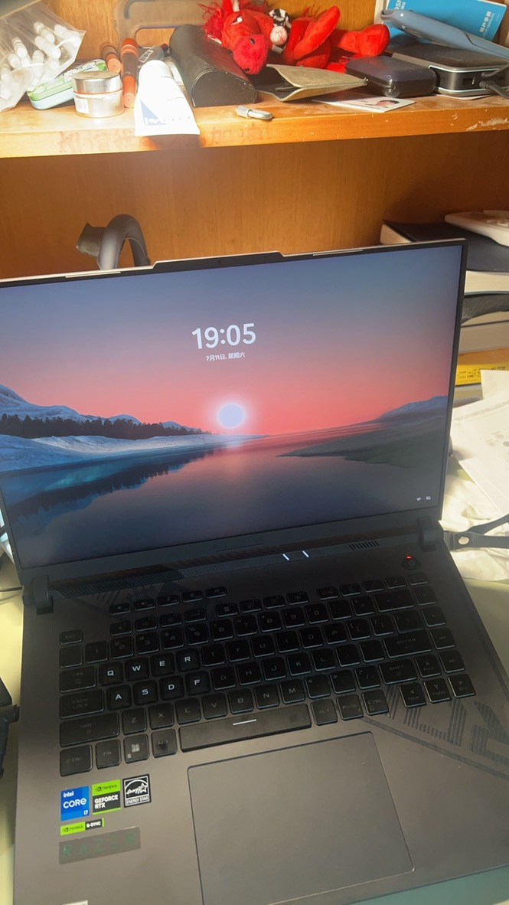

终究走到了这一步，在购买ROG笔记本后，最令我头疼的问题就是液金的维护，为了防止液金偏移不能斜着放，不能刚关机或者不关机就带走，完全违背了笔记本的设计理念。

液金被认为是一种高端的导热介质，可以更有效地给cpu散热，但是虽然理论上更好，对于笔记本来说液金最大的问题就是它的流动性。流动性导致液金容易偏移出cpu的区域，导致即使理论性能好，但全偏移出去就发挥不出来了。笔记本一般是通勤使用的，液金和笔记本是相悖的，这种组合方案注定会受到诟病。我已经看过很多购买笔记本后将液金更换为硅脂或者相变片的帖子，大家的担忧都集中在液金难以维护上。液金偏移导致散热能力下降只是其最小的问题，更大的问题是：液金是纯金属，高度导电，如果其偏移到了主板上，就会导致短路，造成更大的损失。这样一个“高端”的零件对于消费者来说，只是增加了购买与维护成本，性能带来的提升微乎其微。这是产品设计的失败。

最近我明显感觉到笔记本的散热能力大幅下降，开机在无负载的情况下，风扇噪声已经比较明显，且键盘区域比较烫手，拆机看风扇上的灰尘并没有很多，于是决定将液金给更换为硅脂。我在3月份就购买了霍尼韦尔7950SP相变硅脂，但却一直拖延，恰逢最近什么都不想干，决定折腾一下。

## 清理过程
我参考的视频为[电脑清灰，换硅脂液金教程，华硕ROG系列](https://www.bilibili.com/video/BV1hPvYBaEbU/?spm_id_from=333.1391.0.0&vd_source=4f05b05eb19ffd33468ed22d8ea0de7a) ，但他用的机器应该是比较老的版本，虽然大部分情况可以通用，但也有少量不太一致的情况。采用PH0十字螺丝刀(我用PH00结果滑丝了，即使PH0也无法挽救，幸好相变片送的可以拧开)，将后盖的螺丝拧下来后，拆下后盖，拔掉电源(1)，取出风扇(2)，摘下散热铜管(3)：

cpu的区域就在红色方框里，如下图所示：

可以看到cpu区域的液金已经有很多偏移出cpu区域了，采用蘸酒精的棉签将液金小心清理干净，可以在cpu外贴上纸胶带，防止液金不小心进入主板。

在用了数十支棉签后，终于没有很明显的液金的痕迹了，将GPU上干掉的硅脂也清理一下：

之后涂上硅脂(比较随意)：

将散热铜管上的液金也清理干净(铜管上也有很多液金)：

最后按照原顺序装回，开机：

成功点亮，在打开一些应用后，键盘没有明显发热，cpu待机在50度左右，没有做严格的散热测试，但日常使用已基本够用。

更换液金最大的好处在于不必担心偏移问题，笔记本终于可以回归随身携带的属性了。

## 参考
- [电脑清灰，换硅脂液金教程，华硕ROG系列](https://www.bilibili.com/video/BV1hPvYBaEbU/?spm_id_from=333.1391.0.0&vd_source=4f05b05eb19ffd33468ed22d8ea0de7a)
- [螺丝滑丝的一种处理方法，以及手动螺丝刀的合理用法分享](https://www.bilibili.com/video/BV1ZBBsYqEZf/?spm_id_from=333.1391.0.0&vd_source=4f05b05eb19ffd33468ed22d8ea0de7a) 
- [来自云南楚雄的观众朋友寄送的魔霸2023款，让我帮他液金换成7950相变片](https://www.bilibili.com/video/BV14u4y1Q7Nz/?spm_id_from=333.1391.0.0&vd_source=4f05b05eb19ffd33468ed22d8ea0de7a)