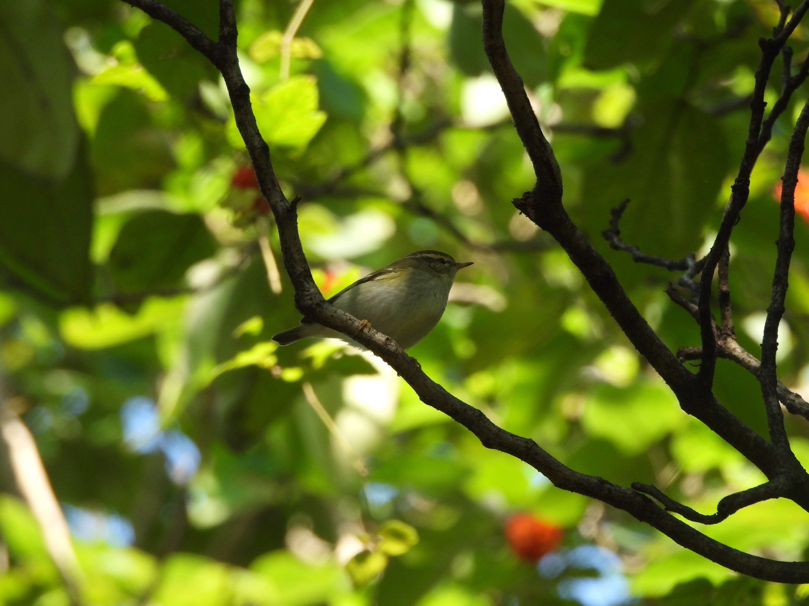
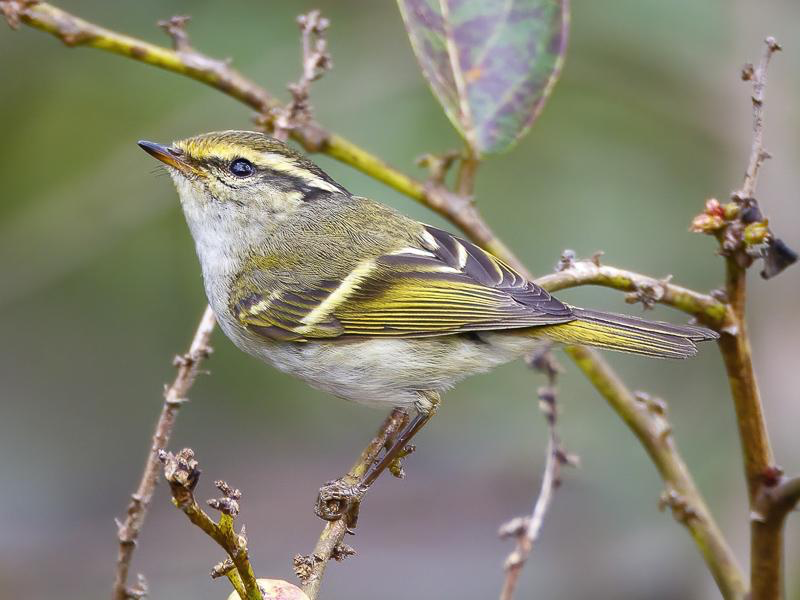
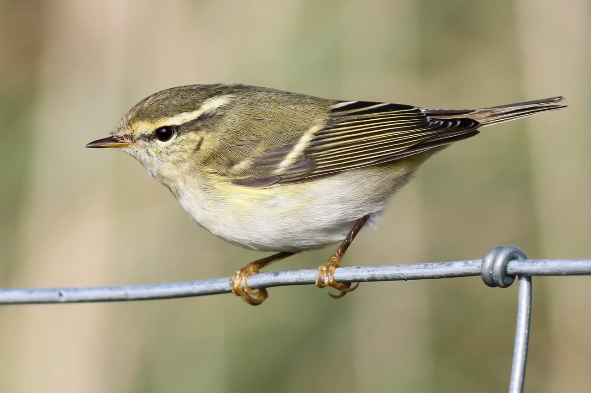
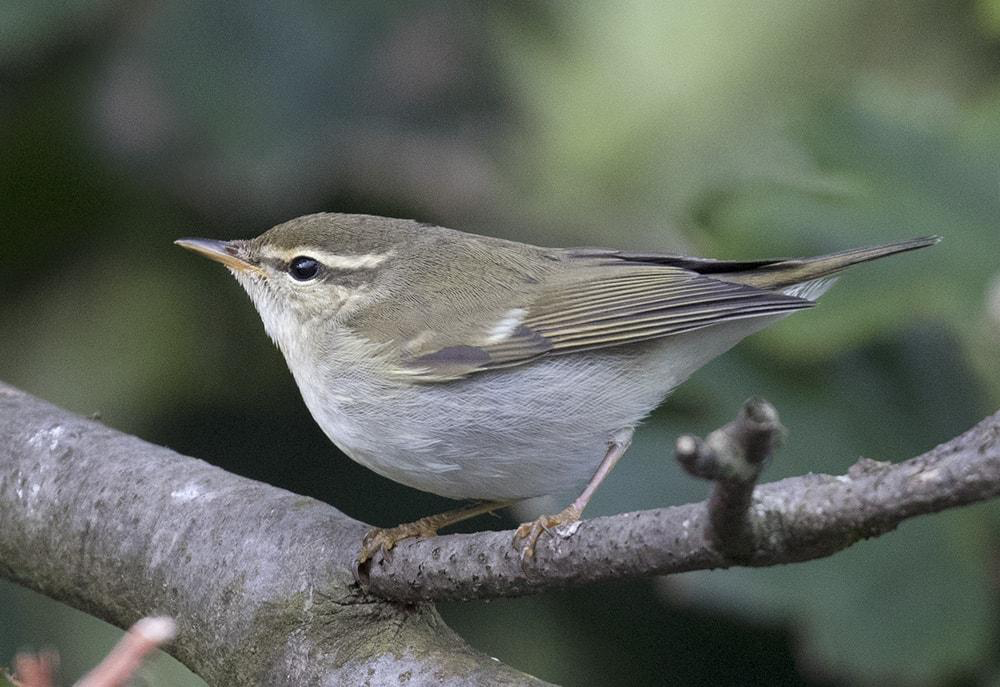
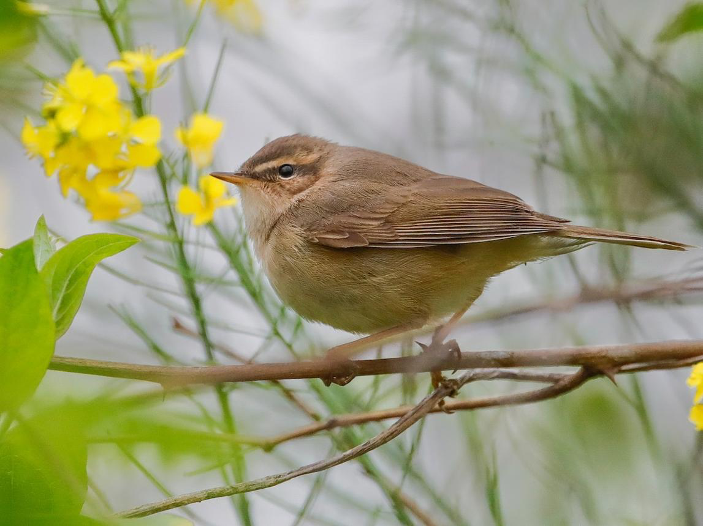
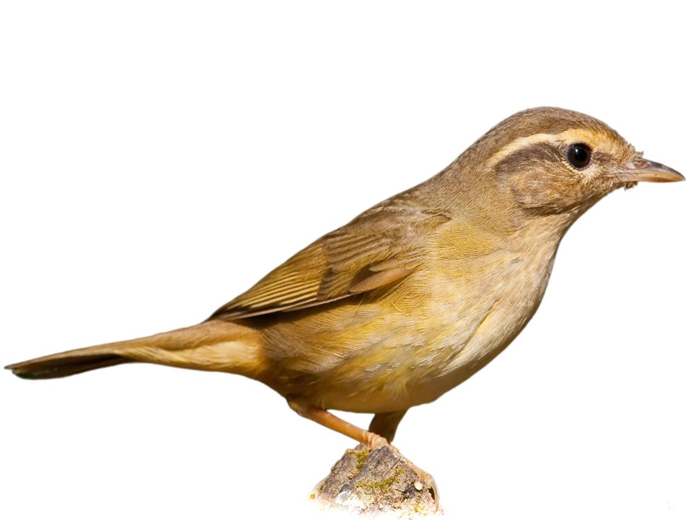
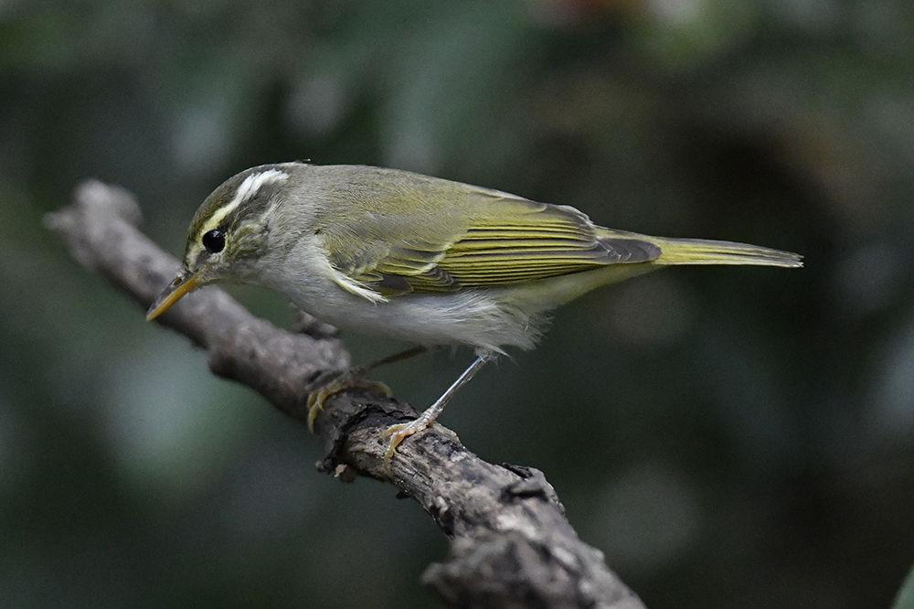

柳莺确实很难辨认，尤其是我没有记叫声的习惯，但根源还是我从来没有想过去认出柳莺。

四顶山看到了几只柳莺，拍到了一只，便想要认出它是谁，但柳莺之间的差异比较小，同行的大学生能做到根据体型和声音就认出是谁，可谓钻研透彻，但我对柳莺有哪些亚种都不清楚，这怎么行？于是搜集了一些关于柳莺辨别的帖子，加深记忆。

柳莺（学名：Phylloscopus）是**柳莺科**、柳莺属鸟类的统称，鸣禽类，俗称柳串儿或槐串儿，是中国最常见的、数量最多的小型食虫鸟类。 体长10厘米左右，其体型比麻雀小，背羽以橄榄绿色或褐色为主，可以把柳莺分成几部分看，再根据叫声、地点、季节判断。

| 鸟        | 第一印象                              | 最值得抓的特征                                                                         | 叫声                                                                            | 照片                      |
| -------- | --------------------------------- | ------------------------------------------------------------------------------- | ----------------------------------------------------------------------------- | ----------------------- |
| **黄腰柳莺** | 小 花                               | 很粗、偏黄色的眉纹 头顶中央明显的浅色冠纹 翅膀两道明显翼斑 体型显得短小、圆润 黄色腰斑                       | 柔和的 _dju-ee / swe-eet_  |  |
| **黄眉柳莺** | 很长的黄白色眉纹 + 两道浅色翼斑                 | 非常长而醒目的浅黄色眉纹 黑色贯眼纹 翅膀两道浅色翼斑 嘴很细小 没有黄腰柳莺那么明显的中央冠纹                    | tsu-WEET                 |  |
| **极北柳莺** | 大一点、长一点、素一点                       | 很长的浅色眉纹   深色贯眼纹   嘴明显比黄眉、黄腰长   身体修长，不像黄腰那么圆   翅膀有一道比较明显的翼斑          | dzit                      |  |
| **褐柳莺**  | 灰褐色、脏兮兮                           | 整体褐色，而不是鲜明的黄绿色   有浅色眉纹   贯眼纹明显   翅膀非常素，基本没有翼斑   下体灰褐、污白，不“亮”        | “check！” / “tek！”       |  |
| **巨嘴柳莺** | 褐色、壮、嘴大 12.5–13.5 cm              | 嘴特别粗壮   很粗、很长的浅色眉纹   整体褐色   翅膀没有明显翼斑   腿和脚也明显比较粗壮                   | **“chik / chep”**          |  |
| **冕柳莺**  | 11-12 cm 体型较大的柳莺，通常**一道翼斑**，嘴也大得多 | 头顶中央一道非常明显的浅色冠纹    两侧有深色冠纹，形成强烈的头顶花纹   很长的浅色眉纹   嘴比较长   翅膀主要是一道明显翼斑 | jia-jia-ji——           |  |

1. 看颜色：绿色还是褐色？
	绿色 → 优先去黄腰、黄眉、极北、冕。  
	褐色 → 优先去褐柳莺、巨嘴柳莺。
2. 翼斑
	**两道明显** → 先想黄腰 / 黄眉。  
	**一道** → 先想极北 / 冕。  
	**完全没有** → 先想褐柳莺 / 巨嘴柳莺。
3. 有没有中央冠纹。
	冠纹特别明显 + 两道翼斑 + 很小  
	→ **黄腰柳莺**
	没明显冠纹 + 两道翼斑 + 长黄眉  
	→ **黄眉柳莺**
	冠纹 + 一道翼斑 + 鸟明显比较大  
	→ **冕柳莺**
	无冠纹 + 一道翼斑 + 嘴又长又粗  
	→ **极北柳莺**
4. 如果是褐色的，看嘴。
	细嘴 → **褐柳莺**  
	粗大嘴 + 超长眉 → **巨嘴柳莺**