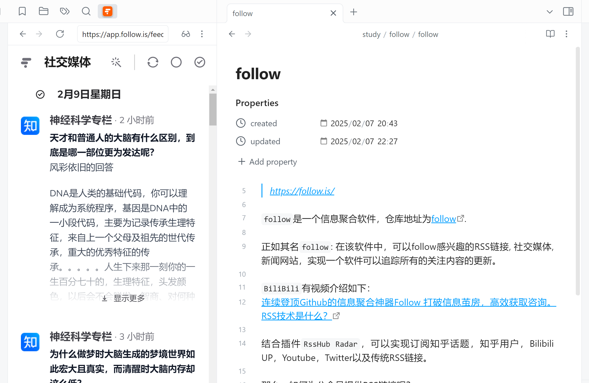

## follow 介绍
`follow`是一个信息聚合软件，仓库地址为[follow](https://github.com/RSSNext/Follow).

正如其名`follow`: 在该软件中，可以follow感兴趣的RSS链接, 社交媒体, 新闻网站，实现一个软件可以追踪所有的关注内容的更新。RSS(really simple syndication)是一种用于发布和订阅网站内容的格式。它允许用户通过RSS阅读器或聚合器来获取网站的最新更新，而无需直接访问该网站。RSS通常用于新闻网站、博客、播客等频繁更新的内容源。

结合chrome插件`RssHub Radar`，可以实现订阅知乎话题，知乎用户，Bilibili UP主，Youtube，Twitter以及传统RSS链接。微信公众号可以选择付费平台[今天看啥](https://www.jintiankansha.me/)或者是开源项目[wewe-rss](https://github.com/cooderl/wewe-rss).
<!--more-->
## 为什么使用follow?
一方面是`All message in one`的成就感吸引了我，另一方面则在于它可以排除其他媒体复杂的广告，提供舒适简洁的阅读体验，我觉得可以给我提供更高的获取信息的效率。结合最近obsidian推出`webviewer`插件，体验感确实不错：

但由于刚使用新鲜感还没有过去，`follow`是否好用我还要继续使用一段时间。

## 参考链接
- [连续登顶Github的信息聚合神器Follow 打破信息茧房，高效获取咨询。RSS技术是什么？](https://www.bilibili.com/video/BV1S2UDYWEKs/?share_source=copy_web&vd_source=def42c8fbba49967e4777b6e21446b75)
- [每天刷无数平台？Follow 一站搞定，只看好内容](https://www.aibase.com/zh/news/12428)